# 如何在 Magento 2 中创建产品类别？

> 原文：<https://www.javatpoint.com/create-product-category-in-magento-2>

产品类别是每个在线商店的支柱。店主总是要花时间去研究、计划和创造合适的产品类别。因此，店主可以有效地管理他们的商店产品。好的产品类别不仅能帮助店主管理产品，还能帮助顾客在网上商店网站上轻松找到产品。

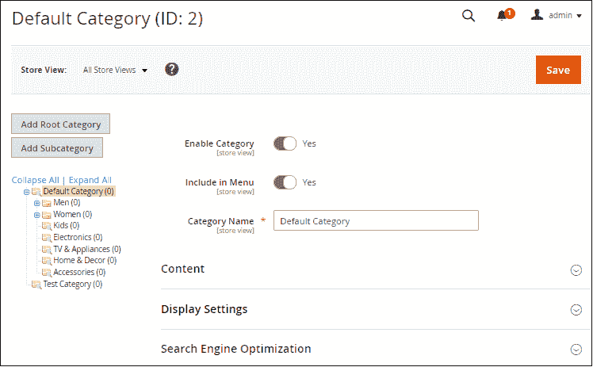

在 Magento 2 中创建产品类别非常容易。Magento 2 中的内容管理系统(CMS)为创建新类别提供了大量支持。在创建类别之前，我们应该对根类别和子类别有基本的了解。

## 根类别和子类别

当我们开始为一个新的 Magento 2 网站创建类别结构时，只有一个根类别，即**默认类别**。所有子类别都嵌套在根类别下。根类别是目录的最高级别，在线商店一次只能有一个活动的根类别。

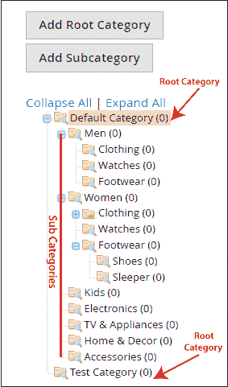

商店产品被组织为根类别下的子类别。我们可以通过左键点击和拖动来改变名称以及排列任何根类别或子类别的位置。

#### 注意:根类别对客户不可见，也没有网址键。

## 在 Magento 2 中设置商店类别

Magento 2 CMS 的一个关键特性是它支持多个商店。通过**单个 Magento 2 安装**，我们可以托管和管理各种完全不同的商店。每个商店都从根类别中提取产品。在设置商店类别时，我们需要了解一些要点:

*   如果我们只有一个在线商店，我们只需要一个根类别。
*   如果我们正在运行各种在线商店，但所有这些商店都在销售相同的产品，在这种情况下，我们可以为所有商店分配相同的根类别。
*   如果我们想要有不同的商店，它们提供不同的产品，那么我们必须为每个商店创建一个根类别。

一旦设置了根类别，我们就可以添加更多的子类别，并组织我们的产品线。在设置商店之前，需要先设置这些类别。

## 如何在 Magento 2 中创建根类别？

要在 Magento 2 中创建根类别，请执行以下步骤:

**第一步:**在管理面板的边栏上，转到**目录>T5】类别**。

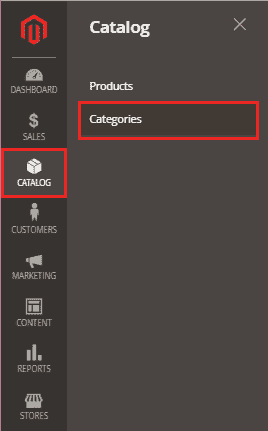

**第二步:**点击**添加根类别**创建根类别。

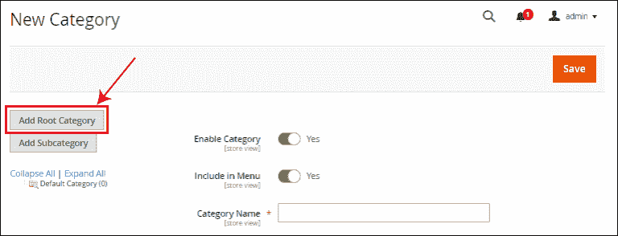

**第三步:**在类别名称等必填字段填写信息，点击【保存】。

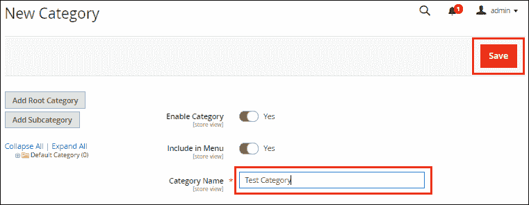

有六个选项卡可用，可用于设置此根类别中的选项。

**内容-** 一般包括类别图像和描述。我们也可以在这里添加 CMS 块。

**显示设置-** 它决定了你的产品在类别页面上的显示方式。因此，我们可以选择类别在前端的显示方式。

**搜索引擎优化-** 该类别的搜索引擎优化包括 URL 关键字、元标题、元关键词和元描述。

**品类中的产品-** 这里，我们将产品分配到给定的品类。如果我们有一个商店是由我们的 Magento 安装托管的，这可能会包括我们所有的活跃产品。

**设计-** 它将我们的定制设计选项添加到一个类别中。

**日程设计更新-** 保持日程信息更新。

## 如何在 Magento 2 中创建子类别？

**第一步:**在管理面板的边栏上，转到**目录>T5】类别**。

**第二步:**首先点击**根类别**，在这个类别下我们要创建一个子类别，然后点击**添加子类别**创建子类别。

**例如:**如果我们想在类别“A”下创建一个子类别“B”。首先，我们需要点击类别 A，然后点击添加子类别。

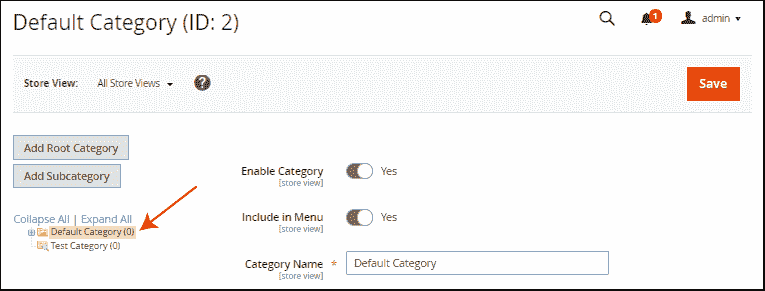

**第三步:**点击**添加子类别**。

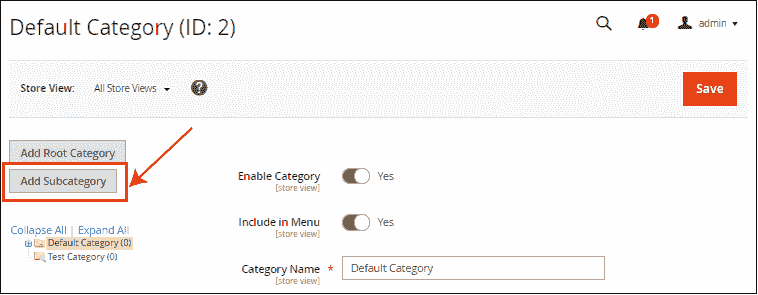

**第四步:**在类别名称等必填字段填写信息，点击**保存**。

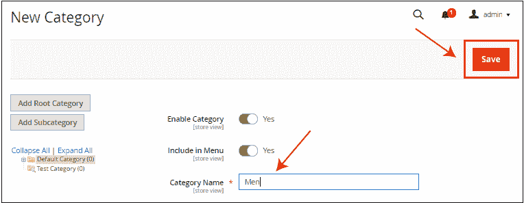

#### 注意:每次需要选择要新建子类别的类别时。

**第五步:**在内容区里面，我们可以上传图片和描述，会设置为**缩略图**。创建新类别时，浏览内容部分，选择图像，添加描述，然后点击**保存**。

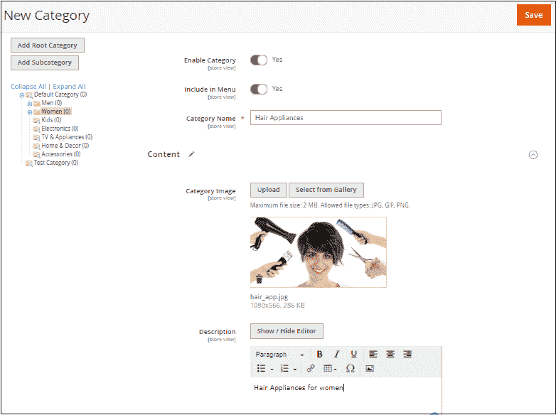

## 如何在您的商店中应用新根类别？

**步骤 1:** 在管理面板侧栏上，转到**商店>T5【所有商店】T3**

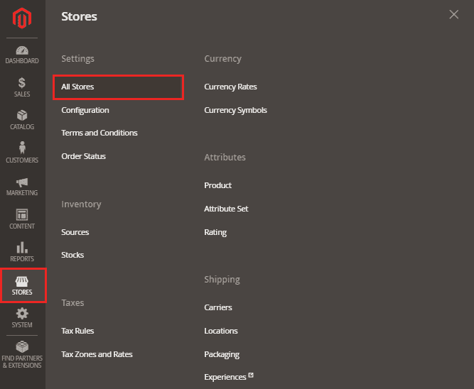

**第二步:**在这里，点击主网站商店。

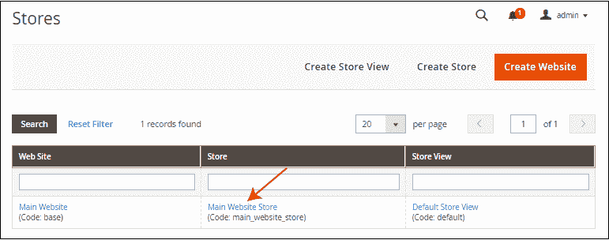

**第三步:**选择想要分配的根类别，然后点击**保存店铺按钮**。

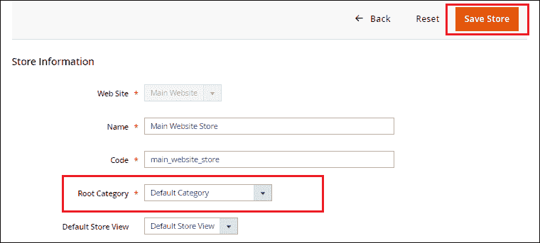

以上就是如何在 Magento 2 中创建一个类别并进行配置的全部内容。客户可以看到如下截图。

* * *