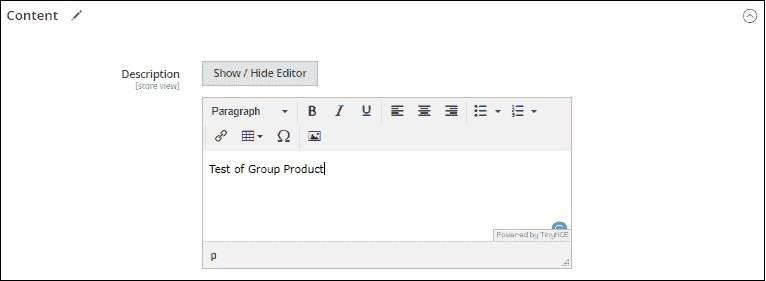
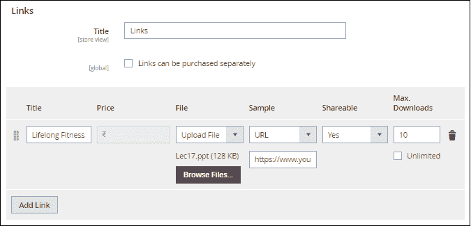

# 如何在 Magento 2 中创建产品？

> 原文：<https://www.javatpoint.com/create-product-in-magento-2>

Magento 2 有六种不同类型的产品，正如我们在上一节中已经讨论过的。我们可以将这些产品添加到我们的网站上。

1.  [创建简单产品](#Create-Simple-Product)
2.  [创建可配置产品](#Create-Configurable-Product)
3.  [创建分组产品](#Create-Grouped-Product)
4.  [创建虚拟产品](#Create-Virtual-Product)
5.  [创建捆绑产品](#Create-Bundled-Product)
6.  [创建可下载产品](#Create-Downloadable-Product)

要在我们的网页中添加这些不同的产品，请按照以下步骤操作:

*   登录到 Magento 2 管理面板。

* * *

## 创建简单的产品

要创建简单产品，请执行以下步骤:

**第一步:**在**管理面板**的左侧，转到**目录> >产品**。

**第二步:**点击**添加产品**下拉列表，选择**简单产品**。

**步骤 3:** 在给定的字段中输入所需的产品详细信息，点击**保存**按钮。我们可以通过点击类别下拉列表直接将产品添加到特定的类别中，甚至通过点击**类别**按钮创建一个新的类别。

**步骤 4:** 给定产品**动力库**被添加到电子产品下的移动配件类别。同样，选择您想要添加新产品的产品类别，然后单击完成。

#### 注意:不要忘记添加产品类别。产品类别完整教程[点击此处](#)。

**创建新类别**

1.  要为产品创建新类别，请点击**新类别**。
2.  输入**类别名称**，选择**父类别**确定其在菜单结构中的位置。
3.  单击创建类别。

很难在中间创建一个类别。因此，在将产品添加到网站之前，创建产品的类别。有关产品类别创建，请参见前面的教程。

对于简单产品，我们需要填写以下详细信息。

| **产品** | 输入产品名称 |
| SKU | 这是一个识别号，通过它我们可以准确地找到使用这个代码的产品。我们可以使用默认的 SKU。 |
| **价格** | 销售产品的成本。 |
| **税级** | 为“应税货物”、“无”或“其他”选择此框。 |
| **图像&视频** | 上传产品的图像或视频。 |
| **数量** | 商店中可用产品的数量，选择缺货或有货状态。 |
| **重量** | 如果需要，填充产品的重量。 |
| **类别** | 将产品放在合适的类别中，例如电子产品类别中的铁。 |
| **描述** | 描述你想卖的产品。这有助于客户更好地了解产品。 |
| **可下载信息** | 此字段仅用于可配置或可下载的产品。因此，在创建简单产品时可以跳过它。 |
| **配置** |  |

**步骤 5:** 展开内容部分，您可以在描述字段中添加产品描述。在此添加描述和简短描述。

**第六步:**在图像和视频部分，我们可以添加产品的图像或视频。展开图像和视频部分，点击**浏览找到图像，或者拖动图像到这里**添加产品图像。从系统中选择图像并保存。

### 要记住的事情

*   简单产品可以包含在可配置、捆绑或分组的产品类型中。
*   一个简单的产品可以有多种输入控件的定制选项，这使得用一个 SKU 就可以销售多种产品。

* * *

## 创建可配置产品

这里我们将基于颜色属性创建可配置的产品。要创建可配置产品，请执行以下步骤:

**第一步:**在**管理面板**左侧，转到**目录> >产品**，类似于简单产品。

**第二步:**点击**添加产品**下拉列表，选择**可配置产品**。

**第 3 步:**填写产品名称、SKU、数量等给定字段中所需的产品详细信息。点击保存按钮。我们可以通过点击类别下拉列表直接将产品添加到特定的类别中，甚至可以通过点击**类别**按钮创建一个新的类别。

**第 4 步:**勾选您要添加产品的类别复选框，点击**完成**。

#### 注意:不要忘记添加产品类别。关于添加产品类别的完整教程，[点击此处](#)。

**第 5 步:**展开内容部分，我们可以在描述字段中添加产品的描述。在此添加描述和简短描述。

**第六步:**对于可配置产品，我们可以添加配置。它允许客户选择不同的选项(例如，夹克颜色)。浏览配置并点击**创建配置**。

**第 7 步:**选择颜色属性。如果产品有其他属性，您也可以创建其他属性。检查颜色，然后单击下一步。

**第八步:**点击**创造新价值**为你的产品添加不同的颜色。选中或取消选中产品的可用颜色，然后单击下一步。

**步骤 9:** 现在，您需要配置产品的图像、价格和数量。通过属性(如颜色)添加产品的图像。我们可以根据自己的要求选择任何一种。我们要么将一组图像应用于所有 SKU，按属性进行唯一的图像，要么跳过它。

**第 10 步:**在此生成产品总结。现在，单击生成产品并继续。

**步骤 11:** 点击保存按钮，从顶部保存配置好的产品。这些产品将通过选择它们的属性来显示。

**第 12 步:**展开图像和视频部分，在此浏览或拖动产品的图像。我们可以使用任何图像作为基础图像，在选择颜色属性之前，客户可以在网站上看到基础图像。

**步骤 13:** 点击想要制作基础图像的图像。将弹出一个窗口，标记**基地**选项并返回上一页。点击**保存**按钮保存我们所做的更改。我们将在这里制作粉色夹克作为基础图像。

### 要记住的事情

*   可配置产品允许购物者从下拉列表中选择选项。
*   用于产品变化的属性必须具有全局范围，并且客户必须选择一个值。
*   购物车中的缩略图可以设置为显示可配置产品记录或产品变化的图像。

* * *

## 创建分组产品

要创建分组产品，请执行以下步骤:

跟随 ***第 1 步*** 到 ***第 6 步*** 类似于 Simple 产品。首先将商店数据库中的产品作为简单产品添加，然后创建分组产品。

**第 7 步:**点击**添加产品**下拉列表，选择**分组产品**。

**第 8 步:**在给定的字段中填写所需的产品详细信息，然后单击保存。请注意，数量字段未启用，因为该值已经取自构成组的单个产品。

**步骤 9:** 展开内容部分，并提供分组产品的描述。

**第 10 步:**现在，展开内容下方的分组产品部分，点击**将产品添加到组**。

**步骤 11:** 在给定的产品列表中，选中要添加到组中的每个产品的复选框。然后点击添加所选产品，如下图所示。

**步骤 12:** 所选项目将在分组产品部分可见，如下图截图所示。输入分组产品的默认数量并保存。

点击要从组中删除的项目对应的**删除**选项。

**第 13 步:**展开图像和视频部分，点击**浏览，在此找到或拖动图像**添加分组产品的图像。从系统中选择图像并保存。

### 要记住的事情

*   分组产品基本上是简单产品的集合。
*   购买的每件产品都单独出现在购物车中，而不是作为该组的一部分。
*   购物车中的缩略图可以设置为显示分组的父产品或关联产品的图像。

* * *

## 创建虚拟产品

要创建虚拟产品，请执行以下步骤:

**第一步:**在**管理面板**左侧，转到**目录> >产品**，类似于简单产品。

**第二步:**点击**添加产品**下拉列表，选择**虚拟产品**。

**第 3 步:**填写产品名称、SKU、数量等给定字段中所需的产品详细信息。单击保存按钮并继续。

请注意，此物品没有重量，因为虚拟产品没有发货。因此，重量字段未启用。

**第 4 步:**点击类别下拉列表，将产品添加到特定类别中。如果类别不存在，则创建一个新类别。按照下面给出的步骤创建新类别。

**创建新类别**

1.  要创建产品的新类别，点击**新类别**。
2.  输入**类别名称**，选择**父类别**确定其在菜单结构中的位置。
3.  单击创建类别。

在中间创建一个类别有点困难。因此，在将产品添加到网站之前，创建产品的类别。有关产品类别创建，请参见前面的教程。

**第五步:**添加虚拟产品的描述。展开“内容”部分，并提供产品的描述和简短说明。

**第 6 步:**展开图像和视频部分，插入产品的图像。单击保存并继续。

### 要记住的事情

*   虚拟产品是无形产品，不发货，如会员、订阅、保修等。
*   这些与简单产品非常相似，但没有重量。
*   除非购物车包含有形产品，否则发货选项不会在结账时出现。

#### 注:创建简单产品和虚拟产品的过程是一样的。

* * *

## 创建捆绑产品

当客户点击 ***【定制】*** 或 ***添加至购物车*** 按钮时，选项选择出现。因为捆绑包中包含的产品各不相同。SKU、重量和价格可以设置为固定值或动态值。

以下说明将带我们完成使用必填字段和基本设置创建捆绑产品的过程。创建任何产品时，每个必填字段都标有红色星号(*)。完成基础后，我们可以完成高级设置和其他设置。

要创建捆绑产品，请执行以下步骤:

跟随 ***第 1 步*** 到 ***第 6 步*** ，类似于 Simple 产品。首先将商店数据库中的产品作为简单产品添加，然后将创建捆绑产品。

**第二步:**点击**添加产品**下拉列表，选择**捆绑产品**。

请注意，添加捆绑产品的给定字段有一些变化，例如- SKU、重量、价格、？介于固定和动态之间。

1.  通过给默认 SKU 添加后缀，可以为每个捆绑产品分配一个**动态 SKU** 。默认情况下，动态 SKU 设置为**是**。
2.  如果您想为每个捆绑产品分配一个唯一的 SKU，那么将动态 SKU 设置为**否**。
3.  同样，要收取捆绑包的固定价格，请将动态价格设置为**否**，并输入捆绑包的价格。

**步骤 3:** 在给定的输入字段中输入所需信息，然后点击保存。

**第 4 步:**现在，向下滚动到捆绑物品部分，并将**装运捆绑物品**设置为以下选项之一。

*   个别地
*   一起

点击**添加选项**并展开字段以添加右下角捆绑项目中给出的选项，并执行以下操作:

1.输入选项标题，并从给定选项之一设置输入类型:

*   下拉列表
*   单选按钮
*   检验盒
*   多重选择

2.选中**必填**复选框，使该字段成为必填项。

3.点击**将产品添加到选项**并通过勾选复选框选择您想要包含在该选项中的产品。如果有这么多产品，那么我们可以使用过滤器和分页控件轻松快速地找到产品。

4.选择产品后，点击**添加所选产品**。

5.所选产品将出现在**选项**部分。输入添加到捆绑包中的每个产品的数量并保存。

**第五步:**在图像和视频部分，插入捆绑产品的图像或视频。展开图像和视频部分，点击**浏览找到图像，或者拖动图像到这里**添加产品图像。从系统中选择图像并保存。

**步骤 6:** 在前端，客户可以通过勾选产品的复选框来选择项目。项目的价格将相应增加。点击前端的**定制并添加到购物车**。

### 要记住的事情

*   捆绑产品可以单独运输，也可以一起运输。
*   SKU 和重量可以是动态的或固定的。
*   捆绑产品最主要的是，客户可以“打造自己的”捆绑产品。
*   捆绑产品可以是虚拟产品，也可以是带有定制选项的简单产品。

* * *

## 创建可下载的产品

要创建可下载产品，请执行以下步骤:

**第一步:**在**管理面板**左侧，转到**目录> >产品**，与其他产品类似。

**第二步:**点击**添加产品**下拉列表，选择**可下载产品**。

**第 3 步:**填写产品名称、SKU、数量等给定字段中所需的产品详细信息。单击保存按钮并继续。

请注意，此物品没有重量，因为可下载产品没有发货。因此，重量字段未启用。

**第 4 步:**点击类别下拉列表，将产品添加到一个类别中。如果类别不存在，则创建一个新类别。按照以下步骤创建新类别。

**创建新类别**

1.  要创建产品的新类别，点击**新类别**。
2.  输入**类别名称**，选择**父类别**确定其在菜单结构中的位置。
3.  单击创建类别。

#### 注意:要在将产品添加到网站之前创建产品的类别，请参见前面的产品类别创建教程。

**第五步:**添加您要在商店中添加的可下载产品的描述。浏览内容部分，并提供产品的描述和简短说明。

**第 6 步:**展开图像和视频部分，插入产品的图像。单击保存并继续。

创建可下载产品直到**图像和视频**部分的过程与虚拟产品非常相似。

**第 7 步:**现在，向下滚动至**可下载信息**部分并展开。标记“**这是可下载的产品吗？**“复选框。

可下载的信息部分有两部分。可下载信息部分的第一部分描述了每个下载链接，第二部分描述了每个示例文件。

### 完整链接

1.  输入**标题**，作为下载链接的标题。
2.  如果适用，标记**链接可以单独购买**复选框。
3.  点击**添加链接**完成链接。
4.  进入**标题**和**价格**进行下载。
5.  对于**文件**和**样本**文件，选择以下方法之一:
    *   **上传文件-** 从下拉列表中选择上传文件，将分发文件上传到服务器，浏览文件进行上传。
    *   **URL -** 选择 URL 从一个 URL 访问分发文件，然后输入下载文件的完整 URL。
6.  将**可共享**设置为否，要求客户登录自己的账户才能访问下载链接。如果在“可共享”中设置了“是”，客户可以通过电子邮件与其他人共享链接。
7.  输入**最大下载次数**以限制每位客户的下载量，否则，通过勾选无限制复选框允许**无限制**下载。

要再次添加另一个链接，点击**添加链接**并重复这些步骤。

### 完整样本

1.  输入用作样品标题的**标题**。
2.  单击添加链接以完成每个样本的信息。
3.  执行与链接部分相同的操作，完成示例部分。

### 要记住的事情

*   可下载的产品可以上传到服务器上，也可以从互联网上的另一个服务器链接。
*   我们可以确定客户下载产品的次数。
*   购买可下载产品的顾客必须在结账前登录。
*   当订单处于“已开票”或“待定”状态时，可以交付可下载产品。

* * *