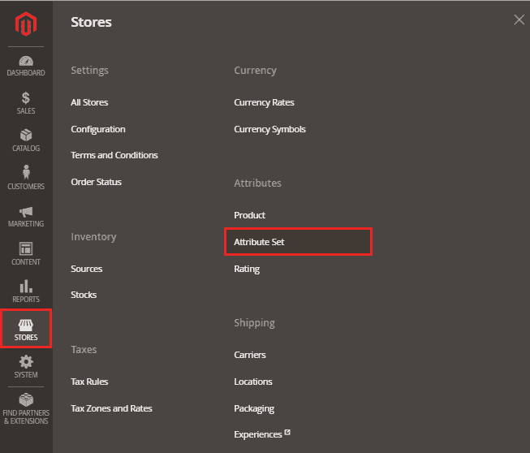

# 如何在 Magento2 中创建属性集？

> 原文：<https://www.javatpoint.com/how-to-create-attribute-sets-in-magento-2>

创建产品属性和属性集是 Magento 系统的重要组成部分。商店所有者应该首先创建产品属性，然后创建产品属性集。在创建属性集之前，我们需要知道什么是属性集。

## 什么是属性集？

属性集可以定义为属性列表，其中展示了产品的所有特征。属性集用作新产品的模板，每个产品都必须属于特定的属性集，这在下面给出的情况下很有帮助:

*   将产品分成多个组。
*   一个产品的特性被收集在一个地方。
*   产品所需的信息可以一步导入。

属性集决定了在数据输入过程中可用的字段以及向客户显示的值。简而言之，属性集是属性的集合，商店所有者在创建新产品时可以看到这些属性。

#### 注意:我们可以更改分配给产品的属性集，即使该产品已经创建。

首先，商店所有者需要创建一个产品属性，然后创建一个新的产品属性集。Magento2 有其默认属性集，其中产品属性是通常使用的选择，例如名称、SKU、描述、价格等。

## 在 Magento2 中创建属性集

要创建属性集，请执行以下步骤:

**第一步:**登录 Magento2 管理面板，前往**商店>T5】属性>T7】属性设置**。

**第二步:**点击右上角**添加属性集**按钮，新建属性集。

**第三步:**指定属性集的名称，同时选择现有的属性集，作为模板。默认情况下，**默认**设置为**基于**字段作为模板。

**第四步:**点击**保存**按钮，继续下一页，如下图所示。

*   左栏显示属性集的名称。此名称供内部参考，可根据需要更改。
*   中间列显示了当前属性组选择的列表。
*   右侧的列列表是属性的选择，这些属性当前未分配给属性集。

**第五步:**要将新属性添加到属性集中，请将属性从**未分配属性**列表拖到适当的文件夹中，在该文件夹中您要在**组**列中添加属性。

完成后，点击**保存按钮**。这里我们在**价格**属性的正下方增加了**品牌**属性。

*   **组**是指有组织的属性集的数量。**例如** -如果属性的名称是元信息，它将包含元描述、元关键字和元标题等属性。
*   **未分配属性**包含当前未分配给任何属性集或组的属性列表。

## 创建新属性组

1.  在属性集中心的组列中，点击**添加新按钮**。
2.  输入新组的名称，然后点击确定按钮。
3.  现在，我们可以执行以下任一操作:
    *   将“未分配的属性”拖到新组中。
    *   将属性从任何其他组拖到新创建的组中。

新组成为任何产品中属性的一部分，它基于属性集。

## 创建新产品时如何应用属性集？

如果您想使用您为 Magento2 产品创建的属性集，请按照以下步骤操作:

*   在管理工具条的左侧，转到**目录> >产品**。

*   从添加产品下拉列表中选择要创建的产品类型，如简单产品。

*   从这里，选择所需的属性集。因此，当特定产品的组包含相同的属性集时，它们会作为部分出现在产品信息面板中。

这里，我们在属性集字段中选择了**属性集 1** 而不是默认值。于是，**品牌**属性被添加到产品信息面板进行输入。

**相关话题:**

[如何在 Magento2 中创建产品属性？](https://www.javatpoint.com/how-to-create-product-attribute-in-magento-2)

[如何在 Magento2 中创建产品类别？](https://www.javatpoint.com/create-product-category-in-magento-2)

* * *