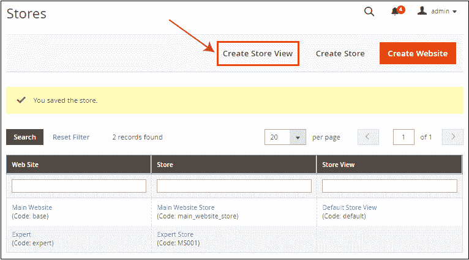
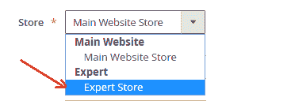
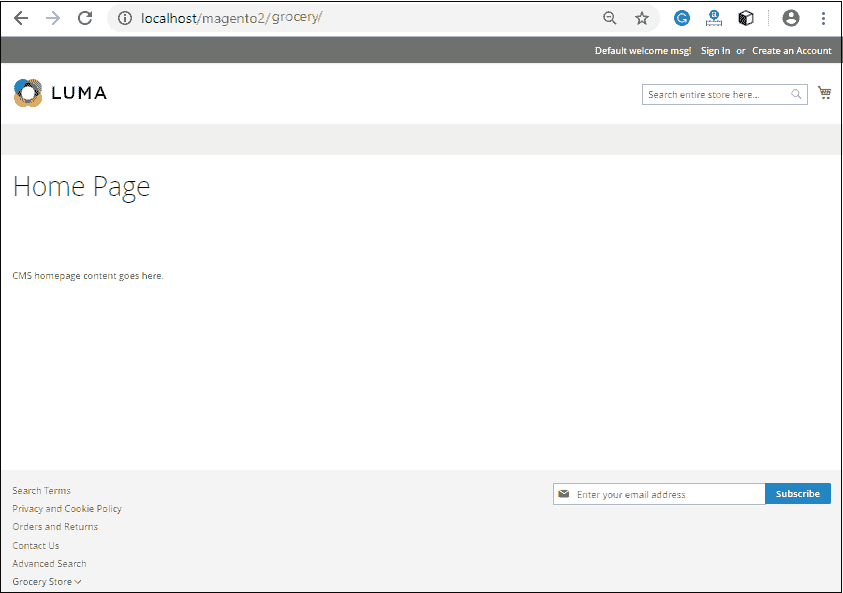

# 如何在 Magento 2 中设置多个网站、商店和商店视图？

> 原文:[https://www . javatpoint . com/如何设置-多个网站-商店-商店-在 magento 中查看-2](https://www.javatpoint.com/how-to-set-up-multiple-websites-stores-and-store-views-in-magento-2)

Magento 允许我们在单个 Magento 后端设置和管理多个商店或域的实例。在本节中，我们将介绍如何在 Magento 2 中设置多个网站、商店和商店视图。

在单个 Magento 2 后端建立多个商店是 Magento 2 为商店所有者带来的可变功能之一。该功能允许我们在单个配置中创建任意数量的商店。所有的商店共享同一个域，被设置为同一个域的子域，或者有一个完全不同的域，但是可能共享同一个后端以便于管理。

## 第一步:创建网站

1.在 Magento 2 管理面板中，转到**商店> >设置> >所有商店**。

2.门店页面会出现在你面前，点击**创建网站**。

3.在给定字段中输入所需信息，如名称、代码和排序顺序，然后点击**保存网站**按钮。

4.现在，我们可以看到网站已经创建，这可以在主网站下面的商店页面上看到。根据需要多次重复这些步骤来创建您的网站。

## 步骤 2:创建商店

1.在 Magento 2 管理面板中，转到**商店> >设置> >所有商店**。

2.现在，在商店页面，点击**创建商店**按钮创建商店。

3.按照以下说明在给定字段中填写所需信息:

a.从下拉列表中选择**网站**，该网站是新店的父网站。如果只有一个网站，则使用默认值，即主网站。这里我们将选择**专家**，这是我们在前面的步骤中创建的。

b.输入新店**名称**，仅供内部参考。

c.在**根类别**字段中，为商店的主菜单选择一个类别。我们将在此选择*默认类别*。

完成店铺详情后，点击**保存店铺**按钮。

4.现在，我们可以看到商店也被创建，这在主网站下面的商店页面上可见。根据需要多次重复这些步骤来创建您的商店。

## 步骤 3:创建商店视图

1.在 Magento 2 管理面板中，转到**商店> >设置> >所有商店**。

2.现在，在商店页面上，点击**创建商店视图**按钮，为您的商店创建商店视图。

3.在给定字段中填写所需信息。

a.从下拉列表中选择与此商店视图相关联的商店。

b.在名称字段中输入名称以标识此商店视图。

c.在“代码”字段中提供唯一的名称来标识此商店视图。

d.将状态设置为**启用**。

e.输入可选的数字排序顺序。

现在，点击**保存店铺视图**按钮保存新的店铺视图信息。

4.保存商店视图信息时会弹出一个窗口。点击确定并继续。

5.根据需要多次重复这些步骤来创建商店视图。在下面的截图中，您可以看到商店视图是为您的新网站和商店创建的。

## 步骤 4:设置商店网址

在这一步中，我们将配置商店网址。

1.在管理面板的左侧栏，转到**商店> >设置> >配置**。

2.在这里，选择**通用**选项卡下的**网页**。

3.展开**网址选项**部分，设置**是**将商店代码添加到网址字段并保存。因此，无论我们在哪里切换商店，商店代码都会自动附加网址。

4.左上角选择**店铺视图**查看我们新增的店铺。从“商店视图”列表中，选择一个网站。我们可以通过从**商店视图**下拉列表中选择任何商店来获取信息。

单击确定验证范围切换。

5.现在，展开**基本网址**部分。清除基本网址字段旁边的**使用网站**复选框，并更改商店的基本网址。**例如**-[https://subdomain.example.com/](https://subdomain.example.com/)

6.打开**安全基本网址**部分，根据需要设置商店的安全网址。

点击页面顶部的**保存配置**按钮完成。

在这种情况下，您已经在主网站下创建了商店和商店视图，类似于下面的截图。然后按照下面的说明操作。

## 清除缓存管理

在管理面板上，转到**系统> >工具> >缓存管理**。

从下拉列表中选择全部，点击**刷新法师缓存**按钮。

现在，打开前端，重新加载网页。在这里，您可以通过点击主网站商店的子域从一个商店切换到另一个商店。请看下面的截图。

新店是:

* * *