# 如何在 Magento 2 中设置税收规则、税率和税区？

> 原文:[https://www . javatpoint . com/setup-tax-rules-tax-rates-and-zone-in-magento-2](https://www.javatpoint.com/set-up-tax-rules-tax-rates-and-tax-zones-in-magento-2)

Magento 2 允许我们设置不同的税级和税率，并将它们合并到税收规则中。我们还可以定义税类并将其分配给产品。为 Magento 2 商店设置税收规则是一个必不可少的配置，因此我们需要将它们应用于特定网站上的每个订单。税收规则是产品税级、客户税级、运输地址、税率和购买金额的大关联。

根据分配给客户纳税类别的客户、属于其他产品类别的产品以及建议的税率，Magento 2 系统将自动计算您商店中每个订单的税款。在本节中，我们将说明如何为 Magento 2 商店设置税率或添加税率。

Magento 2 提供了配置税率的特别优惠，并且可以单独与各种税收类别的产品相关联。以下是描述如何在 Magento 2 中添加和管理税率和税收规则的步骤。

## 设置税区和税率

税率通常适用于在特定地理区域内发生的交易。我们把不同地区的税率加起来，就意味着不同的国家和州。“税区和税率”工具使我们能够指定每个地理区域的税率，因为每个税区和税率都有唯一的标识符。商店税是根据商店的地址计算的。实际客户税在客户完成订单信息后计算。要设置新税率，请执行以下步骤:

**步骤 1:** 要创建新的税率，请登录到 Magento 2 管理面板。

**第二步:**在管理面板的左侧栏中，导航至**商店> >税收> >税收区和税率**。税区和税率屏幕将在您面前打开。

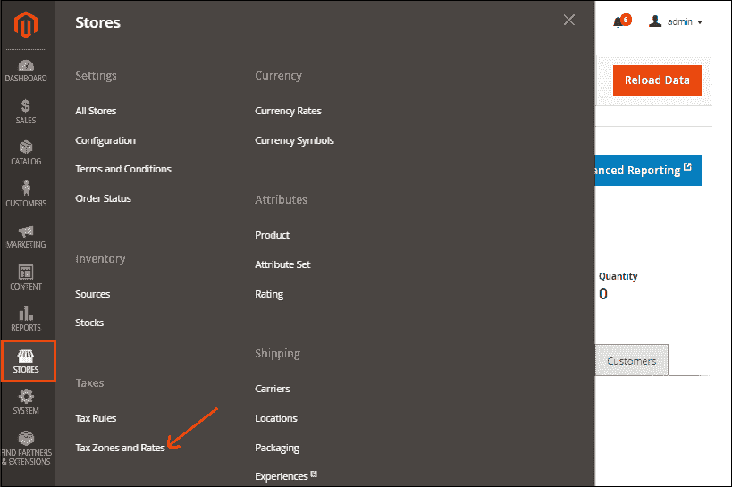

**第三步:**点击右上角的**新增税率按钮**添加新的税收区和税率。

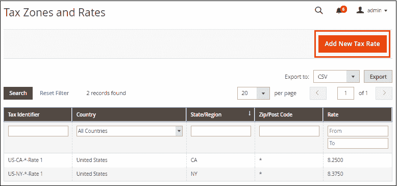

**第四步:**现在，我们可以配置税率了。在给定字段中填写所需信息。

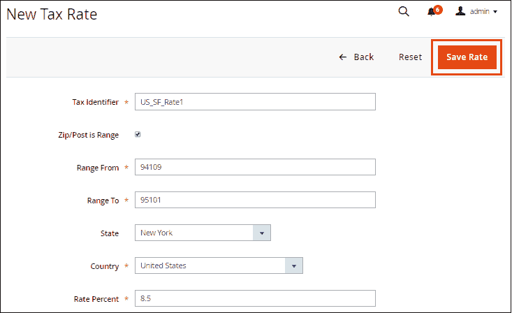

要设置新税率，请执行以下操作:

**税号:**税号为必填字段，定义新建税率的标题。它被用来命名你的税率，这样我们可以很容易地识别我们的税率。名称费率由连字符或下划线分隔。

**邮政编码/邮政编码范围:**标记此字段以应用该州特定邮政编码/邮政编码范围内的税率。例如，

*   **范围从:**输入起始范围，如 94109。
*   **范围至:**输入结束范围，如 95101。

**邮政编码:**提供您要应用税率的邮政编码。如果在此字段中设置星号(*)，税率将适用于所选州的所有邮政编码。

**州:**要征收税率的州。如果国家没有州，此选项将灰显。如果我们在州字段中设置星号(*)，则税率将适用于所有州。

**国家:**选择您希望征收税率的国家。

**税率百分比:**客户需要支付税率百分比。此字段确定我们需要申请指定税率的实际百分比

**第四步:**当所有信息填写成功后，点击**保存税率**按钮保存税率。

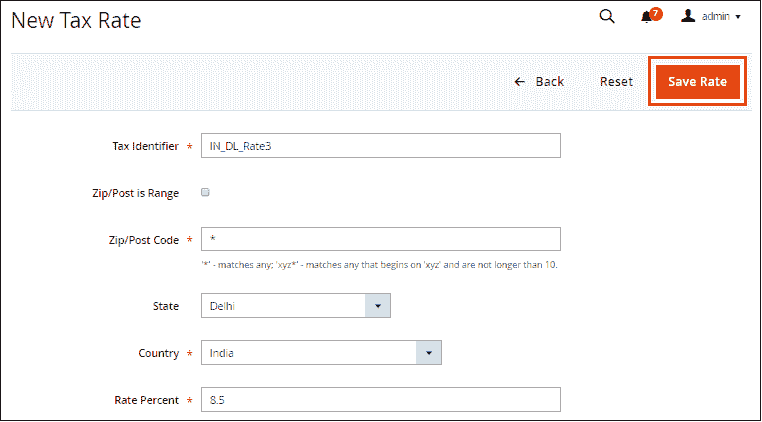

要应用税率，我们需要创建税收规则。要创建税务规则，请参见一节中的。

## 设置税务规则

税规则是客户税类、产品税类和税率的组合。每个客户被分配到一个客户类别，每个产品被分配到一个产品类别。Magento 分析每个客户的购物车，并根据产品、客户类别和地区计算税款。

要创建税收规则，请执行以下步骤:

**步骤 1:** 登录到 Magento 2 管理面板。

**第二步:**在管理面板的左侧栏中，转到**商店>T5】税务>T7】税务规则**。“税收规则”屏幕将在您面前打开，其中将包含现有税收规则的列表。

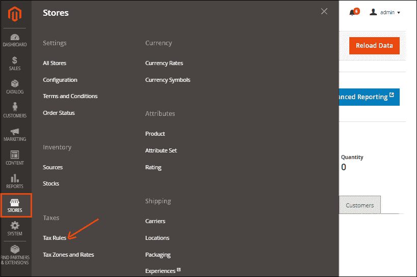

**第三步:**要添加新的税收规则，我们需要点击右上角的**添加新的税收规则**按钮。

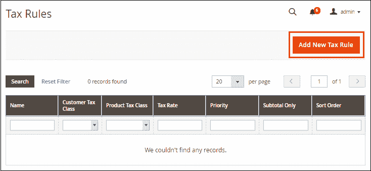

**第 4 步:**在给定字段中填写所需信息。

**1。填写税则信息**

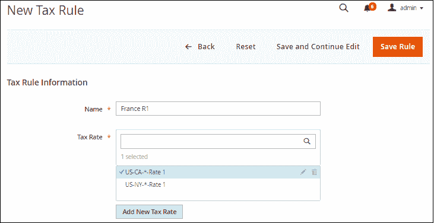

**名称:**在**名称**字段中提供税收规则的名称，建议将其命名为易于记忆的规则内容。

**税率:**税率字段包含税率的集合，该集合存在于我们的 Magento 2 商店中。我们可以根据需要选择一种或多种税率。

我们可以通过点击税率对应的**编辑**或**删除**图标来编辑或删除现有税率。我们也可以通过点击**添加新税率**按钮来定义新税率。

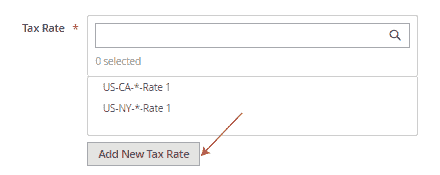

**2。完成附加设置**

展开“附加设置”部分。

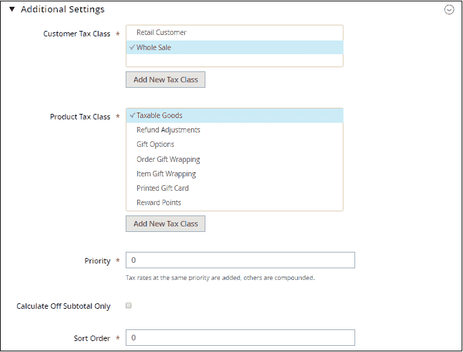

**客户税类-** 如果要对多个客户应用税务规则，请选择一个或多个客户税类。我们可以通过点击**编辑**图标来编辑现有的客户税类，甚至可以通过**添加新的税类**按钮来创建新的税类。

*   输入新税务类别的名称，然后单击右符号保存。

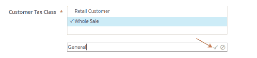

在这里，您可以看到税务规则如何适用于客户群。前往**客户> >客户群**。

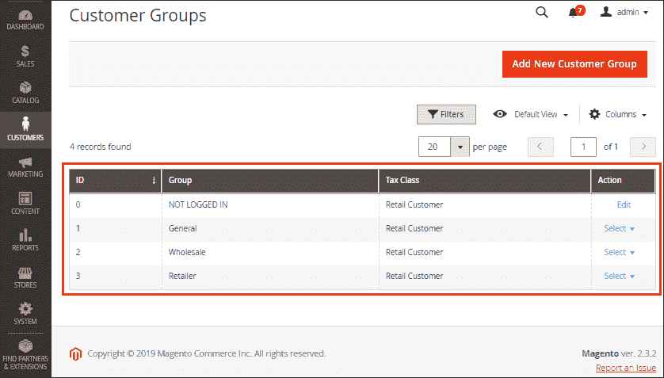

**产品税类-** 是与产品关联的税类。用 **Ctrl** 键选择一个或多个该规则适用的产品税类别。我们也可以通过点击**编辑图标**来修改现有的产品税级，甚至可以通过**添加新的税级**按钮来创建新的税级。

**优先级:**设置优先级，确定在启用多个税种时首先应用的税种。这将优先考虑你的税收规则与其他现有的税收规则无论如何共享相同的条件。

**仅计算小计关闭:**勾选此字段，根据订单小计计算税款。这意味着，如果要对小计征税，请标记此字段。

**排序顺序:**它将决定我们需要应用税收规则的顺序。在此字段中，输入一个数字，以指示此税则与其他税则一起列出时的顺序。

为了完善税收规则的结构，我们有进出口税率。我们可以从任何地方轻松导入或导出文件。

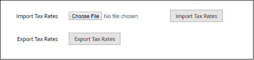

#### 注意:如果您有几个税率需要设置但不想手动编辑，请选择进口税率。

**第四步:**完成后点击**保存规则**。我们可以在主屏幕上看到新制定的税收规则。

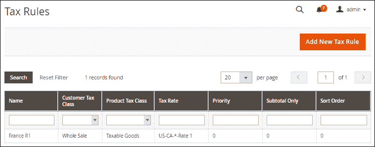

关于您店铺的税费计算的其他设置，您需要访问后端的**店铺> >配置**部分，然后访问**销售> >税费**。

* * *