# 如何在 Magento 2 中设置运输方式？

> 原文：<https://www.javatpoint.com/setup-shipping-methods-in-magento-2>

在在线业务中，向客户销售产品应该有可扩展和灵活的运输策略。Magento 2 是一个友好的系统，适合包括运费在内的业务需求。免费送货方式基于您设置的最低购买量或购物车价格规则条件。此外，根据您设置的当前策略，可以为某些项目或整个订单设置运输方法。

如果你想在你的商店收取不同的运费，那么你可以使用**表格运费法**和**统一运费法**来完成。要启用运输方法，请执行以下步骤:

**第一步:**在 Magento 2 管理面板左侧边栏，导航至**商店>T5】设置>T7】配置**。

**第二步:**在销售部分，点击**发货方式**标签。

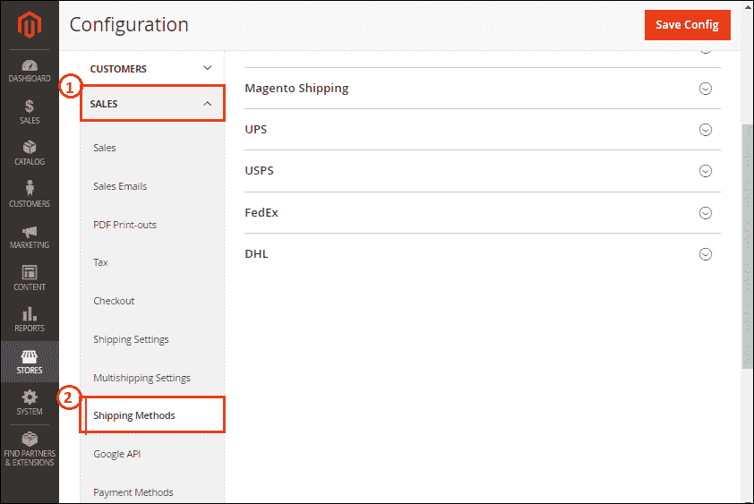

在这里，您将获得运输方式，如统一费率、免费运输、表格费率、马根托运输、联合包裹、美国邮政、联邦快递和敦豪快递。

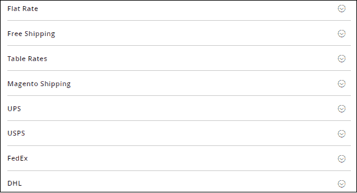

## 统一价格

**步骤 1:** 展开**统一费率**部分，并在给定字段中填写所需的详细信息。

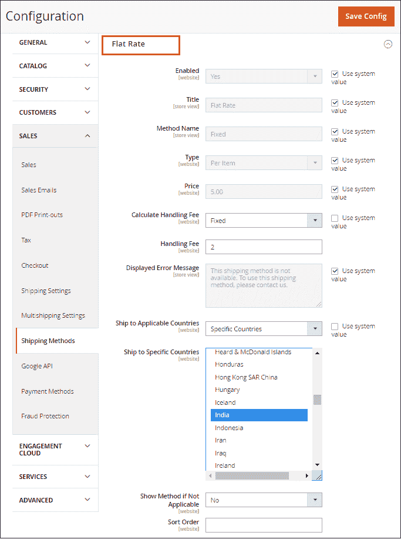

*   **启用:**默认情况下，启用统一费率。因此，它将在购物车的税务部分可用，在结账时也可以在发货部分使用。
*   **标题:**输入统一费率发货的标题，该标题将显示在结账页面上。
*   **方法名称:**在该字段中设置方法名称，该名称将显示在带有运费的购物车中。默认情况下，设置“固定”。
*   **类型:**确定运输中统一费率的适用方式-按项目、按订单或无。

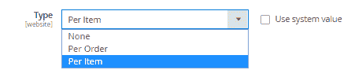

*   没有一个类似于免费送货方式。
*   选择每个项目的**以对每个项目应用统一费率运输。**
***   选择每个订单的**对整个订单应用统一运费。****

*****   **价格:**设置您希望对统一费率运输收取的价格，例如，卢比。6.00.意味着每件 6 卢比。*   **计算手续费:**如果要加收一些费用，设置为**固定**或**百分比**，然后在**手续费**字段输入金额。****

****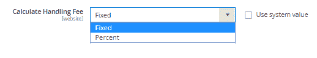

*   **显示错误消息:**如果无法获得统一费率运输，请提供一条短消息。
*   **运送至适用国家:**我们有两个选项:
    *   所有允许的国家/地区:通过选择此选项，每个国家/地区都支持免费运输。
    *   特定国家/地区:使用 Ctrl 键选择支持统一费率运输的国家/地区。
*   **不适用时显示方法:**如果方法不适用于购买，则确定在结账时是否将统一费率显示为选项。
*   **排序顺序:**如果启用了两个或多个发货，那么它将按哪个顺序显示。所以，设置决定顺序的数字。

**第二步:**点击**保存配置**按钮，保存平板发货方式。

## 免运费

**步骤 1:** 展开**自由运输**部分，并在给定的字段中填写所需的详细信息。

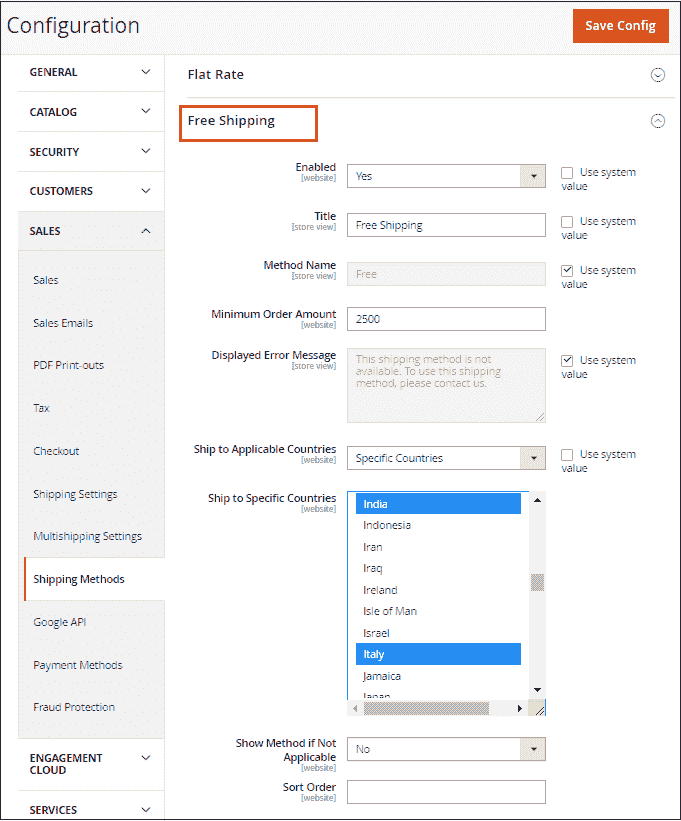

*   **启用:**通过为此设置**是**来启用运输方式。启用时，在结帐过程中，免费送货将作为一个选项出现在送货部分。
*   **标题:**在结账页面输入免费送货的标题。
*   **方法名称:**在**方法名称**字段中提供描述运输方法的名称。
*   **最低订单金额:**输入适用于免费送货的最低金额。
*   **显示的错误信息:**提供一条错误信息，如果免费送货不可用，则会出现该信息。
*   **运送至适用国家:**指定您提供免费运送的国家。我们有两个选择:
    *   所有允许的国家/地区:通过选择此选项，每个国家/地区都可以享受免费运输。
    *   特定国家/地区:使用 Ctrl 键选择支持免费送货的国家/地区。
*   **不适用时显示方法:**如果方法不适用于购买，则确定在结账时是否将统一费率显示为选项。
*   **排序顺序:**如果启用了两个或多个发货，那么它将按哪个顺序显示。所以，设置决定顺序的数字。

**第二步:**点击**保存配置**按钮保存免费送货方式。

## 运费表

根据价格与目的地、重量与目的地、物品数量与目的地等条件的组合，应用运费费率表计算运费。所有这些都列在一个表格费率文件中，我们可以在 Magento 2 设置中导入和导出。现在，我们将学习在 Magento 2 中配置表格费率运送方法。

**步骤 1:** 展开**运费表**部分，并在给定字段中填写所需的详细信息。

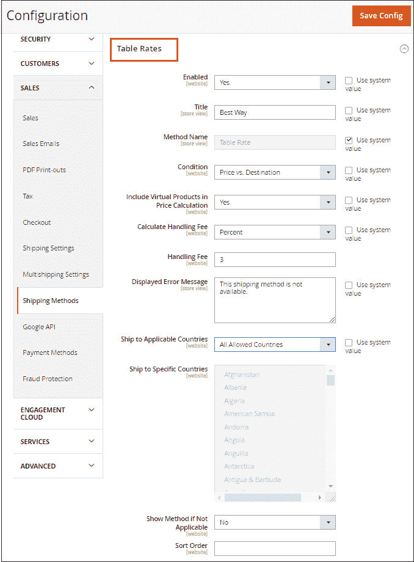

*   **启用:**通过为此设置**是**来启用运输方式。
*   **标题:**在结账页面输入表格运费标题。默认情况下，我们可以使用“最佳方式”免费送货。
*   **方法名称:**在**方法名称**字段中提供描述运输方法的名称。
*   **条件:**确定计算所依据的条件。我们有三个选项:重量与目的地、价格与目的地、物品数量与目的地。

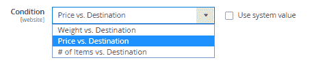

*   **在价格计算中包含虚拟产品:**确定虚拟产品是否包含在费率表价格计算中。

#### 注:我们可以计算虚拟产品上的发货。虚拟产品没有重量，因此它仅适用于价格对目的地和项目数量对目的地。

*   **计算手续费:**如果要加收一些费用，设置为**固定**或**百分比**，然后在**手续费**字段输入金额。

*   **显示的错误信息:**提供一条错误信息，该信息将在表格运费不可用时出现。
*   **发货至适用国家:**确定您提供表格费率发货的国家。我们有两个选择:
    *   所有允许的国家/地区:通过选择此选项，每个国家/地区都可以享受免费运输。
    *   特定国家/地区:选择支持免费送货的国家/地区。
*   **不适用时显示方法:**如果方法不适用于购买，则确定在结账时是否将统一费率显示为选项。
*   **排序顺序:**如果启用了两个或多个发货，那么它将按哪个顺序显示。所以，设置决定顺序的数字。

**第二步:**点击**保存配置**按钮，保存表格费率发货方式。

## 预览表格费率数据

Magento 2 允许我们生成或查看和下载不同的报告。Magento 2 集成了生成 CSV 文件的工具。我们可以在电子表格中创建运费，然后将它们导入我们的网站。

1.在左上角，选择配置处于活动状态的商店视图。我们可以选择**主网站**或者任何我们需要的网站。

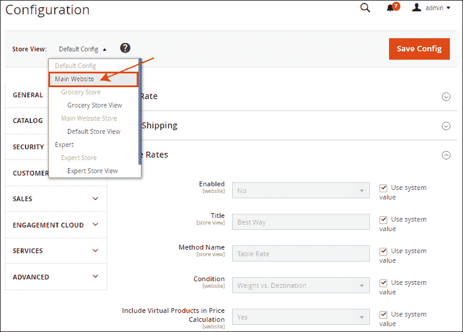

2.一个弹出窗口会在你面前打开。仔细阅读消息，单击确定，然后继续。

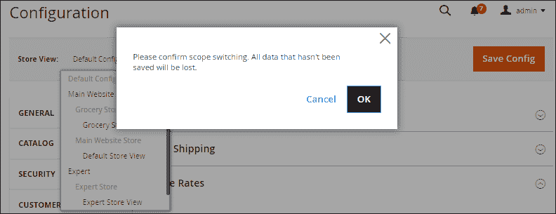

3.将有两个新选项“导入”和“导出”出现在“费率表运输”部分。

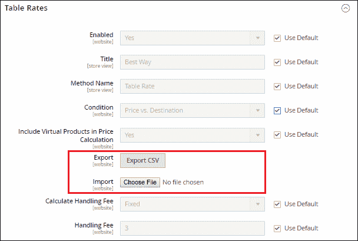

4.点击**导出 CSV** 按钮，系统会下载一个文件 tablerates.csv。将文件(tablerates.csv)保存在系统中。

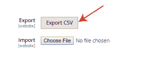

5.在 Excel 中打开下载的(tablerates.csv)文件，您将获得国家、地区/州、邮政编码、订单小计和价格对目的地的运输价格。CSV 结构如下图所示。

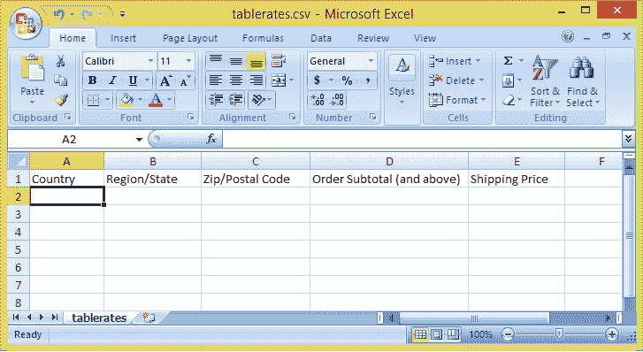

6.在电子表格中完成 CSV 文件。

*   对任何类别中的所有可能值使用星号(*)。
*   “国家/地区”列必须包含每个条目的三个字符的代码。例如，输入国家名称的前三个字符，如印度的- IND。

7.完成后，将更新后的 CSV 文件保存到您的系统中。

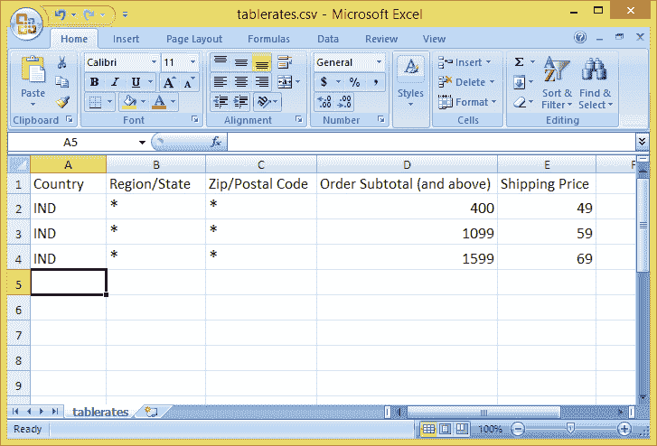

## 导入表费率数据

8.现在，回到 Magento2 中的运费表部分。

9.点击**选择文件**按钮导入更新后的 tablerates.csv 文件，然后从系统上传文件。

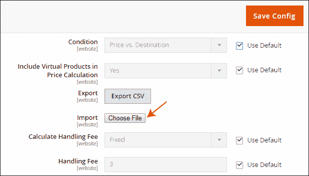

10.单击保存配置以完成表格费率发运方法。

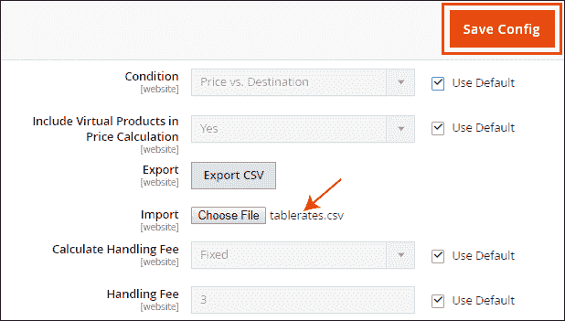

* * *****