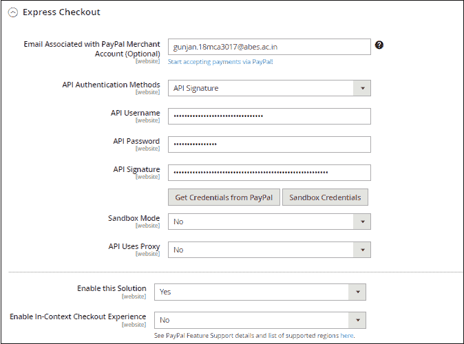

# PayPal 设置为 Magento2

> 原文：<https://www.javatpoint.com/paypal-setup-in-magento-2>

在本节中，我们将讨论如何使用 Magento2 将 PayPal 用作信用卡和 PayPal 支付的支付处理器。PayPal 是客户最安全的在线支付方式。使用 PayPal 和 Magento2，您可以通过借记卡、信用卡以及 PayPal 帐户持有者接受付款。PayPal 是一个值得信赖的支付网关，因其快速结账而被广泛使用。

下面给出了在 Magento2 中设置 PayPal 支付方式的步骤:

**步骤 1:** 登录到 Magento2 管理面板。

**第二步:**在 Magento2 的左侧栏，导航至**系统>T5】配置**。

**第三步:**在这里，你会得到页面左侧的选项列表。向下滚动至**销售**标签，点击**付款方式**选项。

**第 4 步:**在**商户位置**部分，从下拉列表中选择您的企业所在的商户国家或您的企业在哪个国家注册。

如果您没有在这里选择国家，那么默认情况下将使用常规配置中的国家。

#### 请注意如果您的 Magento 中有多个网站、商店或商店视图，那么您可以从左上角选择商店视图来应用支付配置。

**第五步:** Magento2 提供了以下支付方式，将 PayPal 作为额外的支付方式添加到结账页面。点击**支付宝快速结账**对应的**配置**按钮，进行支付宝设置。

**第 6 步:**提供完成 PayPal 设置所需的详细信息:

*   **与贝宝商户账户关联的电子邮件** -输入电子邮件，该电子邮件与接受付款的贝宝商户账户关联。
*   **API 认证方式** -选择 API 签名或 API 证书。
    *   **API 签名:**为 API 签名模式输入 API 用户名、API 密码和 API 签名。
        最快的方法是点击**从贝宝获取凭证**按钮，连接您的贝宝账户并获取这些信息。
    *   **API 证书:**输入 API 用户名、API 密码，上传 API 证书模式的 API 证书文件。

要创建一个贝宝账户并从贝宝获得应用编程接口证书[点击此处](#Create-PayPal-Account)。

*   **沙盒模式-** 如果您使用沙盒中的凭据进行测试沙盒帐户，请将**沙盒模式**选项设置为**是**。但如果您输入了生产凭据，则选择否
*   **API 使用代理-** 如果您的系统通过代理服务器与 PayPal 连接，选择**是**，否则选择否，如果您设置是，系统会要求您为代理主机配置一个 IP 地址，为代理端口配置一个端口号。
*   **启用此解决方案-** 要在前端结账时向客户显示 PayPal 支付方式，请将此字段设置为“是”。
*   将“是”设置为**启用上下文结账体验**字段。
*   **启用 PayPal 信用-** 如果你的商店允许你的商店使用 PayPal 信用，那么设置为“是”。

**第七步:**完成以上信息后，我们需要设置 PayPal 支付方式的基础设置和高级设置，如下图所示。

## 基本设置

**标题-** 输入付款方式的标题(我们可以将其保留为默认值)。

**排序顺序-** 在结账页面设置 PayPal 支付方式对应其他支付方式的顺序。例如，如果您将 1 设置为该字段，则该付款方式将出现在结账页面的第二位。

**支付操作-** 支付操作字段建议选择**销售**或**授权**或**订单**，这定义了如何在贝宝支付系统中处理支付。

如果您为付款活动字段选择**订单**，它将显示另外三个要完成的字段。您必须输入主要授权/订单的有效天数、订单有效期以及单个订单的最大授权数量。

#### 注意要更改任何字段的默认数据，需要联系 PayPal。

**显示在产品详细信息页面-** 将**是**设置为该字段，以显示使用贝宝按钮结账到产品页面。

## 高级设置

通过在字段中提供所需信息，完成高级设置。

**在购物车上显示:**将该字段设置为“是”，在购物车中显示使用 PayPal 按钮结账。

**付款适用自:**选择**所有允许国家/地区**接受所有国家/地区客户的 PayPal 快速结账。否则，选择特定国家/地区，接受您从列表中选择的某些特定国家/地区的客户的贝宝快速支票。

**调试模式:**将调试模式设置为是，将与支付系统的通信写入日志文件。

**启用 SSL 验证:**将该字段设置为**是**以启用主机真实性验证。

**转移购物车行项目:**通过设置“是”来启用此字段，以显示贝宝网站上按行项目列出的客户订单的完整摘要。

**转移运输选项:**将该字段设置为**是**以在汇总中包括最多十个运输选项。

**快捷按钮风格:**快捷按钮风格字段决定了用于 PayPal 接受按钮的图像类型。

选择**动态**显示可以从 PayPal 服务器动态更改的图像。否则，选择“静态”以显示无法从贝宝服务器动态更改的特定图像。

**启用 PayPal 客人结账:**该字段允许客户在没有 PayPal 账户的情况下使用该方法进行购物。

**要求客户的账单地址:**通过将该字段设置为“是”，客户必须提供所有采购的账单地址。否则，选择“否”排除该要求，或选择“仅适用于虚拟报价”仅适用于虚拟报价。

**计费协议签约:**在该字段中选择自动，允许客户在快速结账流程中签署计费协议或使用任何其他支付方式。

设置**询问客户**允许客户决定是在 PayPal 快速结账时签署计费协议，还是设置“永不”禁止在快速结账时签署计费协议。

**跳过订单审查设置:**将“跳过订单审查设置”字段设置为“是”，让客户从 PayPal 网站完成交易，而无需返回您的 Magento2。

**第 8 步:**点击**保存配置**按钮保存更改。

**第 9 步:**一旦我们配置了 PayPal Express Checkout 的支付方式，它就会以我们从后端设置的标准出现在前端。现在，客户可以选择贝宝支付方式并成功下单。

在这里，您可以看到 PayPal 结账按钮被添加到结账页面。现在，用于在线支付的贝宝结账支付方式已经准备好供客户使用。

#### 注意:如果在你的 Magento2 网站的结账页面上看不到支付方式，需要清空缓存，重新加载网站。

## 创建一个贝宝帐户，并获得应用编程接口凭据

为了首先获得应用编程接口用户名、应用编程接口密码和应用编程接口签名，我们需要在贝宝上创建账户。

**第一步:**前往 PayPal 网站[www.paypal.com](https://www.paypal.com/in/home)注册。通过提供所需信息，创建您想要创建的帐户。它可以是个人帐户或企业帐户。

创建账号后可以从这里获得 **API 用户名**、 **API 密码**、 **API 签名**。

**步骤 2:** 现在，使用您的注册 id 和密码登录 PayPal 帐户，使用以下链接[获取凭据](https://www.paypal.com/signin?returnUri=https%3A%2F%2Fwww.paypal.com%2Fcgi-bin%2Fwebscr%3fcmd%3d_profile%2dapi%2dsignature)获取应用编程接口凭据。它将直接将您重定向到请求应用编程接口凭据页面。

**步骤 3:** 您将被重定向到一个新窗口，如下图所示，您在该窗口中请求应用编程接口凭据。选择原料药签名或原料药证书，点击**同意并提交**按钮。我们在这里选择 API 签名。

**第 4 步:**它将移动到一个新的屏幕，在那里您可以查看和删除 API Signature，如下图所示。点击**显示对应于应用编程接口用户名、应用编程接口密码和签名的链接**。

**步骤 5:** API 用户名、API 密码和签名现在在屏幕上对您可见。复制并粘贴到贝宝快速结账配置。

* * *