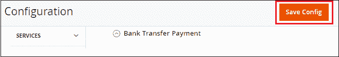

# 如何在 Magento 2 中设置支票/汇票支付方式？

> 原文:[https://www . javatpoint . com/如何设置-支票-汇票-付款方式-in-magento-2](https://www.javatpoint.com/how-to-setup-check-money-order-payment-method-in-magento-2)

**支票/汇票支付**方式是网店信用卡的替代方式。我们可以将支票/汇票设置为 Magento 2 中的默认支付方式，我们可以将其应用于我们的在线商店。在这种方法中，店主通过支票或汇票接受顾客购买的钱。要将支票/汇票设置为付款方式，请执行以下步骤:

**步骤 1:** 登录到 Magento 2 管理面板。

**第二步:**在 Magento 2 的左侧栏，转到**商店>T5】配置**。

**第三步:**在**销售**部分，点击**付款方式**。

**第 4 步:**在这里，我们需要展开**支票/汇票**部分，并通过提供所需的详细信息来完成给定的字段。

**启用:**在启用字段中，选择**是**激活支票/汇票支付方式。默认情况下，此字段处于启用状态。

**标题:**在标题字段输入付款方式名称，在结账时识别支票/汇票方式。

**新订单状态:**在新订单状态字段中，为新订单设置状态**待定**，直到管理员确认付款收据。

**来自适用国家/地区的付款:**在此字段中，选择**所有允许的国家/地区**以接受来自所有国家/地区的支票/汇票付款。否则，选择**特定国家/地区**为您选择的某些特定国家/地区的客户提供此付款方式。用 **Ctrl** 键选择具体的国家。

**开支票收款人:**输入支票和汇票收款人的账户持有人姓名。

**发送支票到:**提供发送支票或汇票的街道地址或邮政信箱。

**最小订单总额:**设置支票或汇票可以支付的最小订单金额。

**最大订单总额:**设置可通过支票或汇票支付的最大订单金额。

**排序顺序:**在该字段中，设置付款方式的支票/汇票的顺序，该顺序将在结账页面上显示给客户(从 0 开始)。

**第 4 步:**完成所有需要的详细信息后，点击**保存配置**按钮，确认 Magento 2 中的支票/汇票支付网关。

**第六步:**一旦我们保存了支票/汇款支付方式，它就会以我们从后端设置的标准出现在前端。客户可以选择自己喜欢的支付方式并成功下单。

#### 注意:如果在网站的结账页面看不到支付方式，需要清除 Cache，重新加载网站。

* * *