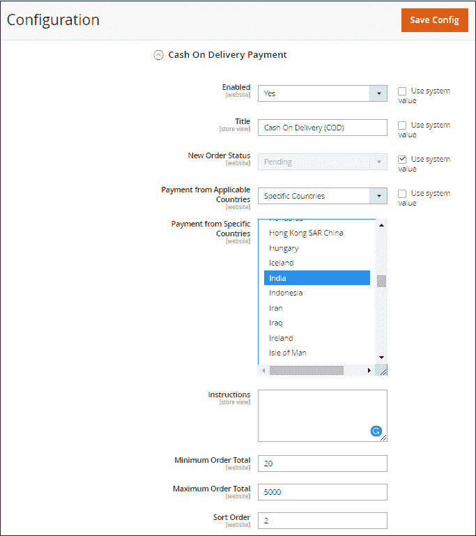
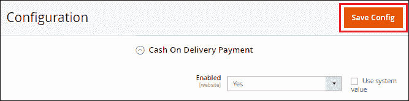
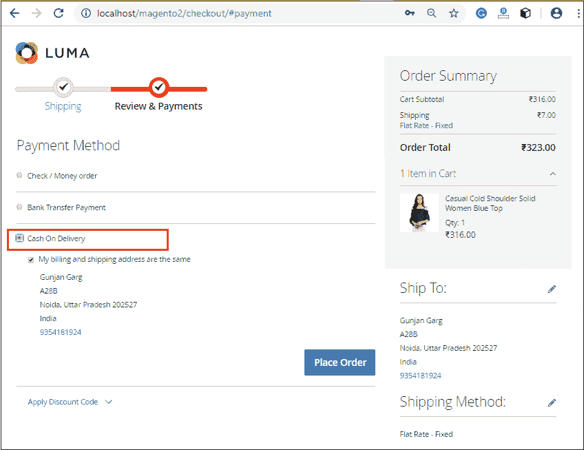

# 如何在 Magento 2 中设置货到付款(COD)支付方式？

> 原文：<https://www.javatpoint.com/how-to-set-up-cod-payment-method-in-magento-2>

在货到付款方式中，客户在接受运输公司订单时用现金支付货款。之后，船运公司把钱带回给店主。与其他支付方式类似，我们可以选择店主接受货到付款的国家。

要将货到付款设置为付款方式，请执行以下步骤:

**步骤 1:** 登录到 Magento 2 管理面板。

**第二步:**在 Magento 2 的左侧栏，转到**商店>T5】配置**。

**第三步:**在**销售**部分，点击**付款方式**。

**第 4 步:**展开**货到付款**支付部分，为我们的 Magento 2 商店进行配置。在这里，我们将找到几个字段来配置支付方式。

#### 注意:要编辑字段的默认值，请清除使用系统值复选框并编辑字段值。

**已启用:**要在结账页面上将货到付款方式显示给客户，请将**是**设置为该字段。

**标题:**输入一个合适且易于理解的标题，该标题将在前端对客户可见。

**新订单状态:**对于新订单，将此字段设置为**待定**，直到管理员授权收到付款。

**适用国家付款:**通过选择**所有允许国家**，所有国家的客户都可以使用货到付款进行付款。

**特定国家付款:**如果我们选择**特定国家**，那么特定国家的客户将适用于使用我们从列表中选择的这种付款方式。用 **Ctrl** 键选择国家/地区的号码。

**说明:**输入客户进行货到付款必须遵循的说明。

**最小订单总额:**设置最小订单总额，以符合货到付款方式。

**最大订单总额:**使用此支付方式将最大订单金额设置为限额。

**排序顺序:**输入订单号，在结账页面对该支付方式的位置进行排序。

**第五步:**点击**保存配置**按钮，在 Magento 2 中确认货到付款。

**第 6 步:**一旦我们保存了货到付款(COD)的支付方式，它就会以我们从后端设置的标准出现在前端。客户可以根据自己的选择选择付款方式并成功下单。

* * *