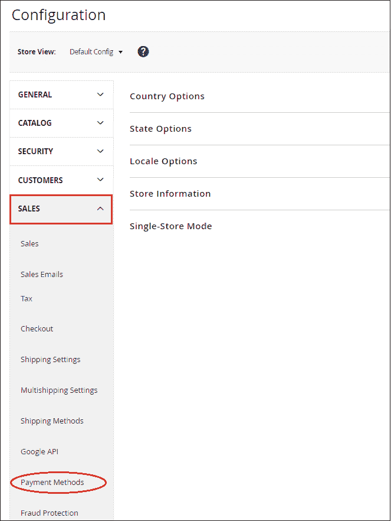
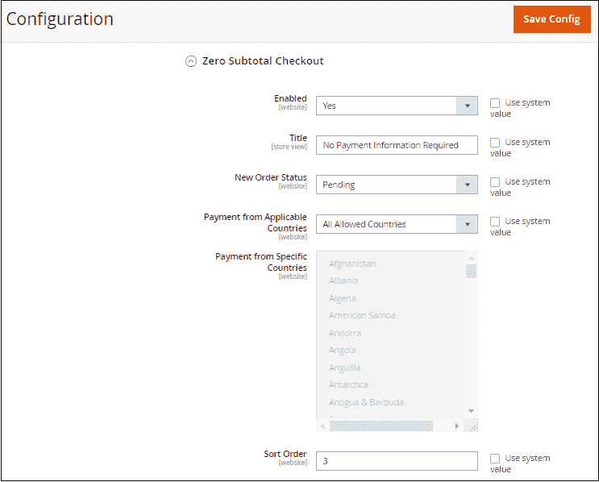
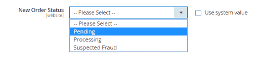
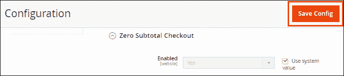

# 如何在 Magento 2 中设置零小计结账支付方式？

> 原文：<https://www.javatpoint.com/how-to-set-up-zero-subtotal-checkout-payment-method-in-magento-2>

**零小计结账**付款方式仅适用于管理员创建的订单。顾客从来不会对免费产品说不，所以零小计结账是一种支付方式，对于总计等于零的订单来说是需要的。这可能是折扣的结果，也可能是由于之前订单中的产品或免费送货的优惠券有任何问题而由管理员手动创建的。

要将零小计结账设置为付款方式，请执行以下步骤:

**步骤 1:** 登录到 Magento 2 管理面板。

**第二步:**在 Magento 2 的左侧栏，转到**商店>T5】配置**。

**第三步:**在**销售**部分，点击**付款方式**。

**第 4 步:**在这里，我们需要展开**零小计结账**部分，并通过提供所需的详细信息来完成给定的字段。

**标题:**在结账时输入标题识别方法。

**启用:**将**是**设置为此字段，以启用零小计结账。

**新订单状态:**这里有三个选项，我们根据以下条件选择:

*   对于等待授权的新订单，将**待定**设置为此字段。
*   如果已经授权付款并且正在处理交易，则设置**处理**。
*   如果检测到欺诈，设置**可疑欺诈**。

**来自适用国家/地区的付款:**如果店主希望从所有国家/地区接收零小计结账，请将**所有允许国家/地区**设置为此字段。否则，选择**特定国家**。

**从特定国家付款:**通过在“从适用国家付款”字段中选择特定国家，零小计结账仅被我们选择的特定国家的客户接受。

**排序顺序:**输入一个排序号，指定零小计结账在支付方式列表中的位置，如 0 代表第一，1 代表第二，2 代表第三，依此类推。它将在结账时以相同的顺序显示在前端，我们在这里定义。

**第五步:**完成后，点击**保存配置**按钮，确认零小计结账付款方式。

**第六步:**一旦我们保存了零小计结账支付方式，它将会以我们从后端设置的标准出现在前端。客户可以选择自己喜欢的支付方式，成功下单。

* * *