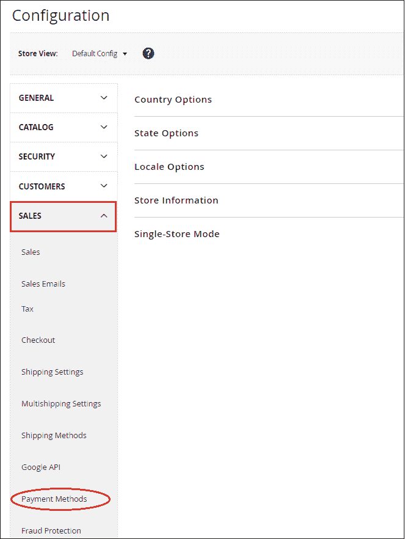

# 如何在 Magento2 中设置采购订单(PO)支付方式？

> 原文：<https://www.javatpoint.com/how-to-set-up-purchase-order-payment-method-in-magento-2>

采购订单是一种付款方式，允许商业客户通过参考采购订单编号来支付其授权采购。采购订单通常适用于批发订单。采购订单是预先授权和发布的。

要将采购订单设置为付款方式，请执行以下步骤:

**步骤 1:** 登录到 Magento2 管理面板。

**第二步:**在 Magento2 的左侧栏，转到**商店>T5】配置**。

**第三步:**在**销售**部分，点击**付款方式**。

**第 4 步:**在这里，我们需要展开**采购订单**部分，并提供设置 Authorize.net 付款方式所需的详细信息。

**启用:**将**是**设置为此字段，以在前端激活采购订单。

**标题:**输入标题，以便顾客在结账时识别该方法。

**新订单状态:**将**待定**设置为此字段，以便新订单等待授权。

**来自适用国家/地区的付款:**如果店主希望从所有国家/地区接收零小计结账，请将**所有允许国家/地区**设置为此字段。否则，选择**特定国家**。

**来自特定国家的付款:**通过选择适用国家付款的特定国家，采购订单(PO)仅被我们选择的特定国家的客户接受。

**最小订单总额:**设置符合此付款方式所需的最小总额。

**最大订单总额:**与最小订单总额类似，设置符合此支付方式所需的最大总额。

**排序顺序:**输入一个排序号，指定零小计结账在支付方式列表中的位置，如 0 代表第一，1 代表第二，2 代表第三，依此类推。它将在结账时以相同的顺序显示在前端，我们在这里定义。

**第五步:**完成后，点击**保存配置**按钮，确认采购订单付款方式。

**第 6 步:**一旦我们保存了采购订单(PO)的付款方式，它就会以我们从后端设置的标准出现在前端。客户可以选择自己喜欢的支付方式并成功下单。

* * *