# Magento2 订单处理

> 原文：<https://www.javatpoint.com/magento-2-order-processing>

在本节中，我们将讨论客户如何创建订单以及管理员如何处理订单。客户需要在您的网站上创建一个帐户来下单或处理订单。要在前端处理订单，请执行以下步骤:

在 Magento2 网络商店上，转到添加产品的网站。使用 Magento2 商店网站，顾客可以订购任何产品。

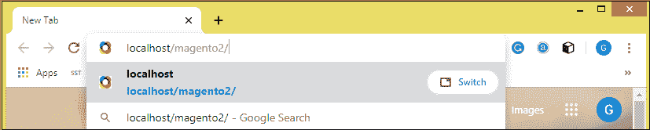

## 没有账户就下单

**第一步:**通过点击**添加到购物车**按钮，将您想要添加的产品添加到购物车中，该按钮在产品下方。

#### 注意:您可以直接将产品添加到购物车中，而无需账户，也可以放置产品。但是在跟踪你的订单时，你必须创建一个使用相同的电子邮件 id 的账户，你已经用这个 id 下了订单。

**第二步:**在这里可以看到产品被添加到购物车中。点击右上角的购物车，继续结账。

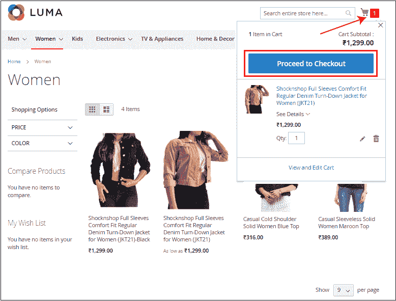

您可以通过点击**查看和编辑购物车**链接来增加或减少产品数量。

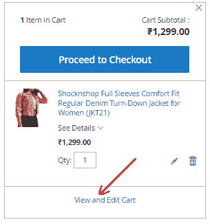

**第三步:**现在，您需要在发货地址中提供详细信息，并选择发货方式。单击“下一步”按钮继续。

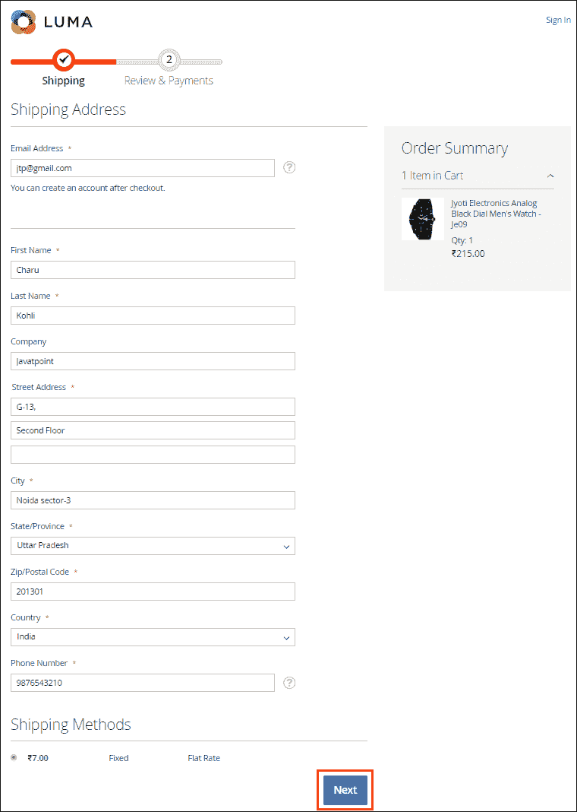

**第四步:**选择您喜欢的支付方式，点击**下单**按钮。我们在这里选择货到付款方式。

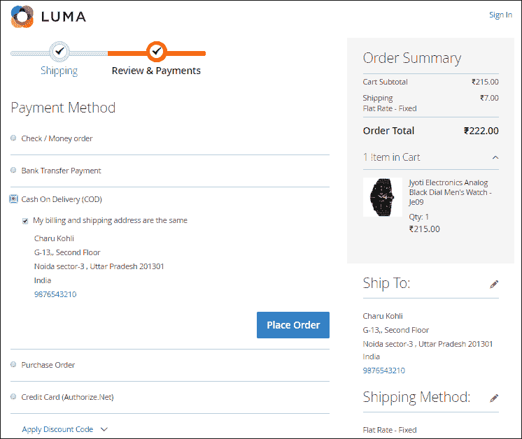

**第五步:**订单成功完成。继续购物或注册以跟踪您的订单状态。

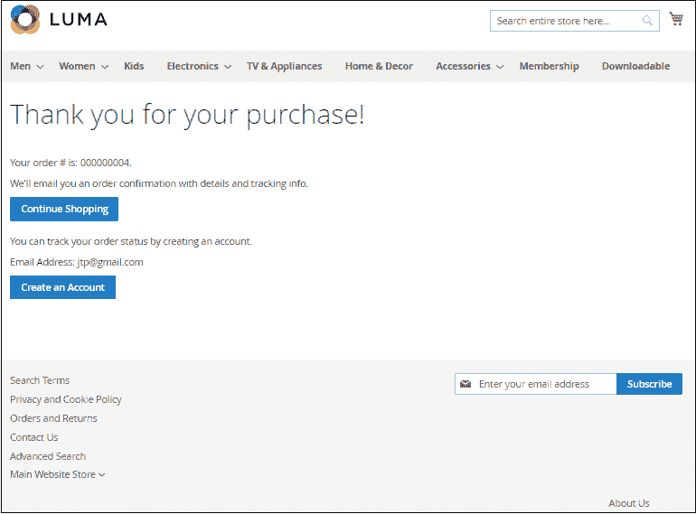

## 创建帐户后下单

**第一步:**如果你是新客户，那么你需要注册。点击右上角**新建账户**新建账户。

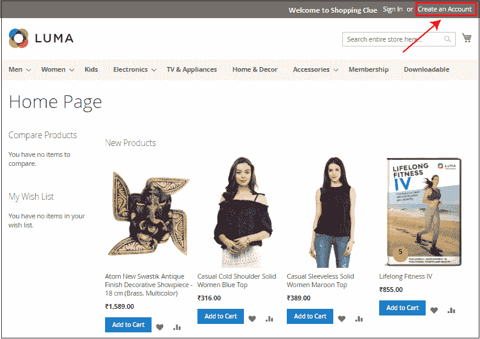

**步骤 2:** 在给定的字段中提供所需的详细信息，并点击**创建账户**按钮提交详细信息。

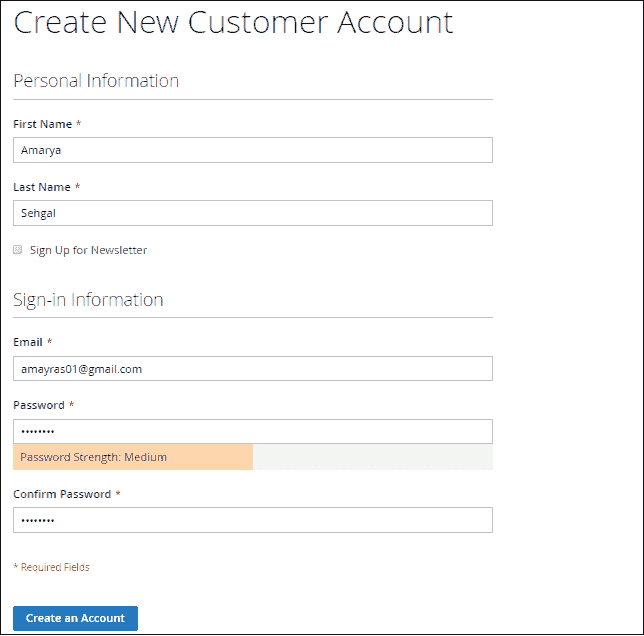

**第三步:**您已在网站成功注册。

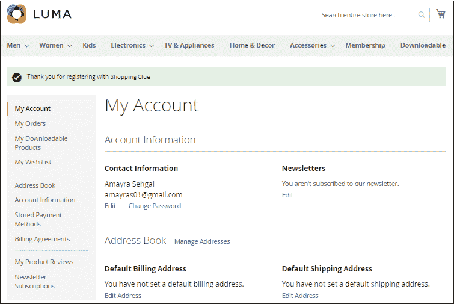

**第四步:**现在，创建完账户后，回到首页，将产品添加到购物车中，您要订购的产品。

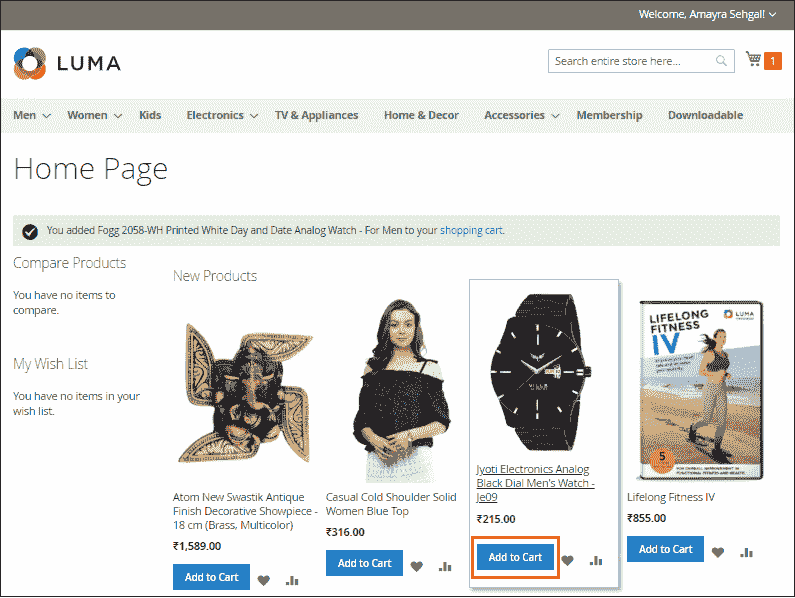

**第五步:**在这里可以看到产品被添加到购物车中。点击右上角的购物车，继续结账。

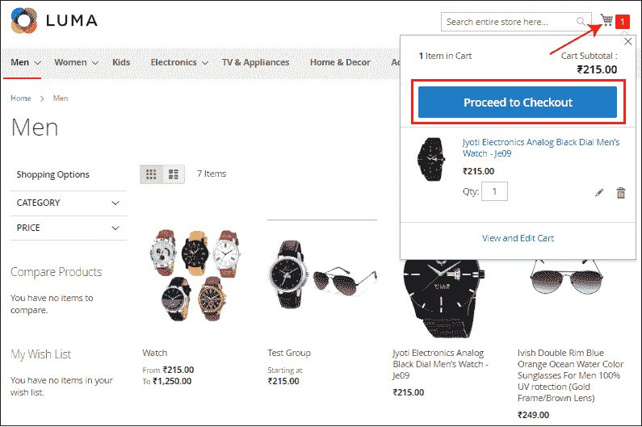

#### 注意:您甚至可以通过点击查看和编辑购物车按钮来编辑产品的数量。

**第 6 步:**现在，提供下订单的发货地址，你要发货的地方，同时选择发货方式。点击**下一步**按钮继续。

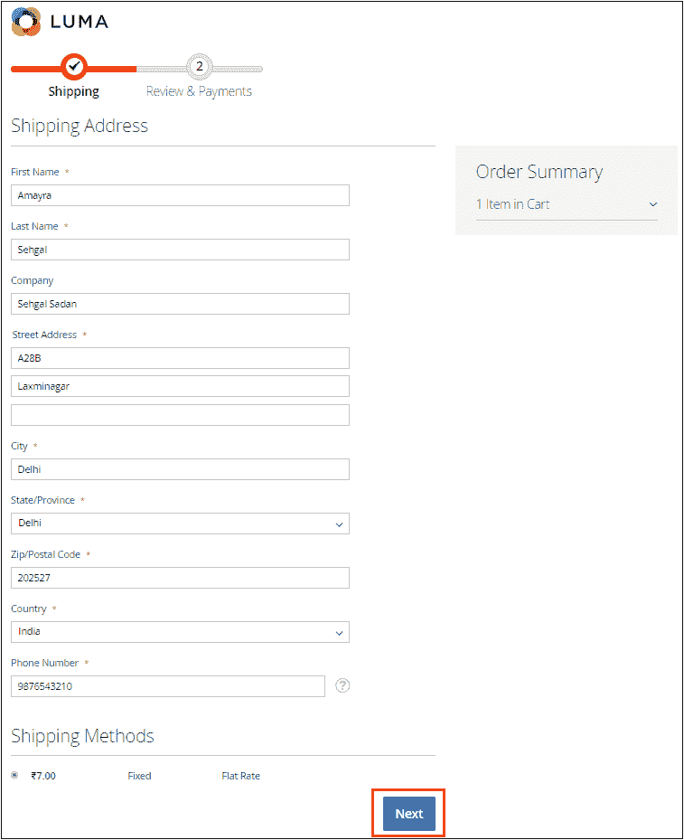

**第七步:**选择您喜欢的支付方式，点击**下单**按钮。

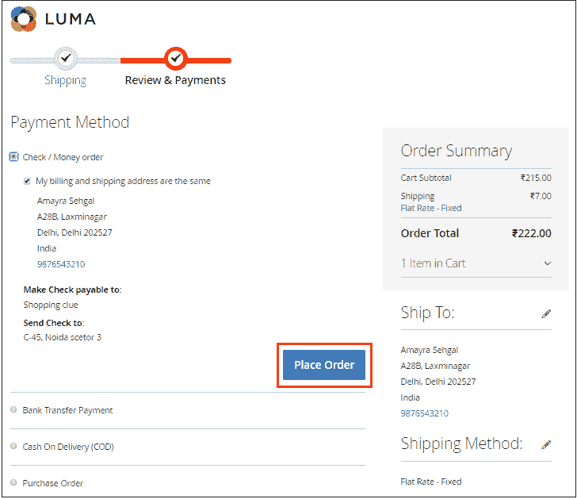

订单已成功下单。现在继续购物或跟踪您的订单状态。

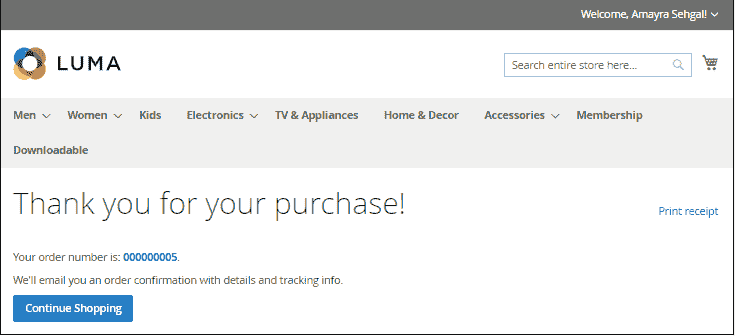

要查看此订单，请转到 Magento2 后端的**销售> >订单**。早些时候，当我们为 Magento2 设置基本配置时，我们看到我们为订单启用了异步索引。因此，除非我们的索引完成，否则我们无法在这里看到订单。

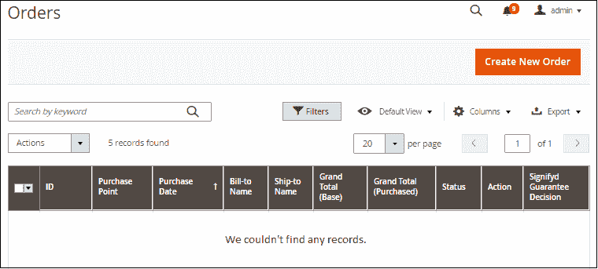

如果没有找到记录，则转到**商店> >配置**。

在左侧导航栏上，点击**高级**选项卡下的**开发者**。

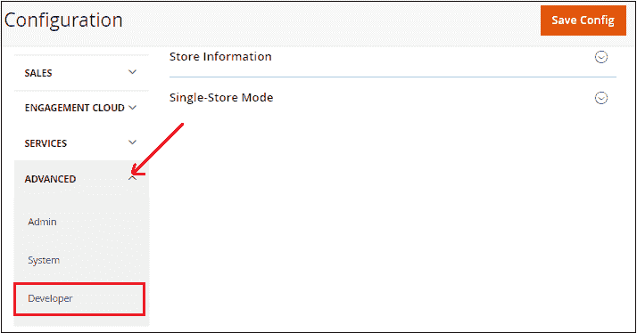

现在，浏览网格设置部分。清除使用系统值并将**禁用**设置为**异步步进**字段。点击**保存配置**按钮。

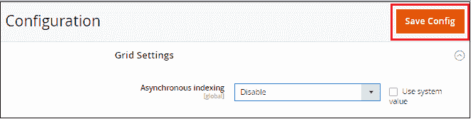

转到**缓存管理**并清除缓存，再次刷新页面。

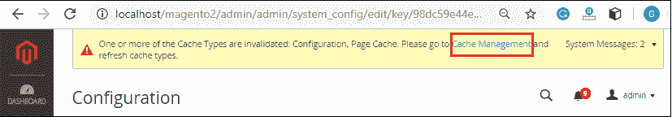

再次前往 Magento2 导航栏上的**销售> >订单**。您可以看到订单列表现在在页面上可见。默认情况下，订单状态为**待定**。

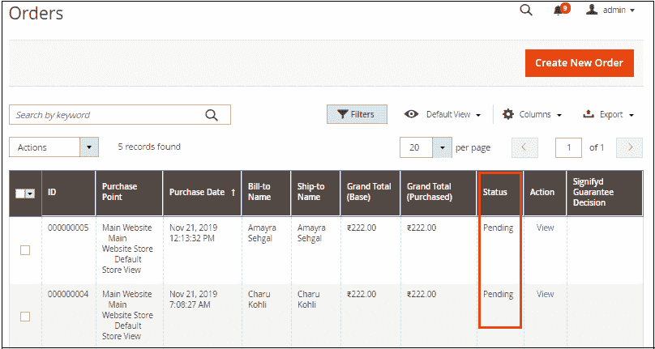

点击订单对应的**查看**链接，查看订单信息并进行处理。在这里，我们将查看并处理订单编号 **#000000004** ，该订单当前处于待处理状态。

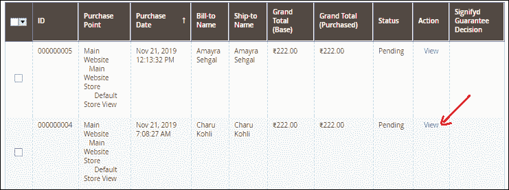

在这里，您将看到订单和客户账户的详细信息、账单地址、付款和运输方式、订购的项目和订单总额等。

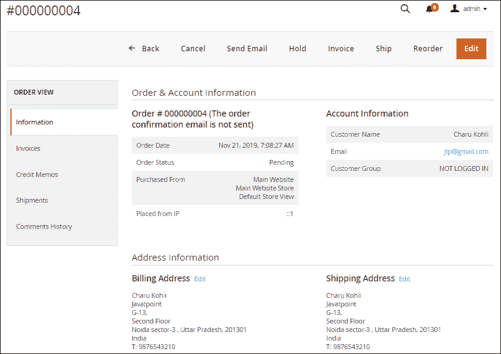

默认情况下，Magento2 的订单处理包括两个步骤:

1.  货品计价
2.  船舶

首先，我们会去看发票，然后是运输。所以，点击发票。我们将为所有项目开发票。因此，如果需要，我们可以增加和减少项目。

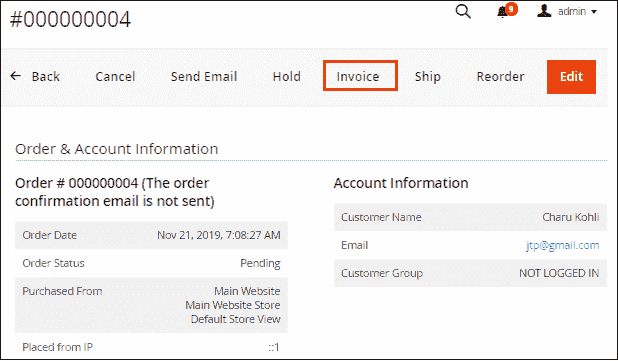

向下滚动并给出发票注释，如果需要，还可以向客户发送发票的电子邮件副本。点击**提交发票**按钮创建发票。

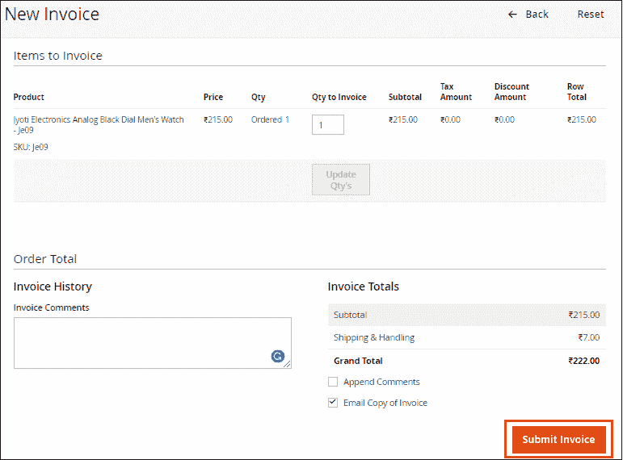

创建发票后，导航至**销售>T5】订单**再次进入订单列表，查看订单状态。默认情况下，订单状态为“待定”，现在在为订单编号**# 00000004**创建发票后，订单状态更改为“处理”。

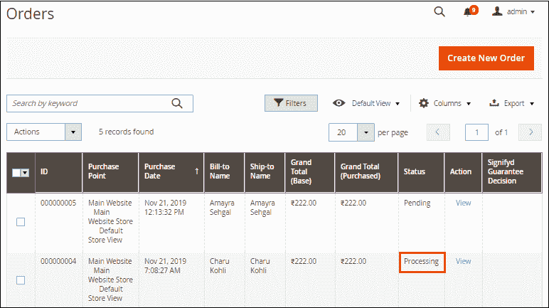

现在，下一步是**发货**。单击订单# 00000004 对应的查看操作。转到同一订单#000000004 的发运，该订单现在处于处理状态，并在同一页面上为该订单创建装运。

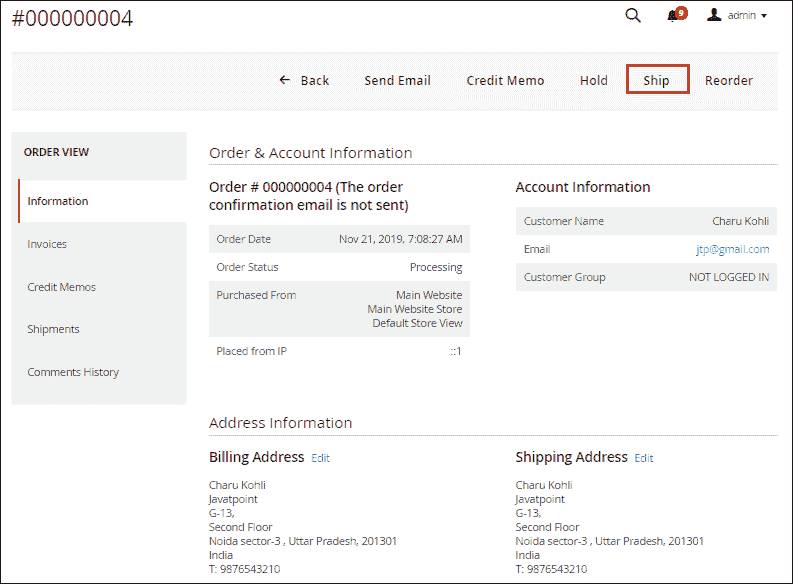

向下滚动并添加一个跟踪编号，以便在“付款和运输方法”部分下跟踪订单。

点击**添加跟踪号**按钮。在此添加跟踪信息，如-承运人、标题和编号。

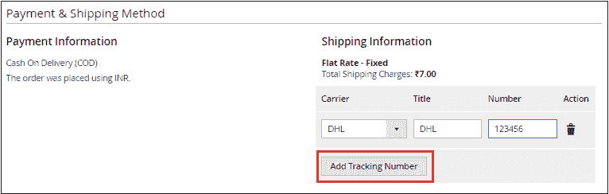

在同一页面上，您可以在注释部分提供装运注释，并通过选中复选框(如果需要)向客户发送装运的电子邮件副本。否则，保持原样，点击“提交装运”按钮，继续完成订单。

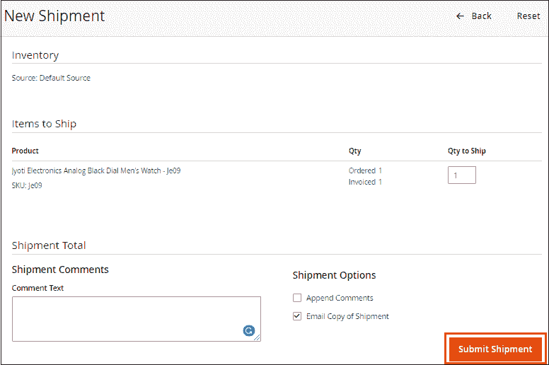

装运现已创建。返回订单列表并刷新页面。您可以看到订单状态从订单编号 **#000000004** 的处理状态变为**完成**。

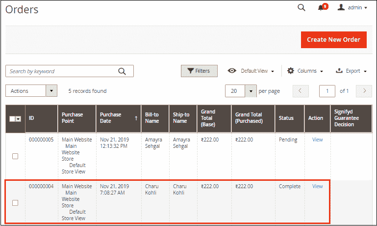

## Magento2 订单处理中需要注意的点:

*   最初，订单的状态为“待定”。
*   创建发票后，它将转换为“处理”状态。
*   当您完成装运时，这意味着订单已送达客户，状态更改为“完成”。

* * *