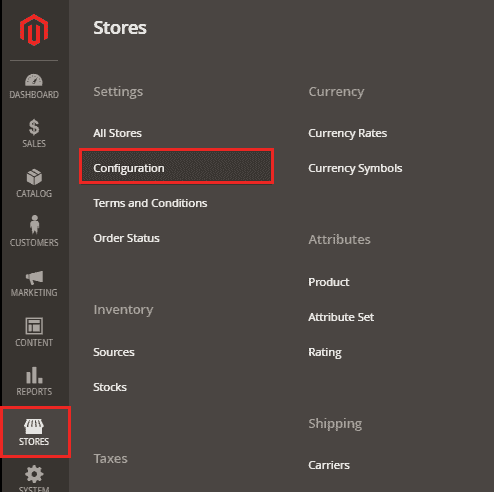
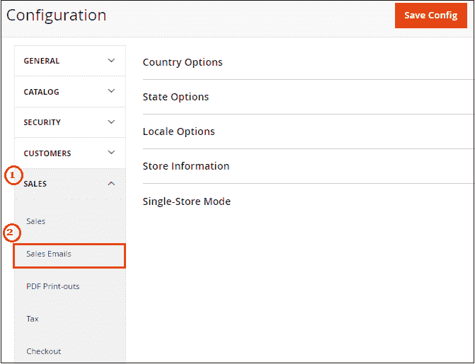
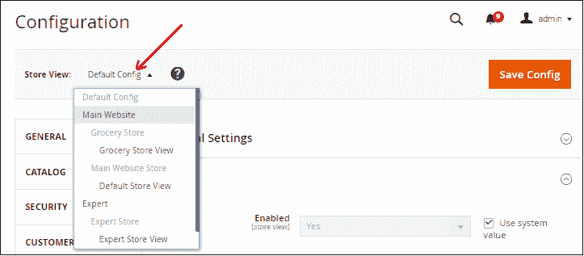
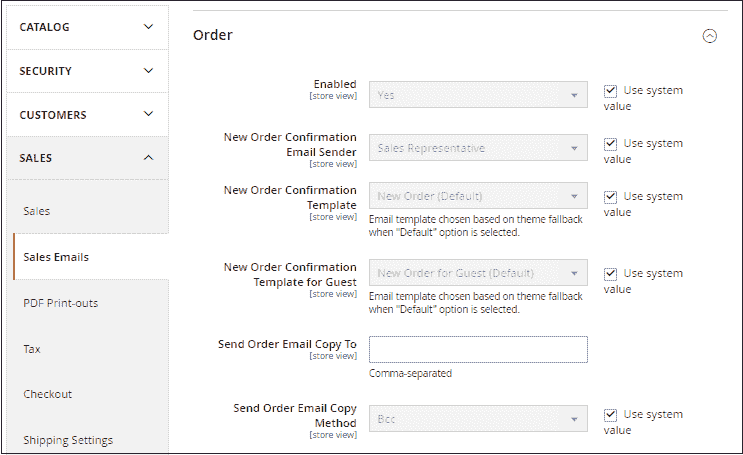
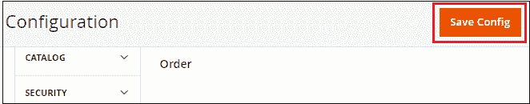

# 如何在 Magento2 中设置订单电子邮件

> 原文：<https://www.javatpoint.com/set-up-order-emails-in-magento-2>

在本节中，我们将描述 Magento2 如何管理电子邮件，如何编辑电子邮件内容，以及设置电子邮件的发送和接收参数等。Magento 有一个名为**销售邮件**的内置功能，管理订单处理时发送给客户的电子邮件。在配置您的电子邮件之前，您可能需要添加一个新的电子邮件模板。为此，下面给出了一些步骤，描述了如何在 Magento2 中设置订单电子邮件。

**步骤 1:** 登录到 Magento2 管理面板。

**步骤 2:** 在 Magento2 管理面板上，导航至**商店**菜单，点击**配置**选项。

**第三步:**在导航栏左侧，转到**销售>T5】销售邮件**。

**第 4 步:**在**当前配置范围**下选择要应用该配置的范围。单击下拉列表并选择商店视图。默认情况下，设置**默认配置**。

**第 5 步:**在“销售邮件”部分下，浏览**订单**部分，并完成以下字段，如下所示。

**启用:**将**是**设置为该选项，以启用发送新订单确认电子邮件。

**新订单确认邮件发送人:**此字段用于选择电子邮件地址，用于发送新订单的确认。

**新订单确认模板:**此字段选择用于发送给注册客户的订单确认电子邮件的模板。

**客人的新订单确认模板:**此字段选择用于订单确认电子邮件的模板，发送给在您的商店没有账户的客人客户。

**发送订单电子邮件副本至:**指定新订单确认电子邮件副本发送至的电子邮件地址。

**发送订单电子邮件副本方式:**使用此字段，您可以使用**密件抄送**或**单独电子邮件**将新订单确认电子邮件的副本发送至附加电子邮件地址。

密件抄送-它发送一份“盲礼副本”，在发送给客户的同一封电子邮件的标题中包含收件人。客户看不到密件抄送收件人。

独立电子邮件-以独立电子邮件形式发送副本。

**步骤 6:** 完成设置后，点击**保存配置**按钮保存更改。

**步骤 7:** 同样，完成其余销售邮件的配置:

*   发票
*   装运
*   付款通知

* * *