# Magento 2 中的搜索引擎优化

> 原文:[https://www . javatpoint . com/search-engine-optimization-in-magento-2](https://www.javatpoint.com/search-engine-optimization-in-magento-2)

Magento 2 是最友好的搜索引擎系统之一。它是运营基于网络的业务的重要组成部分，也是在线营销的基本形式。Magento 用户关心的问题之一是 SEO(搜索引擎优化)。虽然安装的时候已经是 SEO 友好了，但是还有几个地方，还是可以改进的。

为了让你的万磁王电子商店对潜在买家更加可见，网站管理员需要提高电子商店在搜索引擎结果中的排名。客户会喜欢你的网站，如果你的网站容易导航，干净，容易访问。

Magento 允许管理网址，处理链接，并创建图像，使其易于使用搜索引擎优化，以便您的网站可以很容易地在搜索引擎索引。安装和设置商店后，您可以从 web 配置菜单开始为搜索引擎优化您的网站。

下面列出了一些需要立即修复的著名 Magento 技术问题的搜索引擎优化技巧:

*   多个页面的内容重复问题
*   在 Magento 2 中设置一个 XML 站点地图
*   非优化的 HTML 网站地图
*   优化产品形象
*   修改机器人文件
*   加快你的 Magento 2 电子商务
*   从网址中删除默认存储代码
*   在 Magento 2 中启用搜索友好的 URL
*   Magento 2 默认标题和描述的问题
*   通过不同的平台获得优质的商店链接
*   将博客页面添加到您的 Magento 2 商店
*   如何为产品/类别和内容页面添加元标题和描述

下面给出的步骤将描述如何在 Magento 中设置 SEO

**第一步:**登录到 Magento 2 的管理面板。

**第二步:**进入左侧导航栏的**商店**菜单，点击**配置**选项。

**第三步:**在左侧导航栏中，转到**通用**并点击**网页。**

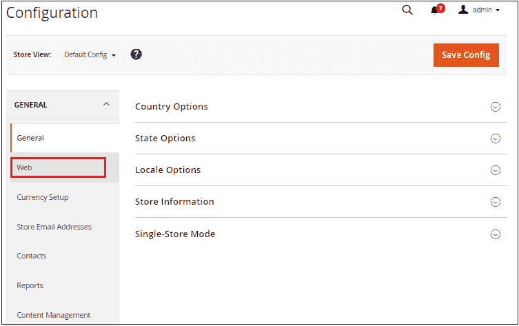

**第四步:**展开**网址选项**部分，将**添加商店代码到网址**选项设置为**否，**不添加商店代码到网址。

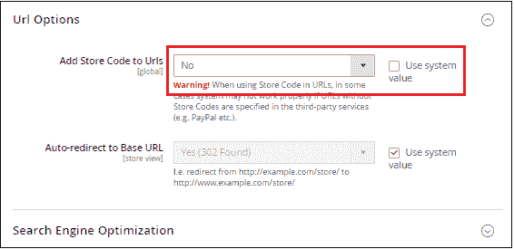

**第五步:**在**搜索引擎优化**面板上，将**是**设置为**使用 Web Server 重写**生成更具搜索友好性和可读性的 URL。

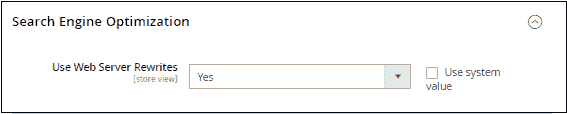

**第 6 步:**点击**保存配置**按钮保存更改。

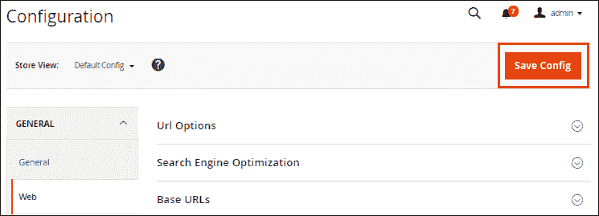

## 几页的重复内容问题

重复内容是影响成千上万 Magento 所有者的最常见的 SEO 问题之一。我们可以使用**规范标签**来去除重复的内容。

**第七步:**为避免网址重复，前往**系统>T5】配置>T7】目录>T9】目录。**(点击目录部分下的目录选项。)

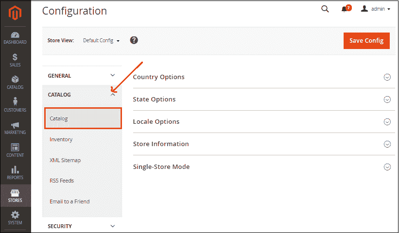

**步骤 10:** 展开 SEO(搜索引擎优化)部分。

*   将**否**设置为产品网址的使用类别路径。
*   将规范链接元标签字段都设置为**是**，以防止当您想要在多个类别中显示同一产品时，Magento 生成重复的内容。
*   所有设置完成后，点击**保存配置**按钮。

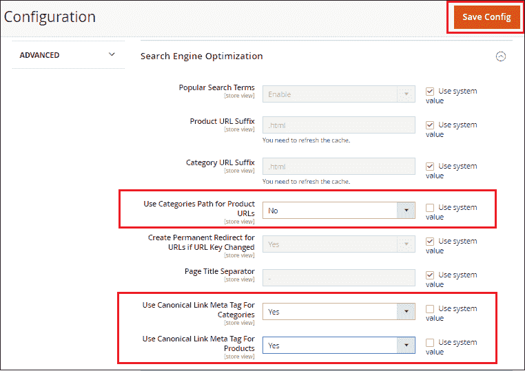

在 Magento 2 中，由于以下原因会出现重复内容:

*   页码
*   产品过滤
*   产品分类
*   不同类别的相同产品
*   同一产品的变异

**第 8 步:**更改默认机器人的设置，设置默认页面标题。转到 Magento 左侧面板的**内容> >配置**。

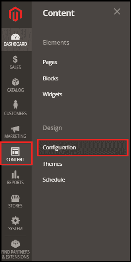

**第九步:**在设计配置面板上，点击你的网站对应的编辑链接。

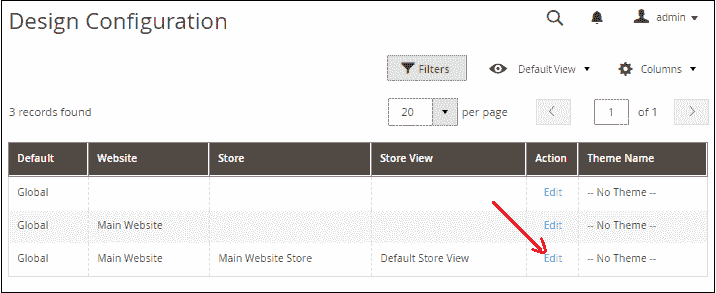

**第十步:**向下滚动，展开【其他设置】下的 **HTML 标题**部分。

*   在页面的默认标题和默认描述中输入标题和描述。

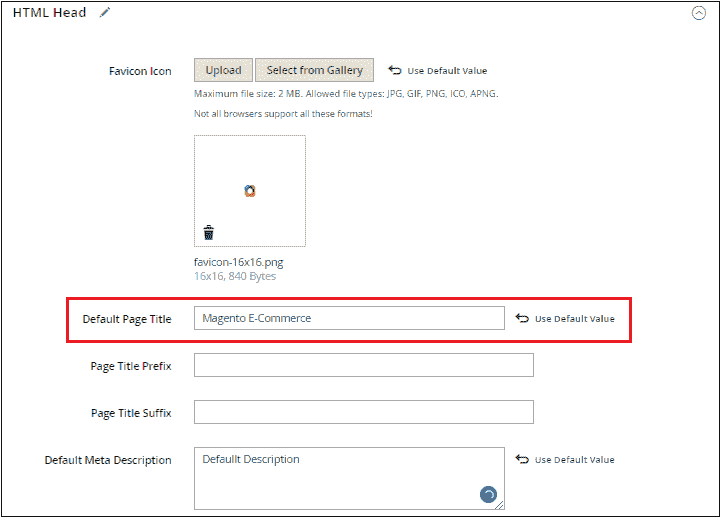

**第 11 步:**展开**搜索引擎机器人**并执行以下操作-

*   将*默认机器人*字段更改为**索引，跟随**选项，以便搜索引擎可以索引您的网站并在搜索结果中显示。

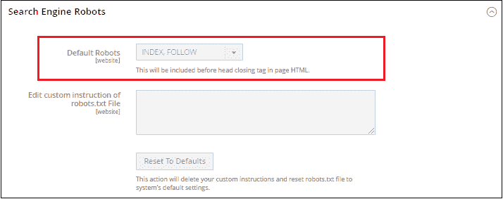

**步骤 12:** 完成后，点击**保存配置**按钮。

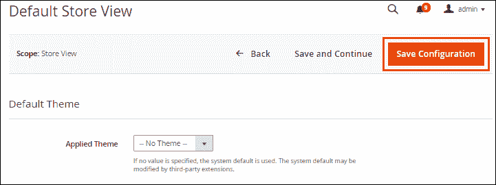

* * *