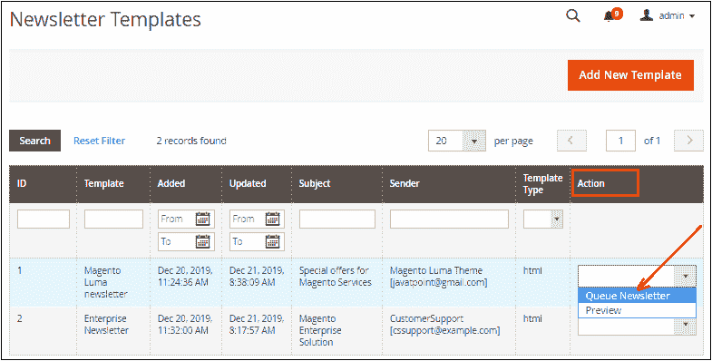

# Magento 设置通讯

> 原文：<https://www.javatpoint.com/setup-newsletter-in-magento-2>

新闻稿制作是与买家或客户沟通过程的一部分。客户可以使用 Magento 订阅时事通讯。客户还可以在创建包含“注册”复选框的新客户帐户时注册时事通讯。要创建简讯，您需要启用简讯选项，以确保客户已确认收到简讯。

时事通讯是一个重要的文件，用来通知客户你的商店的活动，如促销、折扣或忠诚度计划。要启用和配置简讯，请遵循以下步骤-

**步骤 1:** 登录到 Magento 管理面板。

**第二步:**在左侧栏，转到**商店>T5】配置**。

**第三步:**在左侧导航栏中，展开**客户**部分，点击**快讯。**

**第 4 步:**展开**常规选项**部分，选择是启用字段以启用简讯。

简讯已启用。现在，您可以创建时事通讯。

**第 5 步:**展开**订阅选项**部分。清除**需要确认**字段对应的使用系统值，并在其中设置为是。点击**保存配置**按钮保存更改。

#### 注意:是，选项指定客户要订阅简讯。

## 创建简讯模板

在向客户发送简讯之前，您需要创建简讯模板。

要创建简讯模板，请按照以下步骤操作-

**步骤 1:** 登录到 Magento 管理面板。

**第二步:**在左侧栏，转到**营销>T5】简讯模板。**

**第三步:**点击**添加新模板**按钮。

**第四步:**会显示一些与简讯模板相关的设置。填写所有必填字段，点击**保存模板**按钮，如下图所示。

**模板名称-** 提供您的模板名称，供内部参考。

**模板主题-** 指定向客户发送简讯的原因或目的。

**发件人姓名-** 指定发件人姓名。默认情况下，会提到客户支持。我们需要在这里提供我们的细节。

**发件人邮箱-** 输入发件人的邮箱，发送给客户。

**模板内容-** 它提供了一个文本编辑器，可以在其中添加邮件正文的 HTML 代码。请注意，不允许删除取消订阅链接。您也可以通过单击相应的插入按钮在此处插入图像、小部件或变量。

**模板样式-** 这是用于格式化您的新闻稿内容。模板样式是由 CSS 专家完成的，因为这里应用了某种 CSS 代码。

**第五步:**点击保存模板附近右上角的**预览模板**按钮，预览简讯。然后，如果你需要，你可以很容易地做需要的即兴表演。

见下面截图。模板将如下所示。

**步骤 6:** 点击**保存配置**按钮。

新闻稿模板已成功创建。现在，它已准备好发送给您的客户或订户。

## 发送简讯

现在，您可以将简讯发送给您的订户。要发送，请遵循以下步骤:

**步骤 7:** 在简讯模板页面上，从下拉列表中选择与您创建的简讯模板相关的操作**队列简讯**。

**第八步:**会弹出一个页面，提供一些设置，如下图截图所示。填写字段，点击**保存简讯**按钮，将简讯发送给订户。

**排队日期开始-** 选择您要开始发送简讯的日期。

**订户自-** 显示当前和以前的订户列表。

**主题-** 主题字段指定电子邮件的主题。

**发送方名称-** 指定要发送给客户的发送方名称。

**发件人电子邮件-** 指定要发送给客户的发件人电子邮件。

**消息-** 它提供了允许输入邮件消息的文本编辑器。

* * *