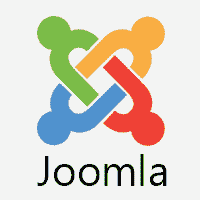

# Joomla 教程

> 原文：<https://www.javatpoint.com/joomla>

Joomla 是一个开源的内容管理系统(CMS)，用于构建漂亮的网站和强大的在线应用程序。它是用 PHP 编写的，由开源公司开发。它建立在一个模型-视图-控制器网络应用程序框架上，可以独立于内容管理系统使用。它是免费的，使用面向对象的编程和软件设计模式。它使用 MySQL、MS SQL 或 PostgreSQL 数据库来存储数据。

我们的教程将包括 Joomla 的所有基本和高级主题，这些主题将指导您如何轻松创建网站。本教程分为不同的部分，如 Joomla 基础、Joomla 菜单、Joomla 模块、Joomla 全局设置和 Joomla 高级，包含所有相关主题的截图和示例。

## Joomla 是什么？

Joomla 据说是最好的开源**内容管理系统(CMS)** 之一，可以用来构建强大的网站和在线应用。它是免费的、可扩展的，并分为前端和后端模板(从管理员端运行)。它建立在模型-视图-控制器框架上，可以独立于内容管理系统使用。

Joomla 是一个基于**PHP****MySQL**的平台。Joomla 还支持第三方扩展和模板，允许我们进行进一步的定制以满足特定的需求。它对任何想要开发扩展和模板的人开放。

## 什么是内容管理系统？

内容管理系统是一个基于网络的应用程序，它跟踪整个数据(即文本、照片、音乐、文档等)。).它包括创建、编辑、归档、发布、协作、报告、分发网站内容、数据和信息的管理。

## 为什么要用 Joomla？

基本上有三个最流行的 CMS 可用，即 **Joomla、Drupal、**和 **Wordpress** 。除此之外，还有无数其他不太受欢迎的内容管理系统可用。它们之间的差异可能相当显著，尽管它们基本上都是为了做同样的事情而开发的。他们的主要目的是帮助您创建和管理您的网站。

Joomla 是易于安装和设置的完美工具。使用 Joomla 不需要是高级用户。一个对 **HTML** 和 **CSS** 知之甚少的人可以使用它。Joomla 扩展目录中有成千上万个可用的扩展，可以用来增强功能。Joomla 还包含一个强大的应用程序框架，帮助开发人员创建复杂的附加组件，将 Joomla 的能力提升到几乎无限的方向。

核心 Joomla 框架帮助开发人员快速轻松地构建:

*   库存控制系统
*   数据报告工具
*   应用程序桥
*   定制产品目录
*   综合电子商务系统
*   复杂业务目录
*   预订系统
*   沟通工具

## Joomla 的应用

Joomla 可用于:

*   公司网站或门户、内部网和外部网
*   小型商业网站
*   在线杂志、报纸和出版物
*   电子商务网站和在线预订
*   政府、非营利和组织网站
*   基于社区、学校、学院的网站或门户
*   个人博客或家庭主页

## Joomla 的优势

*   这是一个免费的开源平台。
*   安装和设置非常简单。
*   它使用**所见即所得(*所见即所得* )** 编辑器，有助于非常轻松地编辑内容。
*   默认情况下，几乎所有浏览器都支持它。
*   它有一个简单的菜单创建工具。
*   它提供了几个模板和主题，使用起来非常灵活。
*   它可以迁移到任何服务器，大多数服务器都可以与任何数据库一起工作。
*   它拥有广泛的社区支持，可以轻松地提出问题并获得解决方案。
*   它基于 PHP 脚本，因此在使用它的框架时兼容性问题会受到限制。
*   它确保了数据内容的安全性和安全性，并且不允许在没有管理员权限的情况下编辑数据。

## Joomla 的缺点

*   当几个模块、扩展和插件同时安装时，就会出现兼容性问题。
*   Joomla 的一些重要插件和模块是付费的。
*   但是，它有许多模块、附加组件和模板，对于更高级的用户来说仍然是有限的。
*   它相当复杂，没有开发者经验很难获得定制设计。
*   不多 **SEO ( *搜索引擎优化* )** 友好。
*   它使网站的加载和运行变得沉重，导致更多的时间。

## 先决条件

在开始本教程之前，我们假设您已经掌握了 HTML 和 CSS 的基本知识。如果您不了解 HTML 和 CSS 的基本规则，那么我们建议您浏览我们关于 HTML 和 CSS 的教程。

## 观众

本教程旨在帮助初学者和专业人士。

## 问题

我们向您保证，您在本教程中不会发现任何问题。但是如果您发现任何错误，请将问题发布在联系表中，以便我们尽快更新。

* * *