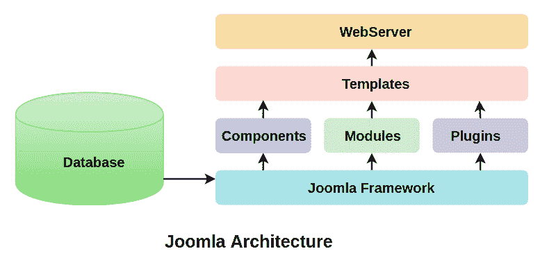

# 朱姆拉的建筑

> 原文：<https://www.javatpoint.com/architecture-of-joomla>

Joomla 是用 PHP 编写的，基于 MVC(模型-视图-控制器)设计模式。它使用 MySQL(MS SQL 2.5 或以上版本，PostgreSQL 或以上版本)来存储数据。有各种功能(例如，页面缓存、博客、投票、语言国际化支持和 RSS 提要等)。)，这使得 Joomla 成为 CMS(内容管理系统)的绝佳选择。

在本文中，我们展示了 Joomla 的架构设计。

下图展示了 Joomla 的结构架构:

Joomla 的架构包括以下几层:

*   数据库ˌ资料库
*   Joomla 框架
*   成分
*   模块
*   插件
*   模板
*   网络服务器

## 数据库ˌ资料库

数据库由除图像文件和文档之外的数据组成，这些数据可以以特定的方式存储、操作和组织。它包括用户信息、内容和网站的其他必需数据。它还包含管理信息，以便管理员可以安全地访问和管理网站。Joomla 数据库层是确保扩展最大灵活性和兼容性的最重要因素之一。

## Joomla 框架

Joomla 框架包含开源软件库/包的集合，Joomla 内容管理系统建立在这些库/包之上。没有必要安装 Joomla 框架来使用内容管理系统，反之亦然。Joomla 框架提供了一组文件，这对创建 web 和命令行应用程序都很有用。它将框架分解成单个模块化包，并且进一步帮助每个包更容易开发。

## 成分

组件被称为微型应用程序，包含两个部分:

*   管理人
*   位置

每当加载页面时，都会调用组件来呈现主页的正文。管理员部分管理组件的不同方面，当任何站点访问者发出请求时，站点部分帮助呈现页面。组件被称为 Joomla 的重要功能单元。

## 模块

模块可以被定义为用于在 Joomla 中呈现页面的轻量级扩展。它们用于显示组件中的新数据。它们可以独立存在，由本身就是组件的“**模块管理器**管理。它们看起来像盒子，比如登录模块。当模块链接到 Joomla 组件时，它们还有助于显示新的内容和图像。

## 插件

该插件可以解释为一个非常灵活和强大的 Joomla 扩展，用于扩展框架。插件是少数在特定事件触发时执行的代码。它通常用于在开发页面时格式化组件或模块的输出。每当特定事件发生时，与事件相关联的插件功能通常会按顺序执行。

## 模板

模板用于管理 Joomla 网站的外观。基本上有两种类型的模板可用；**前端****后端**。前端模板是管理网站外观的一种方式，用户可以看到它。后端模板用于管理或控制管理员的功能。模板是构建或自定义网站最简单的方法。它们用于增加最大的灵活性，使您的网站看起来有吸引力。

## 网络服务器

它是用于将用户连接到站点的服务器。它向客户端提供网页。超文本传输协议用于客户端和服务器之间的通信。最后，网站是你和你的用户互动的地方。

* * *