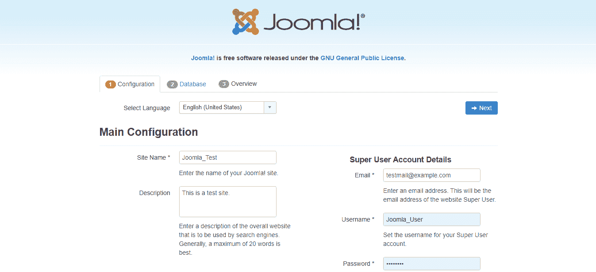

# Windows 上的 Joomla 安装

> 原文:[https://www.javatpoint.com/joomla-installation-on-windows](https://www.javatpoint.com/joomla-installation-on-windows)

通常，Joomla 安装在基于 Linux 发行版的系统上，包括带有 LAMP 或 LEMP 堆栈的 Ubuntu。但是，您可以在一些开源项目的帮助下，在微软视窗桌面和服务器上安装 Joomla。有几个这样的开源项目。其中一个项目是 XAMPP，这是免费提供的，易于安装的 Apache 发行版。XAMPP 包含马里亚数据库、PHP 和 Perl。

让我们讨论一下在 Windows 平台上安装 Joomla 的分步过程:

## 对 Joomla 的要求！3.x

*   **数据库**
    MySQL 5.1 或以上
*   **网络服务器**
    XAMPP(多平台)
*   **Windows 操作系统**
    Windows OS(跨平台)
*   **浏览器**
    谷歌 Chrome、火狐或互联网浏览器(IE 7 或以上)
*   **SSL(安全套接字层)**
    HTTPS 需要。
*   **托管**
    服务器安装需要。

## 装置

在本文中，我们将在本地主机上安装 Joomla。尽管您可以按照相同的步骤将其安装在实际的实时服务器上，但请完成所有步骤:

**步骤 1:安装并激活 XAMPP**

首先，您需要从下面给出的链接下载 XAMPP:[https://www.apachefriends.org/index.html](https://www.apachefriends.org/index.html)

只需下载有效的 valid Windows 安装程序，并通过运行安装包进行安装。它可以很容易地安装，就像其他 windows 软件一样。建议使用默认位置进行安装。

#### 注意:在准备本教程的时候，XAMPP 的最新版本是 7.3.10。

安装完成后，启动 XAMPP 软件。应该是这样的:


现在，您必须通过打开选项来激活 XAMPP 软件，如上图所示。

**第二步:Joomla 下载上传**

**如果你安装在你的本地主机，那么你需要**

下载**。zip** 或官方网站上 Joomla 的 **.tar.gz** 文件。[https://downloads.joomla.org/](https://downloads.joomla.org/)

提取下载的文件，并将所有文件复制到“htdocs”文件夹中，该文件夹位于 XAMPP 安装目录中。您还可以创建子目录，并将所有文件复制到该子目录中。这里，我们使用的是子目录“Joomla”。

```php
This PC > Local Disk (C:) > xampp > htdocs > Joomla

```

**如果你从你的主机安装然后**

你需要上传压缩文件到你的域的根目录并提取它。您可以使用文件管理器或 FTP 客户端来执行。大多数主机为日常任务提供基于网络的文件管理器。默认情况下，这些文件应该出现在 **public_html** 目录中(通常是根文件夹)。

**步骤 3:创建数据库**

在安装 Joomla 之前，您需要创建一个可用于连接的数据库。为此，打开浏览器并导航至 **localhost/phpmyadmin** 。点击页面顶部名为“**数据库**的标签。输入您想要用作数据库名称的名称，然后点击“**创建**”按钮。


要在实时服务器上创建，请浏览您的控制面板，并打开**数据库> MySQL 数据库**部分。创建您的数据库名称、用户 id 和密码。

请记住您创建的数据库的名称，因为它在 Joomla 安装过程中是必需的。

**第四步:安装 Joomla**

打开浏览器，搜索 *http://localhost* 或 *http://localhost/xxxx* (其中 xxxx 是‘htdocs’目录下子目录的名称。

如果您使用的是直播服务器，则必须使用*http://yourdomain.com*或*http://yourdomain.com/joomla*，具体取决于您上传 Joomla 安装包的位置。

现在，您需要完成三个基本步骤来将 Joomla 安装到您的计算机上:

*   主配置
*   数据库配置
*   完成 Joomla 安装

### 主配置

一旦你导航到一个合适的链接，你将进入 Joomla 网络安装程序的主页。在这里，您需要添加关于站点和管理员的必要信息，例如:

*   **选择语言:**从下拉菜单中选择自己的语言。
*   **网站名称:**创建网站名称。
*   **描述:**简单输入你的站点描述。
*   **网站离线:**让你的网站在线或保持离线。选择“是”表示“脱机”，选择“否”表示“联机”。
*   **管理电子邮件:**键入您希望用于您的站点的有效电子邮件地址。
*   **管理员用户名:**输入“管理员”作为默认用户名或自定义用户名。
*   **管理员密码:**为您的站点键入您自己的密码。
*   **确认管理员密码:**重新输入与上面相同的密码。
*   点击“下一步”按钮继续进入“T0”数据库配置。



### 数据库配置

此页面包含以下数据:

*   **数据库类型:**选择 MySQLi
*   **主机名:**键入“localhost”。
*   **用户名:**“root”。
*   **密码:**保持空白
*   **数据库名称:**使用 phpMyAdmin 键入您在上述步骤中创建的数据库的名称。(例如，我们案例中的“joomla_test”如下所示)
*   **表前缀:**自动生成。
*   **旧数据库进程:**点击“备份”按钮从以前的 Joomla 安装中备份表，或者点击“删除”按钮删除那些表。
*   单击“下一步”按钮继续进入最后一页。


### 概观

*   **完成:**您可以通过点击适当的选项来安装样本数据。
*   **概述:**此部分显示您在前面步骤中配置的所有信息。查看所有信息，点击**安装**按钮。


安装完成后，只需点击按钮“**移除安装文件夹**”即可完成安装过程。您可以点击**网站**查看您的网站，也可以点击**管理员**进入管理区。


现在，Joomla 已成功安装在本地主机上。

**第五步:测试 Joomla**

完成安装后，您就可以打开网站的前端和后端了。单击“打开网站”或在浏览器地址栏中键入您的域，以打开网站的前端。如果您已经登录到您的帐户，那么您可以直接从前端视图编辑选项。


要访问您网站的后端，您需要浏览一个网址作为*http://localhost/<your_joomla_folder>/administrator/index . PHP</your_joomla_folder>T3。然后，您需要使用您的 Joomla 帐户详细信息登录。*

* * *