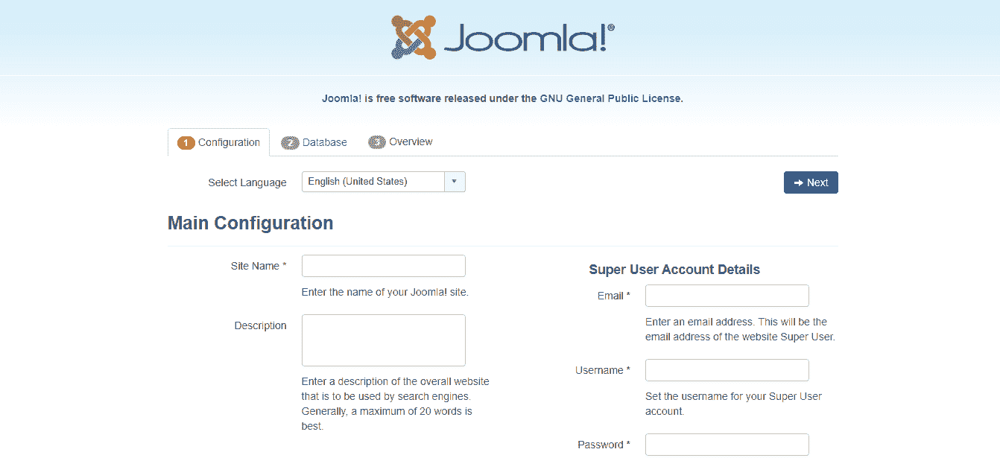
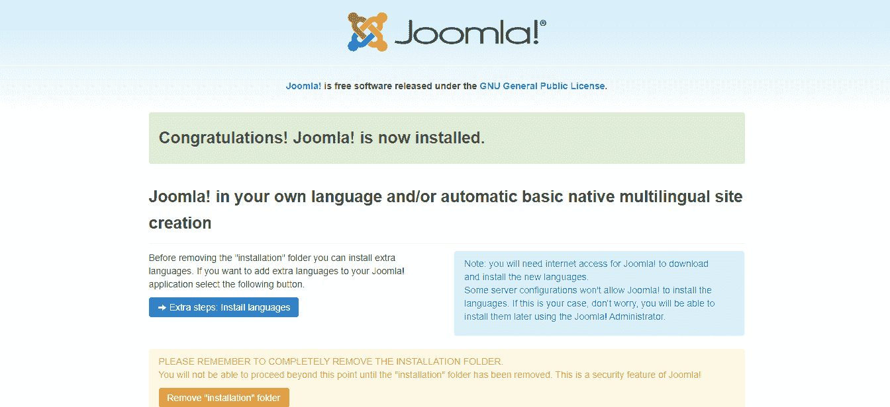

# Linux 上的 Joomla 安装

> 原文：<https://www.javatpoint.com/joomla-installation-on-linux>

Joomla 是流行的 CMS 之一，它相对容易使用，也是 WordPress 的优秀替代品。它被数百万程序员用来创建移动就绪和用户友好的网站。它包含了成千上万的伟大功能和设计，这些功能使它成为建设专业网站的好选择。

在本文中，我们将演示如何在您的 Ubuntu 虚拟专用服务器(VPS)上安装 Joomla。完成下面给出的所有步骤，了解其安装:

## 先决条件

*   具有 sudo 权限的非根用户
*   虚拟专用网或专用服务器托管计划

**第一步:安装阿帕奇**

使用以下命令更新 Ubuntu 存储库中的索引:

```php

sudo apt-get update

```

输入您的密码，以便进一步处理。

然后，输入以下命令安装 Apache:

```php

sudo apt-get install apache2

```

**第二步:安装 MySQL**

正如我们之前讨论的，Joomla 使用一个 MySQL 数据库来存储数据。因此，您需要使用以下命令安装 MySQL 服务器:

```php

sudo apt-get install mysql-server

```

当提示输入时，建议根用户使用强密码。

要确保您的 MySQL 安装是安全的，请使用下面给出的命令并删除匿名用户和测试数据库:

```php

sudo mysql_secure_installation

```

如下所述，输入“ **Y** 或“ **N** 来使用设置，这些设置将帮助您确保 MySQL 安装的安全性:

*   设置验证密码插件？【是/否】**否**
*   更改根密码？【是/否】**否**
*   删除匿名用户？【是/否】**是**
*   不允许根用户远程登录？【是/否】**是**
*   删除测试数据库并访问它？【是/否】**是**
*   现在重新加载特权表吗？【是/否】**是**

现在，您需要创建一个数据库，这样 Joomla 就可以存储它的数据。

输入以下命令并登录到 MySQL 命令行界面:

```php

sudo mysql -u root -p

```

通过输入您的根密码来授予访问权限。

之后，创建数据库、用户，并使用以下命令分配正确的权限:

```php

?   CREATE DATABASE joomla_db;
?   GRANT ALL PRIVILEGES on joomla.* to 'joomla_db'@'localhost' identified by 'PASSWORD';
?   FLUSH PRIVILEGES;
?   QUIT;

```

您可以用首选值替换“ **joomla_db** ”。建议用户使用强密码。

**第三步:安装 PHP**

您还需要安装 PHP，因为 Joomla 是用 PHP(一种服务器端通用脚本语言)编写的。它还应该与为 Apache web 服务器定制的相关模块一起安装，使用给定的命令:

```php

?   sudo apt-get install php libapache2-mod-php

```

键入“是”，并在提示确认安装时按“输入”。

**第四步:安装 Joomla**

您应该安装“解压缩工具”，因为您要下载的文件将是. zip 格式。要安装“解压缩工具”，请使用以下命令:

```php

sudo apt-get install unzip

```

现在，使用下面的命令创建一个“tmp”文件夹，其中将下载 Joomla 文件:

```php

mkdir tmp

```

接下来，使用以下命令将 cd 复制到“/tmp”目录:

```php

cd /tmp

```

使用给定的命令开始从官方网站下载最新版本的 Joomla:

```php
wget <link of the Joomla zip file>

```

即，

```php

https://downloads.joomla.org/cms/joomla3/3-9-11/Joomla_3-9-11-Stable-Full_Package.zip?format=zip

```

运行此命令后，Joomla 将以扩展名下载到“tmp”文件夹中。zip(一个存档文件)。

您需要解压缩下载的存档文件，并将其复制到您的网站的根目录下，可能在一个名为“joomla”的目录下。您可以为文件夹使用任何名称。

使用以下命令创建目录:

```php

sudo mkdir /var/www/html/joomla

```

使用以下命令解压缩您下载的文件:

```php

sudo unzip Joomla_3-9-11-Stable-Full_Package.zip?format=zip  -d /var/www/html/joomla

```

**第五步:配置 Joomla 并分配正确的文件权限**

默认的 Joomla 安装带有一个文件“ **htaccess.txt** ”，应该复制该文件来创建一个“**”。htaccess** 文件。要执行此操作，您应该使用以下命令:

```php

sudo cp /var/www/html/joomla/htaccess.txt /var/www/html/joomla/.htaccess

```

您必须提供文件的正确权限，以便 Apache 能够访问这些文件。使用以下命令设置正确的权限:

```php

sudo chown -R www-data.www-data /var/www/html/joomla
sudo chmod -R 755 /var/www/html/joomla

```

现在，您需要使用以下命令重新启动 Apache，以使所有 PHP 设置生效:

```php

sudo systemctl restart apache2

```

**步骤 6:通过浏览器完成 Joomla 安装**

打开浏览器，将网址“*http://yourdomain.com/joomla*”放入网址地址栏。需要注意的是，您必须将“**yourdomain.com**”替换为您的域名或服务器的公共 IP 地址。你应该有一扇这样的窗户:



按照屏幕上的说明，填写所有需要的细节，就像上一篇文章中显示的那样，并完成安装。



现在，Joomla 已经成功安装在你的 Ubuntu 机器上了。

* * *