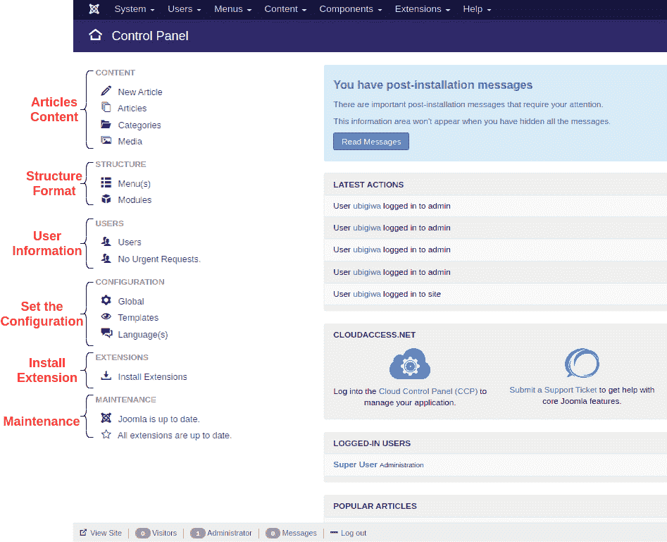

# Joomla 控制面板

> 原文：<https://www.javatpoint.com/joomla-control-panel>

一旦您登录到 Joomla 管理面板，您将被重定向到控制面板(仪表板)屏幕。要从后端的任何其他页面访问控制面板，请从 **Joomla 管理员面板**的下拉菜单中导航至“**系统>控制面板**”。它包含了 Joomla 的几个默认特性和功能，可以通过可点击的图标、菜单栏等进行访问。它看起来像这样:

有一个侧栏包含几个选项，用于访问几个功能，如文章管理器、媒体管理器、菜单、模块、用户、模板、配置和扩展。查看解释这些选项及其功能的以下列表:

## 内容

如下所述，本节包括四个选项:

| **增加新条** | 此选项用于创建新的文章页面或内容。 |
| **物品管理器** | 此选项用于管理所有当前文章。 |
| **品类经理** | 此选项用于添加新类别。它还有助于发布或取消发布现有类别。 |
| **媒体管理器** | 此选项用于管理网络服务器上的所有文件。它有助于上传新文件以及删除现有文件。它也用于在网络服务器的文件系统上创建新目录。 |

## 结构

如下所述，本节包括两个选项:

| **菜单管理器** | 此选项用于创建自定义菜单和网站导航。 |
| **模块管理器** | 该选项用于管理已安装模块的位置和功能。 |

## 用户

该部分包含两个选项，如下所示:

| **用户** | 它会打开用户管理器，允许您创建/删除用户、更改密码、语言和时间。它还用于选择用户可以访问的所见即所得编辑器。您还可以选择用户或将用户分配给用户组。 |
| **紧急请求** | 它会打开“隐私信息请求”屏幕，允许您管理紧急信息请求。 |

## 配置

它包含以下三个选项:

| **全局** | 它会打开全局配置，该配置在后端扮演着重要角色。如果对配置进行更改，将会影响整个 Joomla 站点。在这里，您可以修改许多选项，如元数据、会话设置、服务器配置和时区等。 |
| **模板** | 它打开模板管理器，用于管理网站使用的所有模板。模板是筛选样式的最佳方式。 |
| **语言** | 它会打开语言管理器，通过将一种语言设置为网站的默认语言来修改已安装的语言。 |

## 扩展ˌ扩张

它包括以下选项:

| **安装延伸部分** | 它打开扩展管理器，用于添加或删除加载项。扩展是扩展 Joomla 网站功能的一个很好的工具。它们为 Joomla 提供了默认情况下不可用的功能。Joomla 有一百多个扩展可用。 |

## 保持

该部分包含两个选项，如下所示:

| **Joomla 更新状态** | 它显示了 Joomla 安装的当前更新状态，并用于打开更新安装屏幕。当那里有更新可用时，它将显示要更新的最新可用版本。 |
| **扩展更新状态** | 它显示已安装扩展的当前更新状态，如果扩展具有开发人员提供的此功能。它显示要更新并用于打开安装屏幕的扩展总数。 |

这些是控制面板下左侧栏中的可用选项。除了侧边栏，在控制面板下的主区域还有一些其他选项，如下所示:

## 最新操作

此部分将显示管理员最近执行的所有活动。这些活动包括登录活动和跟踪、添加新文章、检查内容等。

## 登录用户

此部分将显示登录到 Joomla 站点的管理员的姓名。

## 热门文章

本部分跟踪浏览次数最多的文章，并将它们按顺序排列。浏览量最高的文章将被放在列表的顶部。

## 网站信息

这个部分包括了网站的所有细节，比如 OS 名称、PHP 和 MySQLi 的版本、时间、缓存、Gzip 状态等。它还显示网站上活跃用户的数量和已发布文章的总数。

## 最近添加的文章

此部分显示所有已发布的文章以及最近发布的当前文章。

* * *