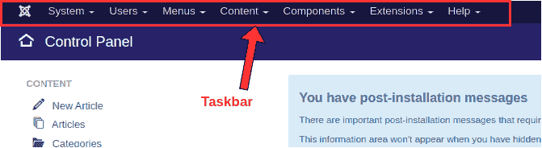

# Joomla 任务栏

> 原文：<https://www.javatpoint.com/joomla-taskbar>

Joomla 管理面板最重要的部分之一是顶部的任务栏。它涵盖了“控制面板”下的几乎所有可用选项以及其他一些选项。它可以从后端的任何页面访问。

以下是 Joomla 任务栏中可用的选项:

### 系统

此选项用于访问控制面板、全局配置、全局签入，以及清除缓存、清除过期缓存和查看系统信息的选项。

### 用户

此选项用于管理用户、用户组和访问级别，添加字段和字段组，添加关于用户和注释类别的注释，处理与隐私相关的请求，查看用户日志，以及向网站上的每个人群发电子邮件。

### 菜单

顾名思义，这个选项包括所有关于创建和管理不同种类菜单(即主菜单、用户菜单等)的选项。).它还包含一个显示创建的菜单项列表的选项。

### 内容

该选项包括许多有助于添加或修改文章的功能。用户可以添加新文章、文章类别、分配特色内容、修改字段和字段组等。它还包含管理站点所有媒体文件的选项。

### 成分

此选项用于创建和管理网站横幅、联系人、私人消息、多语言关联、新闻源等。它有一个选项来检查是否有可用的 Joomla 更新。它包括检查安装后消息的选项。它允许我们在插件的帮助下设置重定向和智能搜索。它还提供了检查搜索词和使用标签的权限。

### 扩展ˌ扩张

此选项用于导航到扩展管理器，它允许我们在 Joomla 站点上安装、更新或管理扩展。在此菜单中，我们可以配置、查找和排除扩展。我们可以检查数据库的状态并更新站点。我们也可以从这个部分安装插件和模板。此选项下还存在更改网站默认语言的选项。

### 帮助

它提供了对 Joomla 的几个帮助主题的直接访问，如扩展、翻译、资源和支持论坛等。这一节可以用来更好地了解 Joomla。

* * *