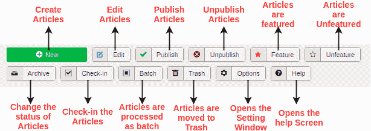
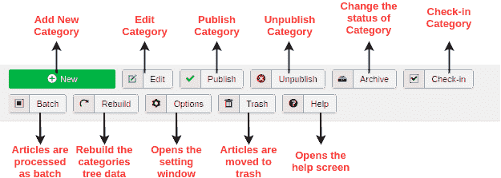
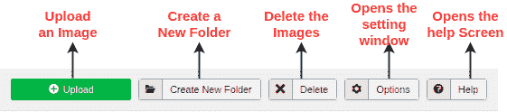
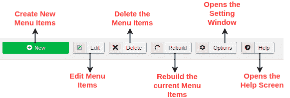
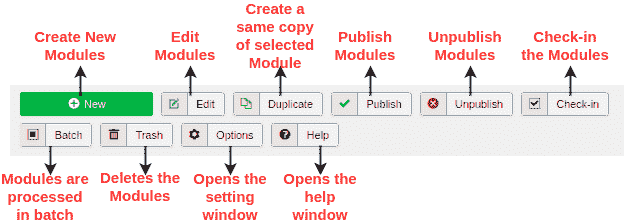
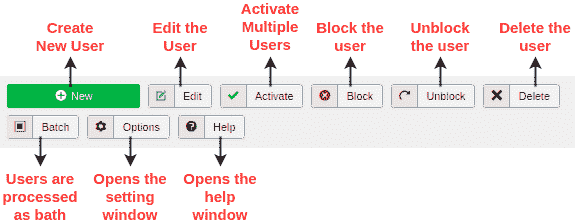
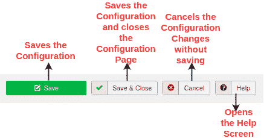
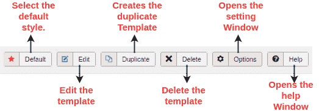
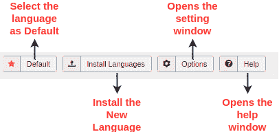

# Joomla 工具栏

> 原文：<https://www.javatpoint.com/joomla-toolbar>

在本文中，我们展示了 Joomla 中可用的各种工具栏。以下是工具栏列表:

*   [文章管理器工具栏](#Article)
*   [类别管理器工具栏](#Category)
*   [媒体管理器工具栏](#Media)
*   [菜单管理器工具栏](#Menu)
*   [模块管理器工具栏](#Module)
*   [用户管理器工具栏](#User)
*   [全局配置工具栏](#Global)
*   [模板管理器工具栏](#Template)
*   [语言管理器工具栏](#Language)

* * *

## 文章管理器工具栏

要访问文章管理器工具栏，请从 Joomla 管理员控制面板(或 Joomla 任务栏)导航至“**内容-文章**”。您可以创建包含图像、文本和超链接等的新文章。查看下面的截图，快速了解文章管理器工具栏:

### 描述

| **新增** | 它用于创建新文章。 |
| 编辑 | 它用于编辑特定的文章。 |
| **发布** | 它用于在网站上发布文章。 |
| **取消发布** | 它用于取消发布以前发布的文章。 |
| **功能** | 它用于特稿选定的文章。可以刊登不止一篇文章。 |
| **未成熟** | 它用于从专题文章中删除文章。 |
| **存档** | 它用于存档选定的文章。它可以通过更改存档状态将文章的状态更改为已发布或未发布。 |
| **入住** | 它用于登记一篇或多篇文章。 |
| **批次** | 用于批量修改或处理选中的文章。 |
| **垃圾** | 它用于永久删除选定的文章。 |
| **选项** | 用于打开设置窗口，可用于更改文章的设置。 |
| **帮助** | 它用于打开帮助窗口。 |

* * *

## 类别管理器工具栏

要访问类别管理器工具栏，请从 Joomla 管理员控制面板导航至“**内容-类别**”。它用于创建类别并将文章分组到指定的类别中。下图显示了类别管理器工具栏:

### 描述

| **新增** | 它用于创建新的类别。 |
| 编辑 | 它用于更改或修改特定类别。 |
| **发布** | 它用于在网站上发布类别，以便与文章一起使用。 |
| **取消发布** | 它用于取消发布以前发布的类别。 |
| **存档** | 它用于存档选定的类别。它可以通过更改归档状态将类别的状态更改为已发布或未发布。 |
| **入住** | 它用于登记一个或多个类别。 |
| **批次** | 用于批量修改或处理所选类别。 |
| **重建** | 它用于重建类别的树数据。 |
| **选项** | 用于打开设置窗口，该窗口可用于更改类别的设置。 |
| **垃圾** | 它用于永久删除选定的类别。 |
| **帮助** | 它用于打开帮助窗口。 |

* * *

## 媒体管理器工具栏

要访问媒体管理器工具栏，请从 Joomla 管理员控制面板导航至“**内容-媒体管理器**”。它用于通过在服务器上上传新文件或从服务器上删除当前文件来管理文件。下图显示了媒体管理器工具栏:

### 描述

| **上传** | 它用于从系统上传图像。 |
| **创建新文件夹** | 它用于在 Joomla 服务器上创建一个新文件夹。 |
| **删除** | 它用于永久删除选定的项目/图像。 |
| **选项** | 它用于打开设置窗口，您可以在其中修改媒体文件的设置。 |
| **帮助** | 它用于打开帮助窗口。 |

* * *

## 菜单管理器工具栏

要访问菜单管理器工具栏，请从 Joomla 任务栏导航至“**菜单-管理**”。它用于管理或修改菜单项。您可以创建新菜单或随后删除当前菜单。下图显示了菜单管理器工具栏:

### 描述

| **新增** | 它用于创建新的菜单项。 |
| 编辑 | 它用于编辑选定的菜单项。 |
| **删除** | 它用于永久删除选定的菜单项。 |
| **重建** | 它用于刷新或重建相关菜单项。 |
| **选项** | 它用于打开一个设置窗口，您可以在其中修改菜单项的设置。 |
| **帮助** | 它用于打开帮助窗口。 |

* * *

## 模块管理器工具栏

要访问模块管理器工具栏，从 Joomla 任务栏导航到“**扩展-模块**”。它用于配置已安装模块的位置和功能。查看下图，该图显示了模块管理工具栏下的可用选项:

### 描述

| **新增** | 它用于创建新模块。 |
| 编辑 | 它用于编辑或修改特定模块。 |
| **复制** | 它用于创建所选模块的副本。 |
| **发布** | 它用于在网站上发布创建的模块。 |
| **取消发布** | 它用于取消发布以前发布的模块。 |
| **入住** | 它用于签入一个或多个模块。 |
| **批次** | 用于批量修改或处理所选模块。 |
| **垃圾** | 它用于永久删除选定的模块。 |
| **选项** | 它用于打开设置窗口，您可以在其中修改模块的设置。 |
| **帮助** | 它用于打开帮助窗口。 |

* * *

## 用户管理器工具栏

要访问用户管理器工具栏，请从 Joomla 管理员控制面板导航至“**用户-用户**”或从 Joomla 任务栏导航至“**用户-管理**”。它用于管理所有用户信息，如用户名、电子邮件、上次访问日期和注册日期等。以下是显示用户管理器工具栏的屏幕截图:

### 描述

| **新增** | 它用于创建新用户。 |
| 编辑 | 用于编辑或修改当前用户。 |
| **激活** | 它用于激活用户。 |
| **区块** | 它用于阻止选定的用户。 |
| **解锁** | 它用于取消阻止被阻止的用户。 |
| **删除** | 它用于删除特定用户。 |
| **批次** | 用于批量处理选中的用户。 |
| **选项** | 它用于打开一个设置窗口，您可以在其中为用户修改设置。 |
| **帮助** | 它用于打开帮助窗口。 |

* * *

## 全局配置工具栏

要访问全局配置工具栏，请从 Joomla 管理员控制面板导航至“**配置-全局**”或从 Joomla 任务栏导航至“**系统-全局配置**”。它用于管理 Joomla 站点的全局设置。以下屏幕截图显示了全局配置工具栏:

### 描述

| **保存** | 它用于保存配置并停留在同一屏幕上。 |
| **保存&关闭** | 用于保存配置和关闭屏幕。 |
| **取消** | 它用于取消配置更改并返回上一屏幕而不保存。 |
| **帮助** | 它用于打开帮助窗口。 |

* * *

## 模板管理器工具栏

要访问模板管理器工具栏，请从 Joomla 管理员控制面板导航至“**配置-模板**”或从 Joomla 任务栏导航至“**扩展-模板**”。它用于管理您应用于网站的模板。下图显示了模板管理器工具栏:

### 描述

| **默认** | 它用于将特定的选定模板设置为默认模板。 |
| 编辑 | 它用于编辑模板页面。 |
| **复制** | 它用于创建重复的模板。 |
| **删除** | 用于删除模板。 |
| **选项** | 它用于打开设置窗口，您可以在其中修改模板的设置。 |
| **帮助** | 它用于打开帮助窗口。 |

* * *

## 语言管理器工具栏

要访问语言管理器工具栏，请从 Joomla 管理员控制面板导航至“**配置-语言**”或从 Joomla 任务栏导航至“**扩展-语言**”。它用于更改您在网站上使用的语言。你网站上的读者可以看到。下图显示了语言管理器工具栏:

### 描述

| **默认** | 它用于将特定的选定语言设置为默认语言。 |
| **安装语言** | 它用于安装新语言。 |
| **选项** | 它用于打开一个设置窗口，您可以在其中更改或修改语言设置。 |
| **帮助** | 它用于打开帮助窗口。 |

* * *