# Joomla 菜单

> 原文：<https://www.javatpoint.com/joomla-menus>

Joomla 菜单管理器用于为网站创建自定义菜单，并允许在网站中轻松导航。查看以下步骤，更好地了解 Joomla 菜单管理器中的可用功能:

### 第一步

从 Joomla 管理员控制面板的左侧栏导航到“**结构-菜单**”，您将看到以下屏幕:

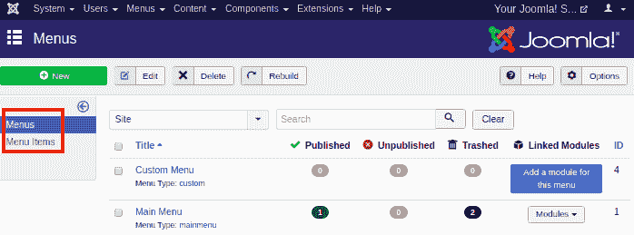

您将获得菜单和菜单项的选项，如下所示。也可以通过 Joomla 任务栏中的“**菜单-管理**”选项进入该屏幕。

### 第二步

如果你想在你的网站上添加一个新的菜单，只需点击**新建**按钮或者通过任务栏上的**菜单-管理-添加新菜单**。

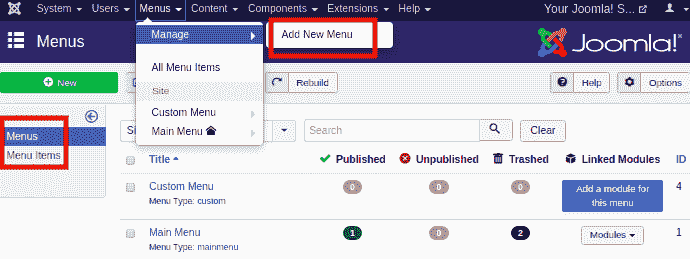

点击“新建”按钮后，您将进入以下屏幕:

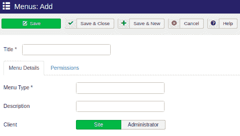

在这里，您可以通过填写以下详细信息来创建新菜单:

| **标题** | 为菜单写一个标题。这是创建菜单的必填字段。 |
| 菜单式 | 选择菜单类型，主菜单或用户菜单。 |
| **描述** | 为创建的菜单写一个简短的描述。 |
| **客户端** | 选择客户端类型，站点或管理员。 |

键入这些基本详细信息，设置菜单权限，然后单击保存按钮。您可以从“Joomla 菜单管理器”查看创建的菜单。

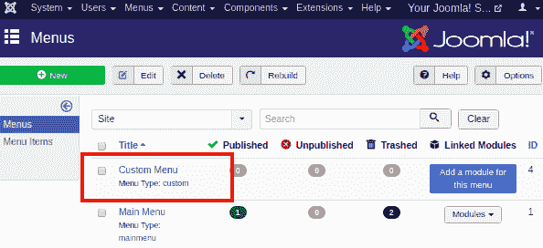

### 第三步

创建菜单后，现在需要创建“菜单项”。每个菜单可以包括多个菜单项。菜单项用于确定可以放在页面主区域的内容范围。要创建菜单项，请从 Joomla 任务栏导航至“**菜单-[选择您创建的菜单] -添加新菜单项**”。

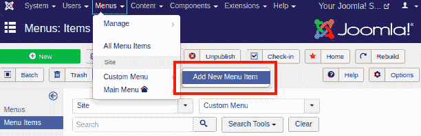

您应该会得到一个包含多个选项卡的表单，如下所示:

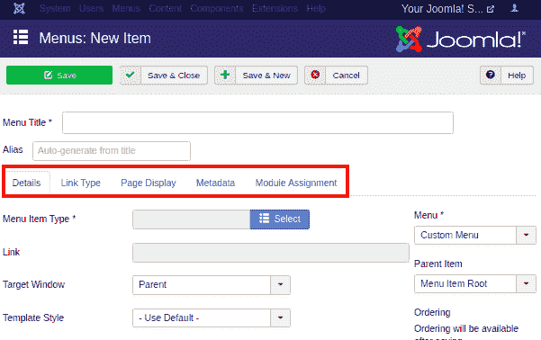

在页面的顶部，有两个主要字段-

| **菜单标题** | 键入菜单项的标题，它将显示在菜单中。 |
| **别名** | 它是根据标题自动生成的。它被用作 SEF(搜索引擎友好)的网址，并产生 UTF-8 别名。它不支持空格和下划线。 |

给定的表单由其他几个部分组成，如**详细信息、链接类型、页面显示、元数据和模块分配**。每个部分都包含许多要填充的选项，以便您可以正确修改每个菜单项的设置。

**详情**

“添加新菜单项”中的“详细信息”部分如下图所示:

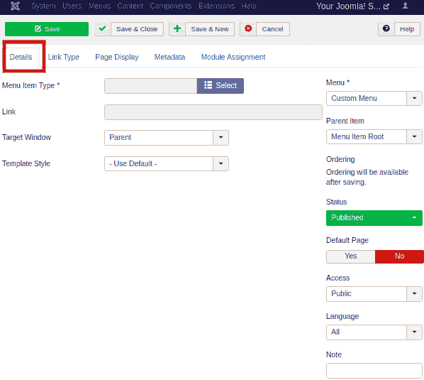

此部分包含以下选项:

| **菜单项类型** | 它用于指定菜单项的类型，如文章、标签、网页链接、系统链接、联系人等。 |
| **链接** | 它用于确定菜单中的链接。 |
| **目标窗口** | 它包含三个选项:父项、带导航的新窗口和不带导航的新窗口，当单击菜单时，它们指向浏览器的窗口。 |
| **模板样式** | 它用于为您的网站选择模板样式。您可以从下拉菜单中选择默认模板或自定义安装的模板。 |
| 菜单 | 它用于指定将出现链接的菜单，主菜单或用户菜单。 |
| **默认页面** | 它用于将菜单项设置为默认或网站主页。它只包括“是”或“否”按钮。 |
| **进入** | 它用于选择谁可以访问或查看菜单项。您可以向来宾、公共、注册用户、特殊或超级用户提供访问权限。 |
| **语言** | 它用于选择将在网站上显示的菜单项的语言。 |
| **注** | 它用于输入文本信息。 |

**链接类型**

“添加新菜单项”的下一部分是“链接类型”，如下图所示:

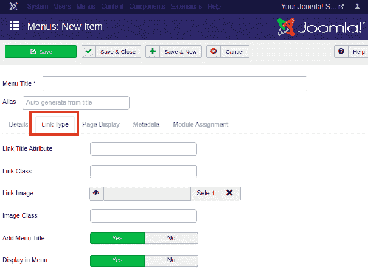

此部分包括以下选项:

| **链接标题属性** | 它用于为给定超链接的标题属性指定描述。 |
| **链接类** | 它用于为超链接定义一个类。 |
| **链接图像** | 它用于使用带有超链接的图像。 |
| **图像类** | 它用于为图像定义一个类。 |
| **添加菜单标题** | 它用于在图像旁边添加菜单标题。它包含用于选择的“是”或“否”按钮。 |
| **菜单显示** | 用于选择菜单中是否显示图像。 |

**页面显示**

“添加新菜单项”的下一部分是“页面显示”，如下图所示:

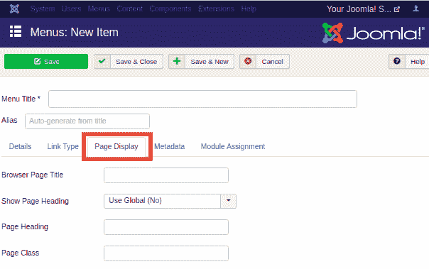

它包含以下选项:

| **浏览器页面标题** | 它用于指定浏览器页面标题的描述。 |
| **显示页面标题** | 它用于在页面标题中显示页面标题。您可以使用“是”或“否”按钮打开/关闭它。 |
| **页面标题** | 它用于为页面标题键入文本。 |
| **页面类别** | 它用于定义可选的 CSS 类，以便页面上的元素可以变得时尚。 |

**元数据**

“添加新菜单项”中的“元数据”部分如下图所示:

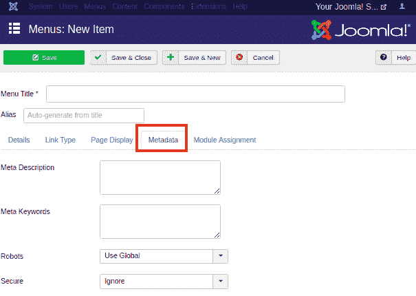

此部分包括以下选项:

| 元描述 | 它用作包含页面描述的可选段落。它显示在搜索引擎的搜索结果中。 |
| **元关键词** | 这些是在 html 页面中使用的可选关键字。 |
| **机器人** | 它用于指定机器人指令，如全局、索引、跟随、无索引、无跟随。它控制着搜索引擎从网站上追踪数据的方式。 |
| **固定** | 它用于定义链接应该使用 SSL 还是安全站点 URL。它包含三个选项(例如，“开”、“关”和“忽略”)。 |

**模块分配**

“添加新菜单项”中的“模块分配”部分如下图所示:

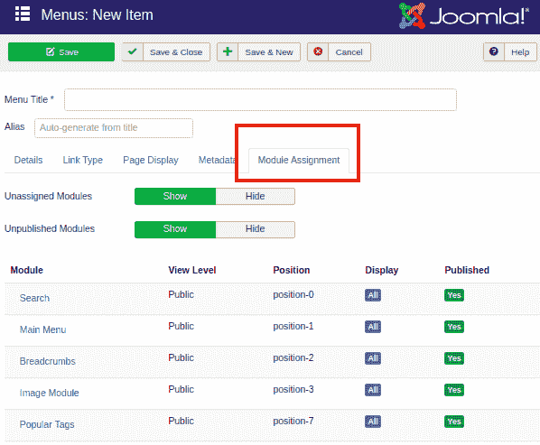

本节包含显示/隐藏未分配模块和未发布模块的选项。

* * *