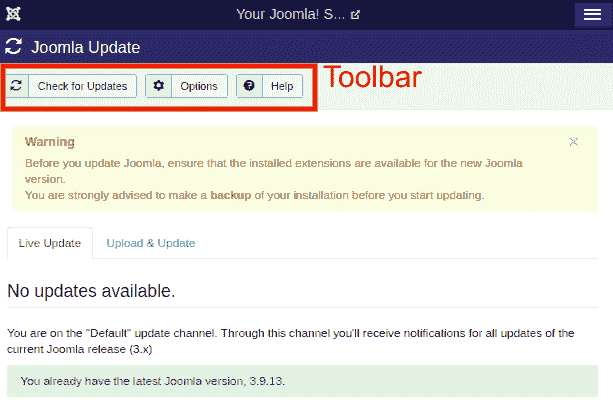

# Joomla 组件菜单

> 原文:[https://www.javatpoint.com/joomla-components-menu](https://www.javatpoint.com/joomla-components-menu)

从 Joomla 任务栏导航到“**组件**”菜单。点击“组件”按钮后，将显示一个下拉菜单。它包含几个选项，如下所示:

## 旗帜

横幅用于在网站上设置或排列横幅。如果您单击横幅，您将获得带有以下选项的子菜单:

**1)横幅**

横幅用于编辑、修改或添加 Joomla 网站上要显示的横幅。要访问横幅，请从 Joomla 任务栏导航至“**组件-横幅-横幅**”。点击“横幅”按钮后，将显示以下屏幕截图:

工具栏中有一些选项，包括一些执行各种任务的按钮。这些任务包括添加新横幅、编辑现有横幅、发布或取消发布横幅、删除横幅等功能。

**2)类别**

类别管理器为您提供了创建新横幅类别或编辑现有横幅类别的选项。你需要点击**组件-横幅-类别**进入类别管理器。类别管理器页面如下图所示:

类别管理器页面还包括位于页面顶部的工具栏，该工具栏包含多个按钮，以便您可以创建、编辑、发布/取消发布或删除横幅类别。然后，有一个带有一些过滤器的搜索框，可以很容易地从列表中找到创建的横幅类别。下面有一列指定了与横幅类别相关的各种详细信息。列标题包含以下选项:

| **订购** | 它由“上下箭头”指示，用于设置所需的项目顺序。您可以激活此选项，通过在所需位置拖动三点条形图标来拖放项目。 |
| **复选框** | 它用于通过单击框来选择一个或多个横幅类别。它可用于对多个项目执行编辑、发布或取消发布等操作。 |
| **状态** | 它用于指定横幅类别的状态，即已发布/未发布或已销毁。 |
| **标题** | 它用于指定横幅类别中标题的名称。 |
| **进入** | 它用于指定访问级别，即公共或私有。 |
| **语言** | 它用于指定用于创建横幅类别的语言。 |
| **ID** | 它是唯一的标识号，自动分配给横幅类别。 |

**3)客户**

客户端管理器用于创建新的客户端横幅或编辑现有的横幅。要访问客户端管理器，请从 Joomla 任务栏导航到“**组件-横幅-客户端**”。它看起来像下面的截图:

客户端管理器页面上的工具栏包含创建、编辑、发布/取消发布或删除客户端的基本选项。“横幅管理器-客户端”页面中的列标题包含以下详细信息:

| **复选框** | 它用于通过单击框来选择一个或多个客户端。 |
| **状态** | 它用于指定客户端的状态，即已发布/未发布或已销毁。 |
| **客户端** | 它用于指定横幅客户端的名称。 |
| **联系** | 用于指定客户的联系信息。 |
| **购买类型** | 它用于指定客户购买横幅的方式，即每年或每月。默认情况下，它总是每月一次。 |
| **ID** | 这是自动分配给项目的唯一标识号。 |

搜索框有助于从列表中轻松找到客户。

**4)轨道**

此页面有助于查看现有横幅列表的跟踪信息。从 Joomla 任务栏导航到“**组件-横幅-跟踪”**，打开一个跟踪页面。它看起来像下面的截图:

工具栏中有两个选项:

| **出口** | 它用于导出 CSV 文件中的横幅跟踪信息。 |
| **删除轨迹** | 用于删除所选曲目的信息。 |

工具栏下方有一个搜索框和一些过滤器选项。您可以选择“**开始日期**”和“**结束日期**”来跟踪特定时间段内的横幅信息。

## 联系人

用于在 Joomla 网站上添加客户的姓名、地址、电话号码、电子邮件等联系方式。要打开联系人管理器，从 Joomla 任务栏导航到“**组件-联系人**”。以下屏幕截图显示了联系人管理器:

您还可以为联系人创建联系人类别、字段和字段组。

**Joomla 更新**

点击“**组件- Joomla！更新**“显示已安装的 Joomla 版本。Joomla 更新页面的工具栏上有三个按钮:

| **检查更新** | 它用于检查是否有更新的版本可用。 |
| **选项** | 它用于打开设置窗口，您可以在其中更改或修改 Joomla 更新的设置。 |
| **帮助** | 它用于打开帮助屏幕。 |

工具栏下面有两个部分:

| **实时更新** | 它会自动检查较新的版本并发出通知。如果有更新，您可以使用此选项直接下载并安装更新。 |
| **上传&更新** | 当您拥有最新的 Joomla 更新包时，将使用此选项。您需要上传 Joomla 包并手动安装它。 |

## 信息发送

消息管理器允许您在 Joomla 中发送和接收消息。点击 Joomla 任务栏中的“**组件-消息传递**，进入消息管理器页面。它看起来像下面的截图:

该选项用于向 Joomla 网站的其他后端发送消息。您可以在此页面创建或删除邮件。

消息管理器页面中的工具栏包含以下选项:

| **新增** | 它用于创建新消息。 |
| **标记为已读** | 它用于将选定的消息标记为已读消息。 |
| **标记为未读** | 它用于将选定的邮件分类到尚未阅读的类别中。即使您已经阅读了邮件，也可以将其标记为未读。 |
| **我的设置** | 它用于指定与消息相关的设置。 |
| **垃圾** | 它用于永久删除选定的邮件。 |

如果你想创建一个新的私人消息，那么你需要点击工具栏上的**新建**按钮。它将打开一个新窗口，如下图所示:

您也可以直接从 Joomla 任务栏创建新的私人消息。导航至“**组件-消息-新私人消息**”。

## 新闻提要

它用于在 Joomla 网站上添加来自其他网站的新闻提要。

要打开新闻提要页面，请从 Joomla 任务栏导航至“**组件-新闻提要**”。下图显示了新闻提要页面:

工具栏提供了几个选项，如创建新的新闻源，或编辑、发布/取消发布、存档、签入、回收站或批处理现有新闻源。然后有一个搜索框，可以很容易地从列表中找到创建的新闻提要。下面有一个部分包含所创建新闻源的详细信息。列标题包含以下选项:

| **订购** | 它由“上下箭头”指示，用于设置所需的项目顺序。您可以激活此选项，通过在所需位置拖动三点条形图标来拖放项目。 |
| **复选框** | 它用于通过单击框来选择一个或多个新闻源。 |
| **状态** | 它用于指定已创建新闻源的状态，即已发布/未发布或已销毁。 |
| **标题** | 它用于指定新闻提要中标题的名称。 |
| **进入** | 它用于指定访问级别，即公共或私有。 |
| **文章** | 它用于指定要在新闻提要中显示的文章数量。 |
| **缓存时间** | 它会根据响应时间自动分配。 |
| **语言** | 它用于指定用于创建新闻提要的语言。 |
| **ID** | 这是自动分配给新闻源项目的唯一标识号。 |

您也可以使用新闻提要管理器页面中的类别选项创建新闻提要类别。

## 安装后消息

如果您点击“**组件-安装后消息**，您将获得一个屏幕，您可以在安装后查看来自 Joomla 的可操作消息。

它用于在成功安装 Joomla 或其扩展后传递消息。

## 再直接的

重定向管理器用于使用工作网页重定向网站上不存在的网址。导航至“**组件-重定向**”选项，打开重定向管理器。它看起来像下面的截图:

以下是“重定向管理器”页面上工具栏上的可用选项:

*   **新建-** 用于新建重定向 URL。
*   **编辑-** 用于编辑已有的重定向 URL。
*   **启用-** 用于启用所选网址的重定向功能。
*   **禁用-** 用于禁用所选网址的重定向功能。
*   **存档-** 通过更改存档状态，将选中的重定向项的状态更改为已发布或未发布项。
*   **批量导入-** 用于同时创建一个或多个重定向项目。
*   **清除禁用-** 用于删除所有禁用的重定向链接。
*   **垃圾桶-** 用于删除所有选中的重定向。

就像其他页面一样，重定向管理器页面也提供了一个带有过滤器的搜索框，以便轻松找到特定的重定向。

列标题包含以下选项:

| **复选框** | 它用于通过单击框来选择一个或多个重定向。 |
| **状态** | 它用于指定已创建重定向的状态，即已发布/未发布或已丢弃。 |
| **过期网址** | 它用于指定要重定向到网站的网址。 |
| **新 URL** | 它指定指定的网址。 |
| **参考页面** | 它用于重定向引用的网页。 |
| **创建日期** | 它用于指定创建网址的日期。 |
| **404 点击** | 它用于通知在多次请求后页面没有被转发。 |
| **ID** | 它是自动分配给创建的重定向的唯一标识号。 |

## 搜索

搜索管理器允许您跟踪对每个组合键进行了多少次搜索，以及每次搜索的结果。从 Joomla 任务栏导航到“**组件-搜索**”打开搜索分析页面。它看起来像下图:

## 智能搜索

它用于增强网站搜索。点击 Joomla 任务栏中的“**组件-智能搜索**，进入 Joomla 智能搜索页面。点击“组件-搜索”后，将显示以下图像:

智能搜索页面中的列标题包含以下选项:

| **复选框** | 它用于通过单击框从列表中选择一个或多个项目。 |
| **状态** | 它用于指定智能搜索项目的状态，即已发布/未发布或已销毁。 |
| **标题** | 它用于指定文章标题的名称。 |
| **类型** | 它用于指定项目的类型，即物品或标签。 |
| **上次更新** | 它用于指定上次修改的日期。 |
| **详情** | 它用于指定链接日期信息。 |
| **原始 URL** | 它用于指定项目的相对链接。 |

## 标签

它用于管理标记页面的列表。点击 Joomla 任务栏中的“**组件-标签**，打开 Joomla 标签页面。它看起来像下面的截图:

在这里，您可以获得几个选项，以便您可以创建新标签、编辑标签、发布/取消发布标签或删除标签等。使用搜索框，您可以轻松地从列表中找到标签。

* * *