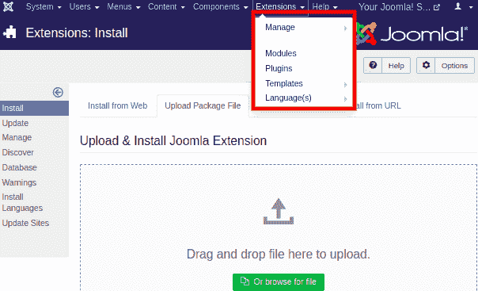
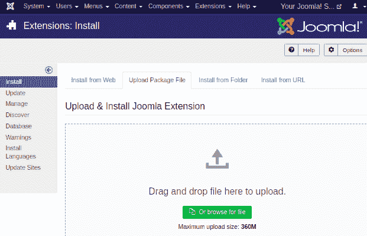
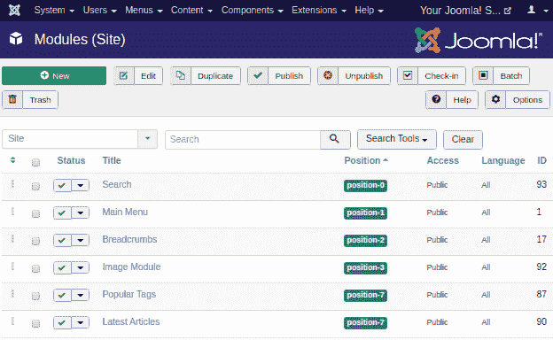
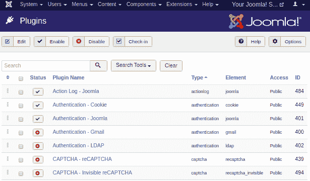
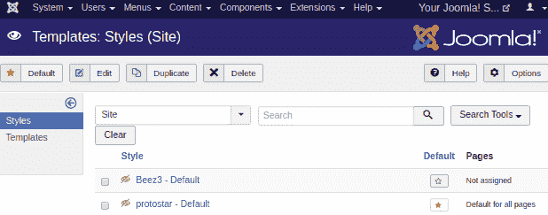
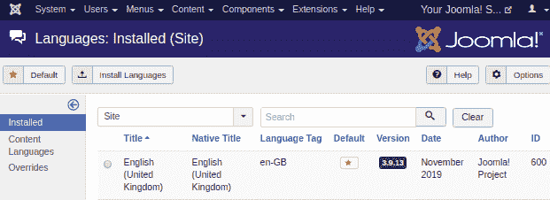

# Joomla 扩展菜单

> 原文：<https://www.javatpoint.com/joomla-extensions-menu>

您可以在扩展的帮助下在 Joomla 中添加额外的功能。扩展是一个软件包，有助于扩展 Joomla 中可用的选项。有五种类型的扩展:

*   成分
*   模块
*   插件
*   模板
*   语言

单击 Joomla 任务栏中的“扩展”选项卡，扩展菜单将显示如下图:

## 扩展管理器

扩展管理器提供了扩展 Joomla 网站功能的选项。要访问扩展管理器，请通过 Joomla 任务栏中的“**扩展-管理-安装**”导航。扩展管理器屏幕将如下图所示:

## 模块管理器

模块管理器用于管理安装在现场的模块，即模块的位置和功能。要访问模块管理器，从 Joomla 任务栏导航到“**扩展-模块管理器**”。它看起来像下面的截图:

## 插件管理器

插件管理器用于管理网站上的 Joomla 插件。它还提供了启用、禁用或编辑插件细节的选项。要访问插件管理器，请从 Joomla 任务栏导航到“**扩展-插件**”。下图显示了插件管理器的视图:

## 模板管理器

模板管理器用于管理应用于网站的设计。您可以在几秒钟内实现模板，而无需更改内容结构。要打开模板管理器，请通过 Joomla 任务栏中的“**扩展-模板**”。如下图所示:

### 语言经理

语言管理器用于设置网站的默认语言。要访问语言管理器，单击 Joomla 任务栏中的“**扩展-语言**”。下图显示了语言管理器中可用的选项:

* * *