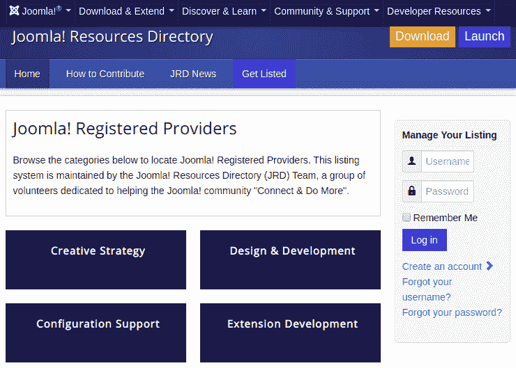

# Joomla 帮助菜单

> 原文：<https://www.javatpoint.com/joomla-help-menu>

Joomla 的帮助菜单提供了解决大多数问题的选项。单击任务栏上的“帮助”按钮，将显示以下屏幕-

Joomla 帮助菜单下的可用选项描述如下:

## Joomla 帮助

该页面包括帮助用户创建 Joomla 网站的指南。要访问 Joomla 帮助菜单，请导航至“**帮助- Joomla 帮助**”。您将看到许多与 Joomla 上可用选项相关的指南。

## 官方支持论坛

官方支持论坛是人们通过在 Joomla 正式交流想法和观点来互相帮助的地方。Joomla 支持论坛是世界上最繁忙和友好的支持论坛。这是一个获得帮助和寻找其他 Joomla 用户的好地方。

打开官方支持论坛，点击“**帮助-官方支持论坛**”。它看起来像下面的截图:

## 官方语言论坛

官方语言论坛选项将您重定向到 Joomla 的其他论坛，这些论坛有不同的语言版本。你可以找到特定语言的论坛，用那种特定的语言提问。

要访问官方语言论坛，请导航至“**帮助-官方语言论坛**”。它看起来像下面的截图:

## 文档维基

文档维基用于格式化文章内容、交叉链接页面和创建维基模板的文档。要访问文档维基页面，请点击“**帮助-文档维基**”。点击文档维基选项将显示以下屏幕:

## Joomla 扩展

Joomla 扩展用于扩展 Joomla 网站的功能。要访问 Joomla 扩展页面，请导航至“**帮助- Joomla 扩展**”。下图显示了 Joomla 扩展页面的视图:

在 Joomla 扩展页面中有几个可用的扩展。

## Joomla 翻译公司

Joomla 翻译用于翻译 Joomla 核心文件中的语言。它有助于文档和屏幕以及其他任务，以满足多样化语言社区的需求。点击**帮助- Joomla 翻译**，进入 Joomla 翻译页面。它看起来像下图:

## Joomla 资源

Joomla Resources 用于定位专业服务提供商。它帮助用户在 Joomla CMS 中连接和执行更多功能。导航至**帮助- Joomla 资源**进入 Joomla 资源页面。它看起来像下图:

## 社区门户

社区门户网站有助于在一个地方获得来自世界各地的关于 Joomla 的新闻和更新。点击**帮助-社区门户**，会出现如下所示的社区门户界面:

## 安全中心

安全中心提供 Joomla 软件版本中已解决的安全问题的最新公告。点击“**帮助-安全中心**”即可打开安全中心页面。下图显示了安全中心页面的视图:

## 开发者资源

开发者资源页面为那些想要构建或维护基于 Joomla 平台的软件的人提供资源。单击“帮助-开发人员资源”访问开发人员资源页面。它看起来像下图:

## 堆栈交换

Stack Exchange 是一个面向 Joomla 管理员、用户、开发人员和设计人员的问答网站。你可以提问，也可以分享你的答案。要访问堆栈交换页面，请导航至“**帮助-堆栈交换**”。下图显示了堆栈交换页面:

## 乔姆拉商店

Joomla 商店是用户可以购买 Joomla 相关产品的地方。有几个项目有简短的描述。你可以根据自己的要求阅读和购买最大数量的物品。

打开 Joomla 店铺页面，点击“**帮助- Joomla 店铺**”。它看起来像下面的截图:

* * *