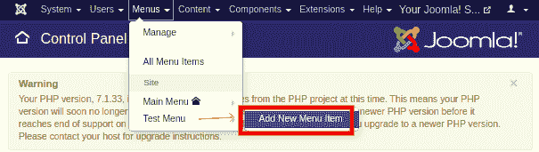
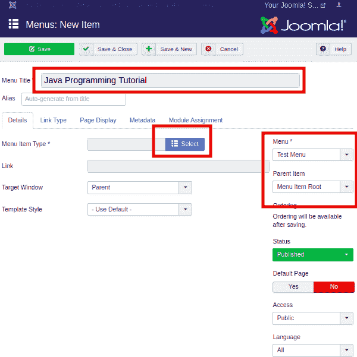
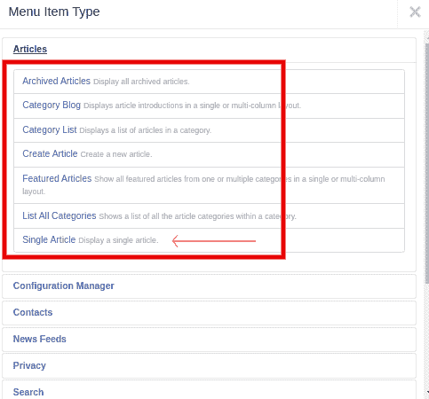
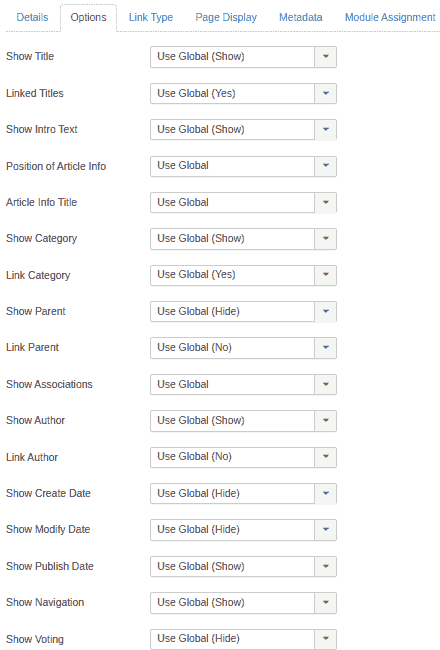
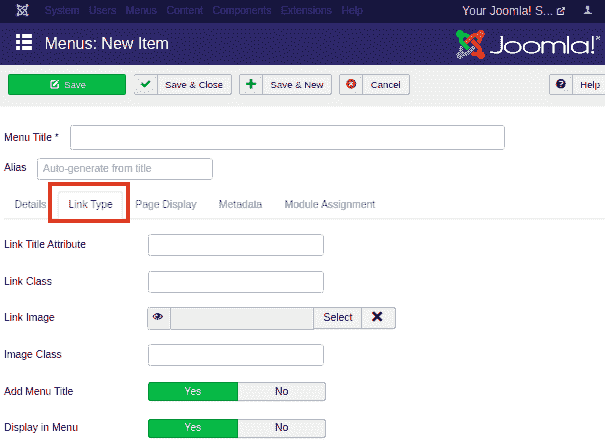
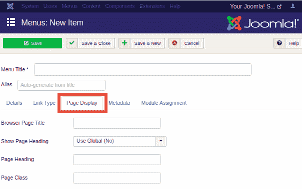
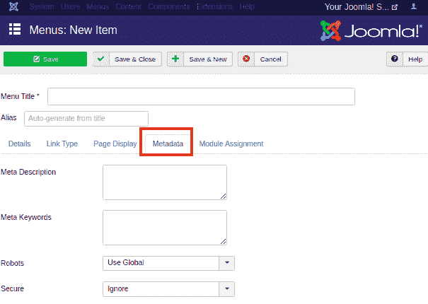
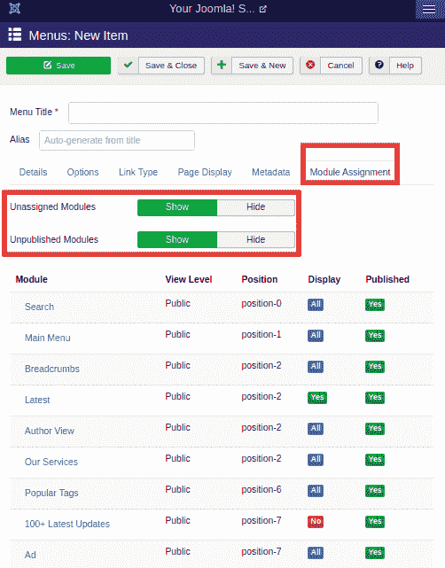

# 添加菜单项

> 原文:[https://www.javatpoint.com/joomla-adding-menu-items](https://www.javatpoint.com/joomla-adding-menu-items)

Joomla 中的每个菜单可能包含几个菜单项。菜单项处理由菜单项类型决定的预定义页面类型。菜单项类型包括**文章、配置管理器、联系人、新闻提要、隐私、搜索、智能搜索、系统链接、标签、用户和包装器、**等多个选项。在本文中，我们将解释如何在 Joomla 中创建菜单项。我们将创建一个带有单个文章页面的菜单项。

## 创建菜单项

**第一步**

登录您的 Joomla 帐户，点击 Joomla 任务栏中的“**菜单-[您的菜单名称] -添加新菜单项**”。它看起来像下图:

或者，您可以从 Joomla 控制面板页面点击“**菜单**”选项，并从左侧栏点击“**菜单项**”。然后，点击工具栏上的“**新建**”按钮。

**第二步**

您应该会得到如下所示的表单:

此页面中有几个框和选项卡。选项卡上方有两个字段，它们是:

| **菜单标题** | 它用于定义菜单项的标题。 |
| **别名** | 用作 **SEF(搜索引擎友好)**网址。Joomla 根据标题自动分配值。它不允许使用空格和下划线。 |

默认情况下，您将被重定向到“**详细信息**选项卡。现在，您需要选择“详细信息”选项卡下的选项。

**菜单项类型**

它用于指定您要创建的菜单项的类型。可以是文章、标签、网页链接、系统链接、联系人等。要分配菜单项的类型，你需要点击“**选择**按钮，你会得到不同类型菜单项的列表。

现在点击**文章**选项，你会得到一个新的窗口。选择“**单品**选项，如下图:

点击“单篇文章”按钮后，您将获得一个新的字段(**选择文章**，该字段将要求您选择要与此菜单项链接的文章。从列表中选择文章并进一步处理。

“详细信息”选项卡下的其余选项定义如下:

| **链接** | 它用于指定分配给菜单项的链接。它是自动生成的。 |
| **目标窗口** | 它用于在窗口中定位菜单项，如父窗口、带导航的新窗口或不带导航的窗口。 |
| **模板样式** | 它用于选择网站的模板样式。有预装的模板(Beez3 和 Protostar)可以使用。 |
| 菜单 | 它用于指定菜单链接，无论是主菜单还是创建的菜单。 |
| **父项** | 它用于通过选择菜单项根或主页来选择父项。 |
| **状态** | 它用于指定菜单项的状态，如已发布、未发布或已销毁。 |
| **默认页面** | 它用于选择菜单项作为网站的默认页面或主页。只有一个滑块按钮可以选择“是”或“否”选项。 |
| **进入** | 它用于允许访问选定的用户。有一个下拉列表，允许访问来宾、公共、超级用户、注册用户或特殊用户。 |
| **语言** | 它用于指定菜单项的语言。 |
| **注** | 它用于放置文本信息供参考。 |

**第三步**

选择菜单项的类型后，会自动生成一个新的“**选项**”标签。您可以使用“选项”选项卡在网站上“显示”或“隐藏”不同的详细信息。这些细节包括标题、类别、作者姓名、发布日期、标签等。此页面看起来像下面的截图:

根据您的喜好自定义这些字段。

**第四步**

下一个标签是“**链接类型**，包含以下选项:

| **链接标题属性** | 它用于指定指定超链接的标题属性的描述。 |
| **链接类** | 它用于为链接定义一个类。 |
| **链接图像** | 它用于将图像作为超链接附加。 |
| **图像类** | 它用于定义附加图像的类别。 |
| **添加菜单标题** | 它用于在图像旁边添加菜单标题。有一个滑块可以选择“是”或“否”选项。默认情况下，它保持“是”。 |

没有强制字段，因此您也可以将其保留为默认值。它看起来像下图:

**第五步**

点击**页面显示**选项卡，会出现如下画面:

根据您的选择输入以下详细信息。这些不是强制性的，但有利于更好的定制。

| **浏览器页面标题** | 它用于指定浏览器页面标题的描述。 |
| **显示页面标题** | 用于选择“是”或“否”显示页面标题。 |
| **页面标题** | 它用于指定页面标题的文本。 |
| **页面类别** | 它用于设置可选的 CSS 类来设置页面元素的样式。 |

**第 6 步**

下一个标签是“**元数据**”标签，包含以下选项:

| 元描述 | 它用于指定页面的描述，将显示在搜索引擎的结果中。 |
| **元关键词** | 它用于定义相关关键词，帮助搜索引擎显示相关结果。 |
| **机器人** | 它用于指定机器人指令，如全局、索引跟随、无索引跟随、索引不跟随、无索引不跟随。 |
| **固定** | 它用于指定链接应该使用 SSL 还是安全站点 URL。它提供了一个下拉菜单，有三个选项，如关闭、打开、忽略。 |

**第 7 步**

**模块分配**是控制页面上模块显示的最后一个标签。您可以显示或隐藏未分配的模块和未发布的模块。下图显示了“模块分配”选项卡下的可用选项:

填写完所有必填字段的详细信息后，您需要点击工具栏上的“**保存**”按钮。

这是在 Joomla 中创建菜单项的方法。

#### 注意:如果您没有为创建的菜单分配模块，创建的菜单项将不会显示在网站上。

* * *