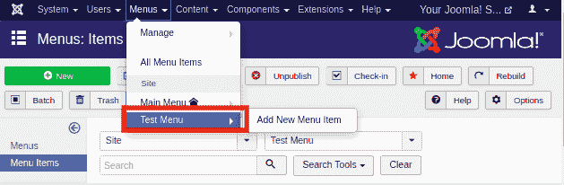
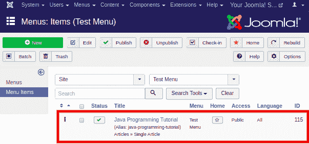
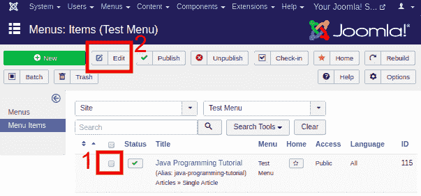
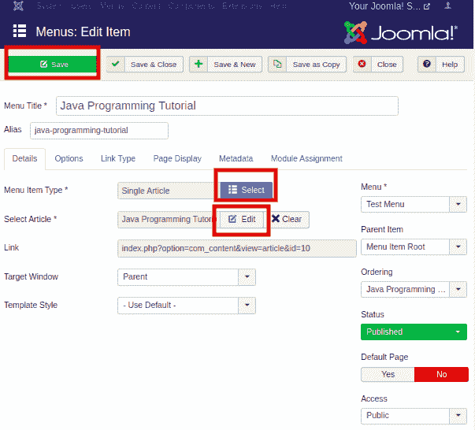

# 修改菜单项

> 原文：<https://www.javatpoint.com/joomla-modify-menu-items>

在本文中，我们已经定义了如何在 Joomla 中编辑或修改菜单项。要创建菜单项，请查看我们之前的文章。编辑/修改菜单项的步骤如下:

**第一步**

登录 Joomla 的帐户，从 Joomla 任务栏导航到“**菜单-【您的菜单名称】**”。它看起来像下图:

在这里，我们将修改我们在上一篇文章“添加菜单项”中创建的“测试菜单项”。

**第二步**

单击菜单名称(在我们的例子中是测试菜单)后，您将获得对应于该菜单的所有菜单项的列表。下图显示了列表视图:

这里，“Java 编程教程”是我们在上一篇文章中创建的一个菜单项。它的菜单项类型是“单品”。

**第三步**

要修改菜单项，您需要点击特定菜单项的复选框，然后点击工具栏上的“**编辑**”按钮。它将打开选定的菜单项进行编辑。

**第四步**

点击“编辑”按钮后，您将看到以下窗口:

在这里，您可以根据自己的喜好编辑/修改文件。您可以通过单击“选择”按钮，然后选择菜单类型来修改菜单项类型。您也可以使用“**编辑**按钮编辑文章，或者通过单击“**清除**按钮选择新文章。你想改变什么就改变什么。

进行更改后，您需要点击工具栏中的“**保存**”按钮来保存更改。

* * *