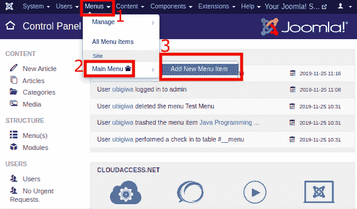
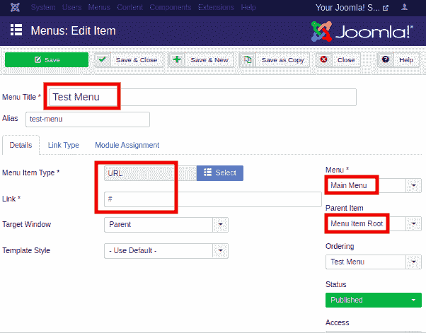
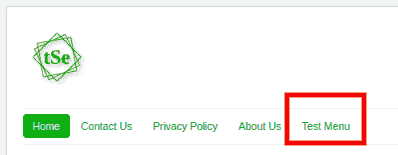
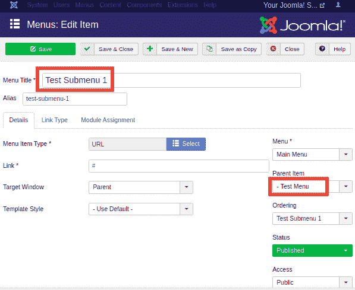
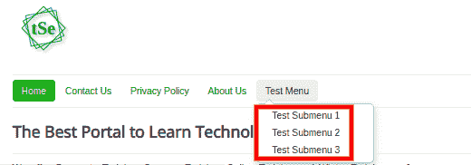
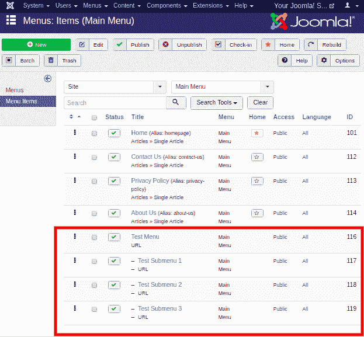

# Joomla -创建子菜单

> 原文:[https://www.javatpoint.com/joomla-creating-submenus](https://www.javatpoint.com/joomla-creating-submenus)

在 Joomla 中，菜单用于组织网站的内容。如果你的网站上有很多内容，你应该开始使用子菜单。子菜单是从常规菜单访问的菜单，它可以作为具有两个以上级别的菜单或作为单独的菜单模块工作。

## 创建子菜单

查看以下步骤，了解如何在 Joomla 中创建子菜单:

**第一步**

首先，您需要在要添加子菜单的菜单中创建一个菜单项。在这里，我们将在“主菜单”下添加子菜单。因此，我们需要在主菜单中创建一个菜单项。

从 Joomla 任务栏导航到“**菜单-主菜单-添加新菜单项**”。您也可以使用 Joomla 控制面板页面的左侧栏来访问此选项。

**第二步**

通过填写必要的详细信息来创建菜单项，如下所示:

在这里，我们创建了一个名为“测试菜单”的菜单项，用于说明目的。为了制作一个空项目，我们选择了“**系统链接-网址**”作为菜单项类型，并在链接字段中输入“#”。您必须从页面的右侧选择正确的菜单和父项目。我们选择“主菜单”作为菜单位置，选择“菜单项根”作为父项，使其成为顶级项目。保存详细信息后，将在网站上添加一个新的菜单项，如下所示:

**第三步**

要创建子菜单项，您需要遵循以下步骤，与创建菜单项相同，除了一个步骤，即选择父项。创建子菜单时，您需要选择该特定菜单项作为父项，并在其中添加子菜单。

下图显示了在我们上一步创建的“测试菜单”下创建的子菜单(测试子菜单 1):

它将在网站的“测试菜单”下添加一个子菜单。您可以添加任意数量的子菜单。我们在“测试菜单”中添加了三个子菜单。下图显示了子菜单在网站上的外观:

在菜单项中创建子菜单后，“**菜单管理器-菜单项**”将如下图所示:

在这里，您可以看到“测试菜单”下面有三个子菜单。

#### 注意:如果 Joomla 没有显示子菜单，则编辑“主菜单”的链接模块，并将“显示子菜单项”选项转到“是”。

* * *