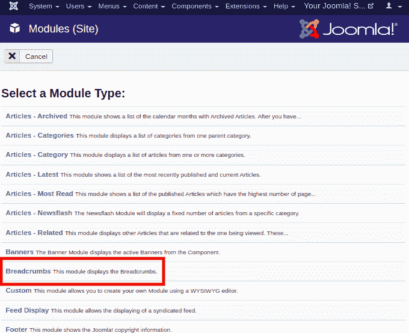
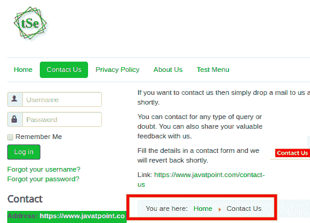
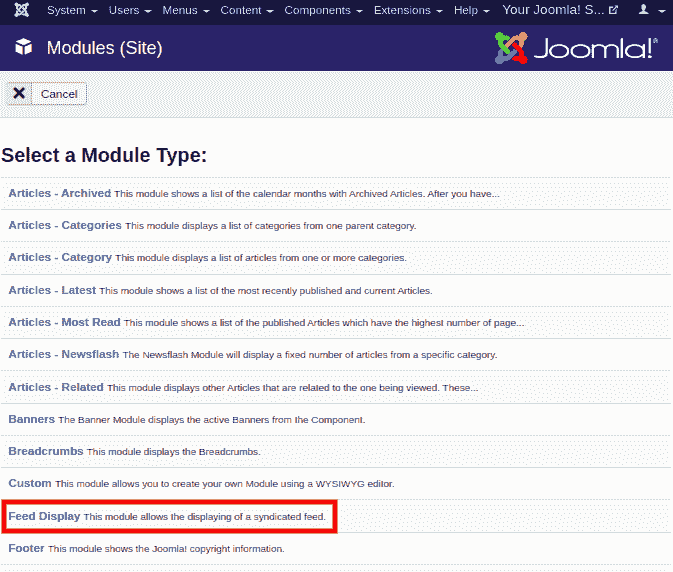
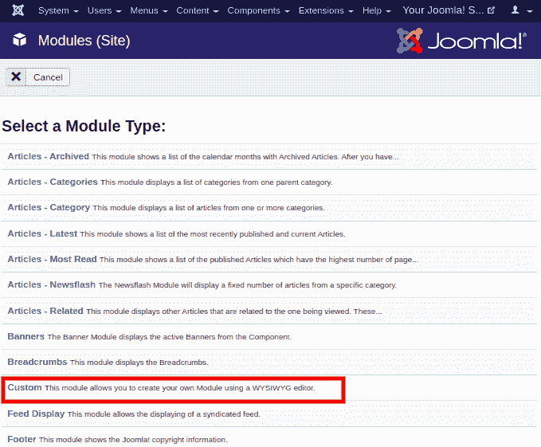
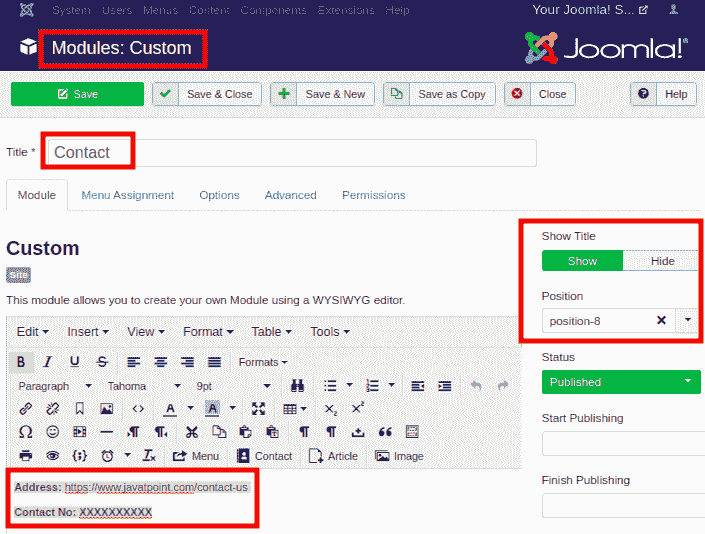
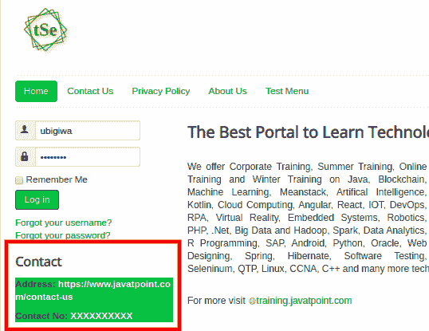
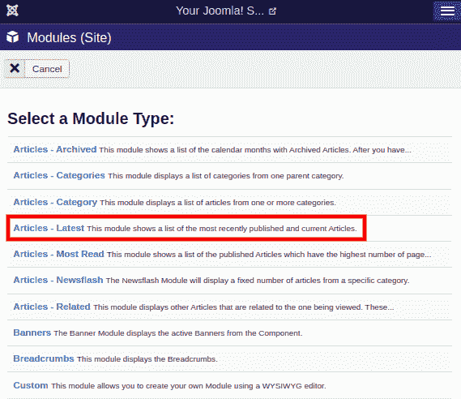
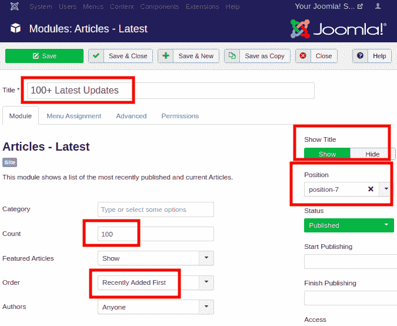
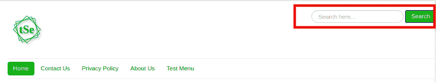

# 模块类型

> 原文:[https://www.javatpoint.com/joomla-module-types](https://www.javatpoint.com/joomla-module-types)

Joomla 包含一些预安装类型的模块，您可以使用模块管理器在您的站点上使用。在前一篇文章中，我们已经定义了如何在 Joomla 中添加模块。在本文中，我们将解释 Joomla 中可用的一些重要模块类型:

## 面包屑模块

面包屑模块用于以特定的顺序显示一组导航链接，以便用户能够理解他们在网站中的位置。这也让他们可以轻松地导航回去。

## 创建面包屑模块

要创建面包屑模块，请从可用模块类型列表中选择“**面包屑**”选项。它看起来像这样:

你会得到一张表格，需要填写所有需要的细节。完成所有更改后，您需要点击工具栏中的**保存**按钮来保存更改。

创建的面包屑模块在网站上看起来像下图:

## 进料显示模块

订阅源显示模块用于显示来自网站的 **RSS(真正简单联合)**新闻订阅源。新闻提要也称为“网络提要”或“联合提要”。这是一种从其他资源向用户提供自动更新数据的方式。例如，您可以在站点“Y”的某个位置读取站点“X”的内容。

### 创建馈送显示模块

从模块类型列表中选择“**进给显示**”模块，如下所示:

## 自定义模块

如果您想要显示预定义模块类型以外的一些信息，则可以创建或添加新的自定义模块。

### 创建自定义模块

要添加自定义模块，您需要从可用模块类型列表中选择“**自定义**”，并创建自己的模块。

自定义模块允许您使用**所见即所得(所见即所得)**编辑器创建自己的模块。

下图显示了我们为演示目的而创建的自定义模块:

该网站上的图片如下所示:

## 页脚模块

页脚模块用于显示网站版权和 Joomla 许可证信息。

### 创建页脚模块

要添加页脚模块，请从可用模块类型列表中选择“页脚”模块。在网站上添加后，它看起来像下图:

## 最新新闻模块

最新新闻模块用于显示最近发表的文章列表。它还包括列表中的当前文章。

### 创建最新新闻模块

要创建此模块，请从可用模块类型列表中选择“**文章-最新**”选项。它看起来像下图:

下图显示了我们为演示目的而创建的最新新闻模块的创建页面:

保存详细信息后，它将看起来像网站上的下图:

## 搜索模块

搜索模块是在网站上显示搜索框的一种方式。用户可以在搜索框中键入特定的名称或关键词，以便在整个网站中轻松找到内容。

### 创建搜索模块

要添加“搜索模块”，在网站上，您需要选择模块类型为“**搜索**”。选择职位并输入所需的详细信息。保存细节后，应该如下图所示:

## 随机图像模块

随机图像模块允许您在站点上创建一个模块，随机显示选定目录中的自定义图像。每次加载页面时，Joomla 都会从您选择的文件夹中显示不同的图像。

### 创建随机图像模块

要添加随机映像模块，您需要在媒体库内创建一个文件夹。您需要将图像上传到该文件夹。然后新建一个模块，选择模块类型为“**随机图像**”。在“**图像文件夹**字段中输入该文件夹的路径，并保存设置。

下图显示了随机图像模块在网站上的外观:

## 谁在线模块

世卫组织的在线模块用于显示当前访问该网站的匿名用户和注册用户的数量。

### 创建谁在线模块

要创建此模块，请从可用模块类型列表中选择“**谁在线”**”选项。选择职位并填写所有必需的详细信息。该网站上的图片如下所示:

这些是 Joomla 中存在的重要模块类型。

* * *