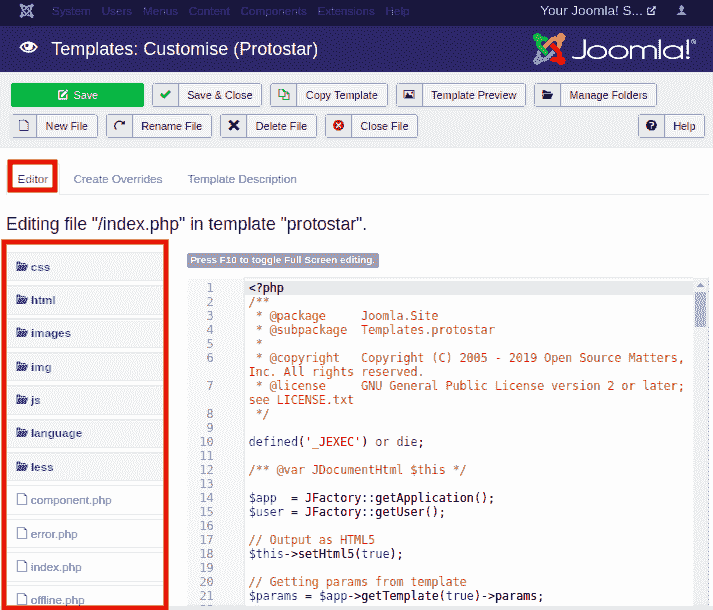
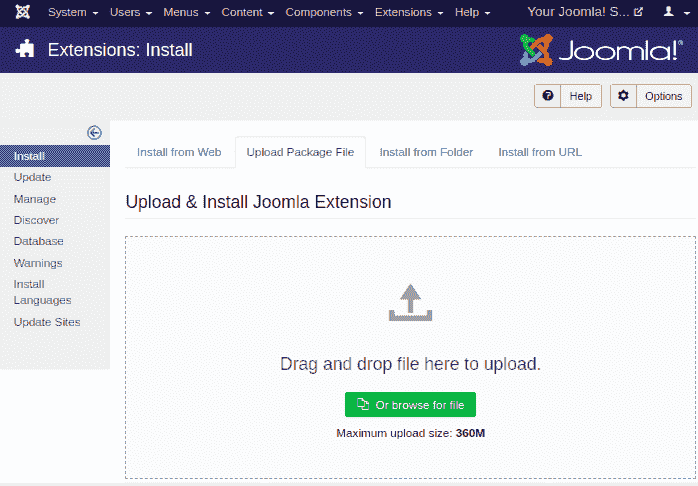

# Joomla -模板管理

> 原文：<https://www.javatpoint.com/joomla-templates-manage>

模板管理器允许您在 Joomla 中预览和编辑您安装的模板。模板被认为是控制 Joomla 网站的视图和布局的扩展。模板可以应用于网站，甚至无需对内容结构进行任何更改。

## 访问模板管理器

要访问模板管理器，请按照下面给出的步骤操作:

**第一步**

您需要登录您的 Joomla 帐户，然后从 Joomla 任务栏浏览“**扩展-模板**”。查看下图:

也可以从 Joomla 控制面板的左侧栏访问模板管理器页面。

**第二步**

点击“模板”选项后，您将被重定向到“**模板管理器:样式**”页面，您将获得所有已安装模板的列表。您可以通过单击列表中的模板名称来选择任何模板。它看起来像这样:

**第三步**

单击列出的任何模板后，您将看到一个屏幕，如下所示:

在这里，您将看到三个选项卡:详细信息、高级和菜单分配。

#### 注意:要在网站上使用您的自定义徽标，您需要单击“高级”选项卡，然后单击“徽标”字段旁边的“选择”按钮。然后，您需要上传徽标并点击“保存”按钮。

**第四步**

现在，点击左侧栏中的“模板”选项，进入**模板管理器屏幕**。下图显示了模板管理器屏幕:

## 自定义模板

要自定义安装的模板，请执行以下步骤:

**第一步**

选择模板，您将被重定向到编辑器页面，您可以在其中选择任何要编辑的模板文件。

您可以使用模板管理器工具栏执行不同的操作。例如，您可以创建新文件、复制模板、管理模板中的文件夹等。您也可以直接从网站后端检查模板的预览。

**第二步**

您可以使用“**创建覆盖**”选项卡轻松覆盖新模板。它将显示模板管理器中存在的模块、组件和布局的列表。它看起来像下图:

选择任意一个组件，你会得到它的几个子组件。单击“子组件”名称，它将创建对它的覆盖。

您可以使用“**模板描述**”选项卡查看所选模板的详细描述。

## 添加模板

如果您想在 Joomla 网站上添加或安装新模板，那么您需要按照下面给出的步骤操作:

**第一步**

从 Joomla 任务栏导航到“**扩展-管理-安装**”。您将看到一个屏幕，您可以在其中上传模板文件。您也可以从网站、网址或目录安装模板。

安装模板后，您可以从模板管理器页面中的列表中检查新安装的模板。

* * *