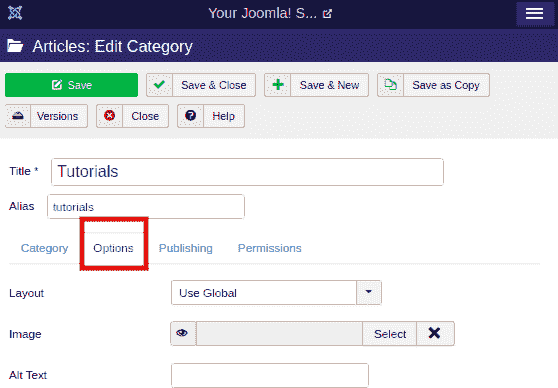

# Joomla -类别管理

> 原文：<https://www.javatpoint.com/joomla-category-management>

类别管理器用于创建类别，这些类别提供了组织文章的可选方法。一个类别可能包含文章以及其他类别(称为子类别)。你不能在一篇文章中包含几个类别。首先，你必须创建一个类别，然后你可以在其中添加一篇文章。

## 添加类别

要添加类别，您需要遵循给定的步骤:

**第一步**

登录您的 Joomla 帐户，并从 Joomla 任务栏导航到“内容-类别-添加新类别”。您也可以通过单击 Joomla 控制面板左侧栏中的“类别”选项，然后单击工具栏中的“新建”按钮来访问同一窗口。

**第二步**

完成上述步骤后，您将获得需要填写所有必需细节的表格。标题框是成功创建类别的唯一必填字段。屏幕将如下所示:

**第三步**

类别创建页面中还有许多其他有用的选项卡，如“**选项、发布和权限**”。

**选项**

选项选项卡下有三个可用字段:

| **布局** | 它用于从下拉列表中指定替代布局，如“使用全局、博客或列表”。 |
| **图像** | 它用于选择要显示的图像。 |
| **高文本** | 它用于将文本与图像一起附加，这将有助于搜索引擎轻松找到文本。 |

**发布**

在此选项卡中，您将获得以下选项:

| **创建日期** | 它用于指定类别的创建日期。 |
| **由**创建 | 它用于指定创建类别的用户的名称。 |
| **修改日期** | 它用于指定修改类别的日期。 |
| **由**修改 | 它用于指定修改类别的用户的名称。 |
| **点击** | 它用于指定项目被查看的总次数。 |
| 元描述 | 它用于指定网页内容的简短说明。 |
| **元关键词** | 它用于指定与内容相关的关键词，这有助于在搜索引擎中获得更好的排名。 |
| **作者** | 它用于在元数据中指定作者的姓名。 |
| **机器人** | 它用于指定使用“使用全局、索引跟随、无索引跟随、索引不跟随和无索引不跟随”等命令浏览页面的机器人的指令。 |

**权限**

“权限”选项卡提供以下选项:

| **创建** | 它用于允许用户组创建类别。 |
| **删除** | 它用于允许用户组删除扩展中可用的类别。 |
| 编辑 | 它用于允许用户组编辑扩展中可用的类别。 |
| **编辑状态** | 它用于允许用户组更改或修改扩展中可用类别的状态。 |
| **编辑自己的** | 它用于允许用户组编辑他们以前创建的类别。 |

**第四步**

放好所有细节后，需要点击**保存**按钮保存更改。您可以从类别管理器页面中的列表中检查创建的类别，如下所示:

在 Joomla 中，您可以根据需要创建任意多的类别。创建类别后，您可以创建一篇文章并将其与类别一起附加。

* * *