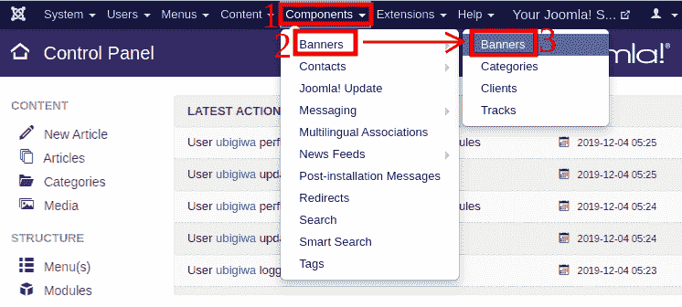
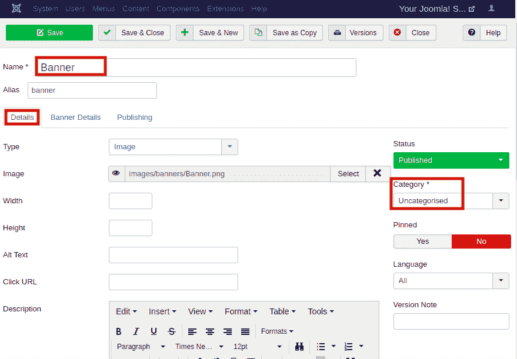
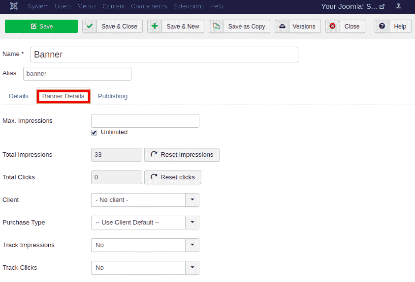
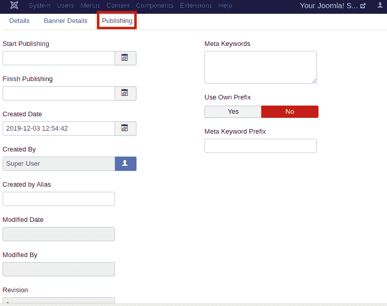

# Joomla -添加横幅

> 原文：<https://www.javatpoint.com/joomla-adding-banner>

横幅是网站的重要组成部分，它让你在网站上做广告。默认情况下，Joomla 3 包括横幅组件，用于添加新横幅，将它们组织成类别，并在 Joomla 网站的不同页面中显示它们。

## 创建横幅

以下步骤描述了如何在 Joomla 中创建横幅:

**第一步**

登录到你的 Joomla 帐户，点击 Joomla 任务栏中的“**组件-横幅-横幅**”。

**第二步**

然后，点击 Joomla 工具栏中的“**新建**”按钮。您将看到以下窗口:

您将在页面顶部看到两个字段，它们是:

| **名称** | 它用于指定横幅的名称。 |
| **别名** | 它是根据给定的名称自动生成的。 |

您将看到三个不同的部分:**详细信息、横幅详细信息、**和**发布**。

**详情**

默认情况下，您将输入一个“**详细信息**”选项卡，并获得以下字段:

| **类型** | 用于指定横幅类型(即**图像或自定义**)。如果选择自定义，您可以为横幅添加自定义代码，然后为横幅附加链接。 |
| **图像** | 它用于选择要显示为横幅的图像文件。 |
| **宽度** | 它用于指定横幅图像的宽度。 |
| **高度** | 它用于指定横幅图像的高度。 |
| **高文本** | 它用于添加备选文本以显示在横幅图像上。它还允许搜索引擎在搜索结果中显示图像。 |
| 点击 URL | 它用于指定横幅的链接，每当用户单击横幅时，该链接将导航到指定的网址。 |
| **描述** | 它用于指定横幅的简短描述。 |
| **状态** | 它用于指定横幅的状态，如已发布、未发布、已存档或已丢弃。 |
| **类别** | 它用于选择横幅的类别。这是一个必填字段。 |
| **固定** | 用于选择横幅是否有粘性。您可以使用“是/否”按钮进行更改。 |
| **语言** | 它用于指定横幅的语言。 |
| **版本说明** | 它用于指定横幅项目的版本信息。 |

**横幅详情**

点击**横幅详情**标签后，会出现如下窗口:

“横幅详细信息”选项卡包含以下选项:

| **最大印数** | 它显示为横幅购买的最大印象数。有一个选项可以选择是允许有限数量的印象还是无限数量的印象。 |
| **总印象** | 它显示横幅向用户显示的次数。有一个选项可以将总印象重置为零。 |
| **总点击量** | 它显示用户点击横幅的次数。您可以将点击次数重置为零。 |
| **客户端** | 它显示指定横幅的客户端信息。 |
| **购买类型** | 它显示横幅的购买类型，即无限、每年、每月、每周或每天。 |
| **赛道印象** | 它跟踪横幅在网页上显示的次数。 |
| **轨迹点击** | 它跟踪网页上的点击次数。 |

**发布**

它是横幅创建页面中的最后一个选项卡。它看起来像下图:

发布选项卡包括以下选项:

| **开始发布** | 它用于指定横幅在网站上发布的日期。 |
| **完成发布** | 它用于指定停止在网站上发布横幅的日期。 |
| **创建日期** | 它用于指定横幅的创建日期。 |
| **由**创建 | 它用于指定创建横幅的用户的姓名。 |
| **由别名**创建 | 它用于指定创建横幅中所需内容的别名。 |
| **修改日期** | 它用于指定横幅的修改日期。 |
| **由**修改 | 它用于指定修改横幅的用户的姓名。 |
| **修订版** | 它用于指定横幅的修订数量。 |
| **元关键词** | 它用于指定横幅的元关键字。 |
| **使用自己的前缀** | 它用于允许您自己的前缀。您可以选择“是/否”进行更改。 |
| **元关键词前缀** | 它用于指定元关键字的前缀。它从元关键字标签中获取前缀。 |

在必填字段中输入详细信息。其中大部分不是强制性的，因此您可以根据需要自定义设置。

**第三步**

完成所有更改后，点击**保存**按钮保存更改。

#### 注意:要在您的站点上显示横幅，您需要创建一个横幅模块，并指定您想要显示横幅的位置。

下图显示了横幅在网站上的外观:

这是为你的 Joomla 网站创建一个横幅的过程。

* * *