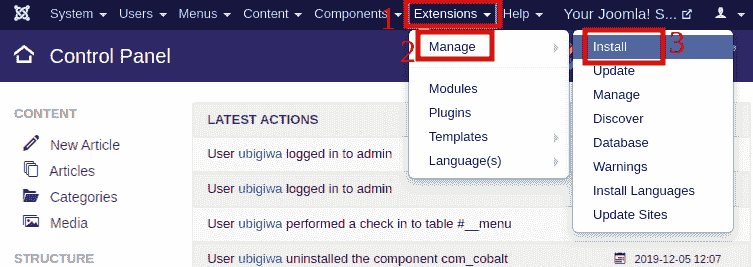
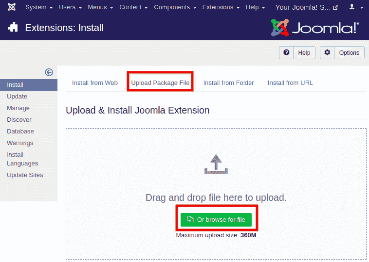
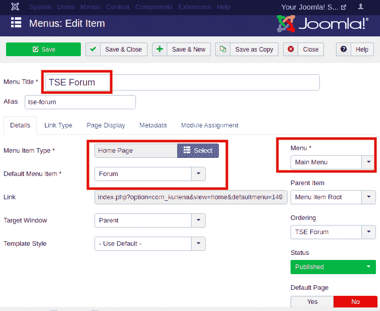
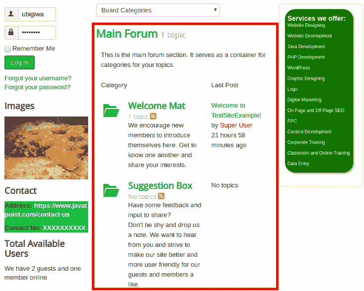

# Joomla -论坛

> 原文:[https://www.javatpoint.com/joomla-forum](https://www.javatpoint.com/joomla-forum)

该论坛可以说是网站上的一个讨论区。对于普通访问者来说，这是保持网站互动性和趣味性的好方法。允许你的访问者分享他们的想法或者和其他人见面是很好的。在本文中，您将了解如何在 Joomla 中添加论坛。

## 添加论坛

查看以下步骤，了解如何在 Joomla 网站上添加论坛:

**第一步**

登录您的 Joomla 帐户，从 Joomla 任务栏导航到“**扩展-管理-安装**”。

或者您可以从 Joomla 控制面板的左侧栏中点击“**安装扩展”**”按钮。

**第二步**

完成上述步骤后，您将被重定向到一个新窗口，在该窗口中，您需要单击“**上传包文件**”选项卡，如下所示:

#### 注意:有很多论坛扩展是免费提供的。下载适合您喜好的扩展。

然后，您需要选择下载的扩展名为的 zip 文件来开始安装。

**第三步**

安装扩展后，导航至“**菜单- <您的菜单名称> -添加新菜单项**，并选择论坛扩展作为菜单项类型。

#### 注意:代替 <您的菜单名称> ，您需要选择要添加论坛分机号的菜单。

下图显示了菜单项的创建，这将在主菜单中添加论坛菜单。

**第四步**

根据您的喜好进行更改，点击**保存**按钮保存更改。下图显示了创建的论坛在网站上的外观:

**第五步**

要编辑或修改论坛内容，您需要从 Joomla 任务栏导航到“**组件- <您的分机名称>** ”。

## 删除扩展

要删除 Joomla 论坛，请从 Joomla 任务栏导航至“**扩展-管理-管理**”。在搜索框中输入分机名称，以找到该分机。选择分机，点击工具栏中的**卸载**按钮。

* * *