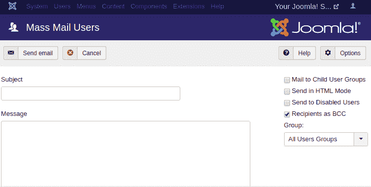

# Joomla -私人消息和电子邮件

> 原文：<https://www.javatpoint.com/joomla-private-messages-and-emails>

## 私人消息

私有消息系统用于向另一个用户发送消息，而不必向所有注册用户发送电子邮件。您应该具有发送、读取、写入和删除私人消息所需的权限。以下步骤描述了如何通过 Joomla 发送私人消息。

### 创建私人消息

要创建和发送私人消息，您需要遵循以下步骤:

**第一步**

首先，登录您的 Joomla 帐户，并从 Joomla 任务栏导航到“**组件-消息传递-新私人消息**”。

**第二步**

您将被重定向到窗口，在该窗口中您将看到以下字段:

| **收件人** | 选择要向其发送消息的人。(请注意，您可以使用此字段旁边的图标直接选择人员) |
| **主题** | 在此字段中键入新邮件的主题行。 |
| **消息** | 在此字段中键入要发送的文本。它提供了一个编辑器，包含许多选项，如粗体、斜体、标题格式、插入图像、链接、表格等。 |

它看起来像下图:

创建消息时，所有这些字段都是必需的。

**第三步**

点击工具栏上的**发送**按钮，将消息发送给选定的收件人。如果您不想发送消息并想返回上一屏幕，请点击“**取消**按钮。

### 检查私人消息

要查看私人消息，您需要点击 Joomla 任务栏中的“**组件-消息传递**”。您将看到所有私人消息的列表。您需要点击邮件主题来阅读特定邮件。您也可以使用工具栏执行以下选项:

| **标记为已读** | 它用于定义消息已被读取。 |
| **标记为未读** | 它用于定义您尚未阅读消息。 |
| **我的设置** | 它用于管理与私人消息传递相关的设置。您可以执行“锁定收件箱”、“发送新邮件”和“自动删除邮件”等选项。 |
| **垃圾** | 它用于删除选定的邮件。 |

## 电子邮件

电子邮件(也称为**电子邮件**)是使用电子设备的人之间交换信息的方法。Joomla 提供了向一组注册用户发送批量电子邮件的选项。

### 群发电子邮件

查看以下步骤，了解如何在 Joomla 中发送大量电子邮件:

**第一步**

点击 Joomla 任务栏中的“**用户-群发邮件用户**”。

**第二步**

完成上述步骤后，您将看到如下所示的窗口:

此窗口包含以下选项:

| **主题** | 它用于指定您电子邮件的主题。 |
| **消息** | 它用于添加邮件的内容。您可以以纯文本或 HTML 格式书写。 |
| **发送给子用户组的邮件** | 如果选择此选项，您的电子邮件将发送到指定父组的所有子组。 |
| **以 HTML 模式发送** | 它用于以 HTML 模式发送电子邮件。 |
| **发送给禁用用户** | 如果选择此选项，您的电子邮件将发送给禁用的用户。 |
| **作为密件抄送的收件人** | 它用于隐藏收件人列表，以便对其他用户的详细信息保密。 |
| **组** | 它用于指定要向其发送电子邮件的用户组。 |

填写完所有细节后，点击 Joomla 工具栏中的**发送邮件**按钮。如果您想返回上一屏幕，可以点击**取消**按钮。

* * *