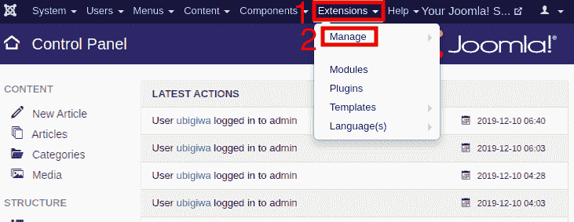
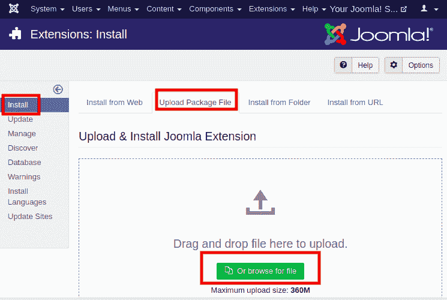
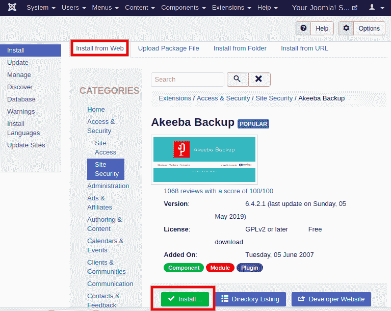
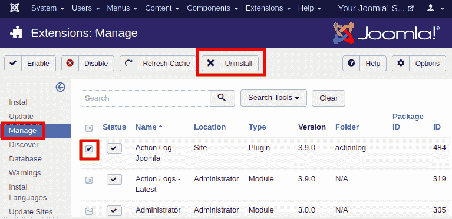
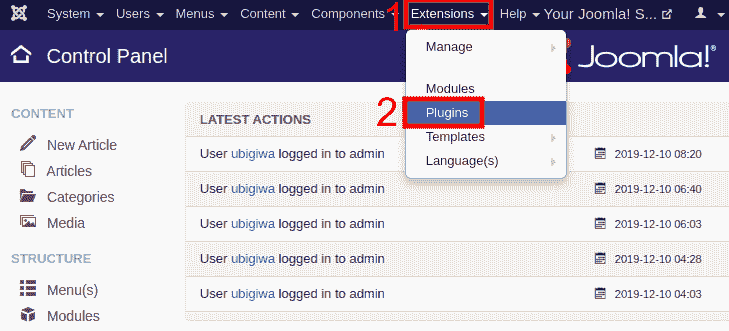
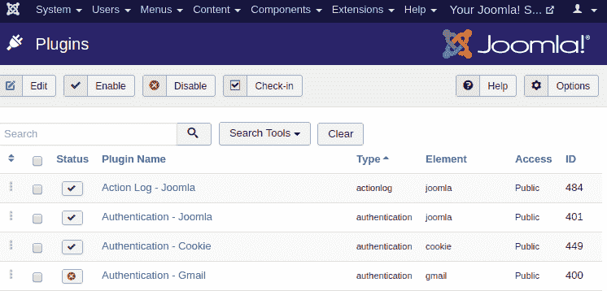

# 扩展管理器和插件管理器

> 原文：<https://www.javatpoint.com/joomla-extension-manager-and-plugin-manager>

在本文中，您将学习如何在 Joomla 中使用扩展管理器和插件管理器。

## 扩展管理器

扩展被认为是附加组件，是为了扩展 Joomla 的功能而添加的。它们用于在 Joomla 中添加标准包中没有提供的功能。有几个扩展可以在 Joomla 中使用，包括免费的和付费的。

扩展管理器是安装、修改或卸载此类扩展的地方。

### 访问扩展管理器

以下是指导您如何在 Joomla 中打开和使用扩展管理器的步骤:

**第一步**

登录你的 Joomla 帐户，点击 Joomla 任务栏中的“**扩展-管理**”。

**第二步**

它会将您重定向到“**扩展管理器**”页面。它看起来像下图:

在这里，您需要选择您已经单独下载的扩展，以包括在您的网站上，它将开始安装过程。

安装 Joomla 扩展后，它会显示一条成功的安装消息。

**第三步**

您也可以直接从网站安装扩展。你需要选择分机，点击“**安装**按钮，在你的 Joomla 网站上添加分机。

### 删除扩展

要删除扩展，从 Joomla 任务栏导航到“**扩展-管理-管理**”。点击复选框选择分机，然后点击“**卸载**按钮。它将完全删除你的 Joomla 网站的扩展。

如果您不想永久删除扩展，则可以在临时时间间隔内“禁用”特定的扩展。

## 插件管理器

插件被定义为一个 Joomla 扩展，它提供与触发事件相关的功能。插件根据运行的事件进行分组。

插件管理器是帮助你在 Joomla 中启用或禁用插件的方法。

### 访问插件管理器

以下是指导您如何在 Joomla 中打开和使用插件管理器的步骤:

**第一步**

从 Joomla 任务栏导航到“**扩展插件**”。

**第二步**

点击**插件**后，会显示一个新窗口，如下图:

该窗口包含所有现有插件。您可以使用此窗口启用、禁用或编辑插件。您需要通过点击复选框来选择插件，并使用工具栏执行以下操作:

| 编辑 | 它用于编辑插件。 |
| **启用** | 它用于使插件在站点上可见。 |
| **禁用** | 它用于禁用插件以将其从站点中删除。 |
| **入住** | 它用于签入插件。它会在完成该过程后显示消息。 |

* * *