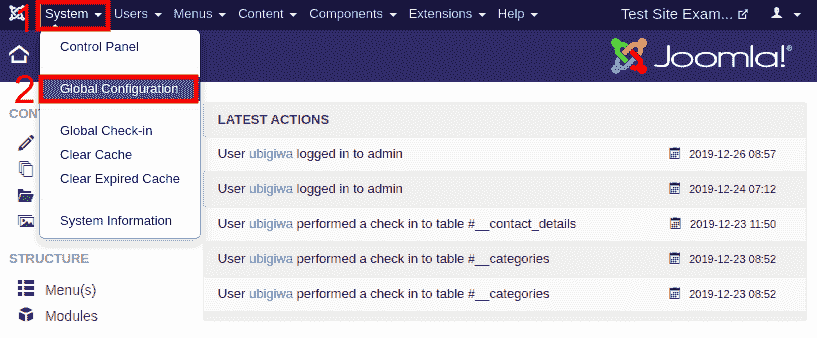
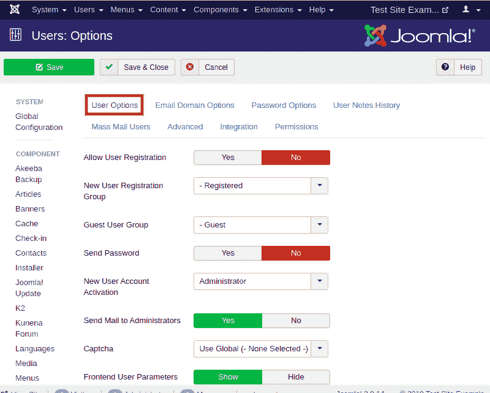

# 用户设置

> 原文：<https://www.javatpoint.com/joomla-user-setting>

Joomla 用户设置提供了为新用户配置设置的选项。它们还包括有助于限制新用户提供不需要的详细信息的功能。

## 在 Joomla 中访问用户设置

查看以下步骤以访问 Joomla 用户设置:

*   从 Joomla 任务栏导航到“**系统-全局配置**”。

*   点击左侧栏中的“**用户**”标签。您将看到以下屏幕:

此页面上有几个选项卡和字段。默认情况下，您将被重定向到“**用户选项**”选项卡。

以下是“**用户选项**”标签中不同字段的详细信息。

**允许用户注册** -如果此功能打开，用户将能够使用登录模块上的“**创建帐户**”链接从您的网站前端进行注册。默认情况下，该选项设置为“**否**”。

**新用户注册组** -该选项用于为新用户在网站注册时分配默认组。默认情况下，新注册组设置为“**注册**”。

**访客用户组** -该选项为未登录的访客分配一个默认组。默认情况下，它设置为“公共”。

**发送密码** -如果该选项打开，那么第一个密码将作为注册的一部分通过电子邮件发送给用户。

**新用户账户激活** -该选项用于激活用户账户。此设置有三个选项:

*   **无** -用户账户将立即激活，无需任何进一步操作。
*   **自我** -用户将收到一封包含激活链接的电子邮件。用户需要点击链接激活账户。
*   **管理员** -用户将收到一封带有激活链接的电子邮件，用户应点击该链接。之后，网站管理员将通过电子邮件得到通知，并进一步激活用户的帐户。

**向管理员发送邮件** -如果“**新用户帐户激活**”选项设置为“无”或“自己”，将向管理员发送通知电子邮件。

**验证码** -该选项将允许使用验证码进行用户帐户注册，以及用户名或用户密码提醒。

**前端用户参数** -该选项用于允许用户从网站前端修改其语言、编辑器和帮助网站首选项。

**前端语言** -该选项用于用户注册时选择默认站点语言。

**更改用户名** -该选项用于允许用户在编辑个人资料时更改用户名。

就像“**用户选项**选项卡一样，可以在其他选项卡中自定义选项。建议尝试其他选项卡和字段，以更好地了解高级选项，这将有助于为新用户配置设置。

* * *