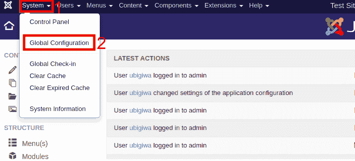
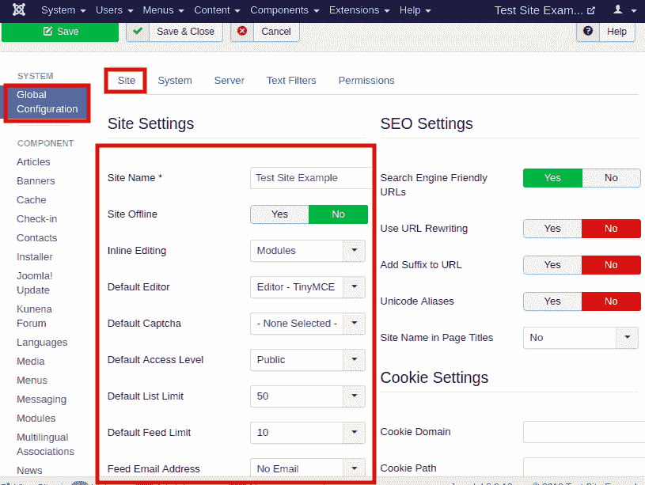
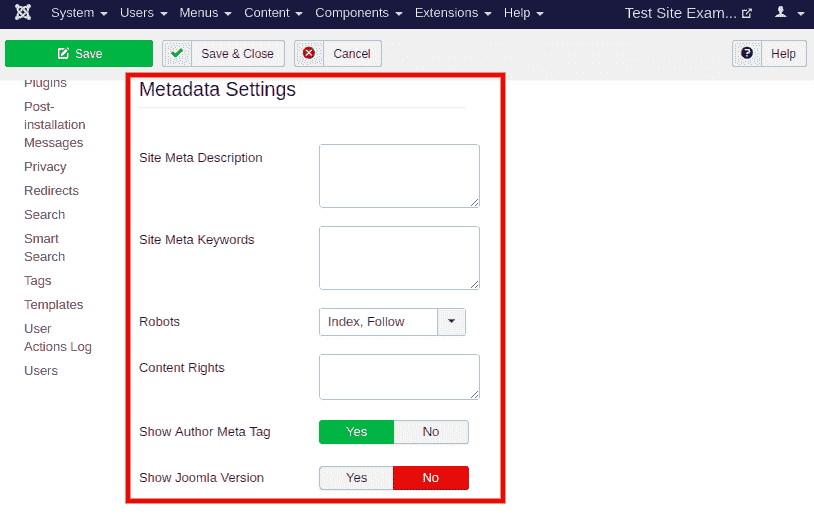
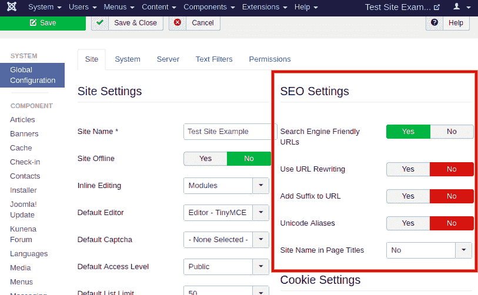
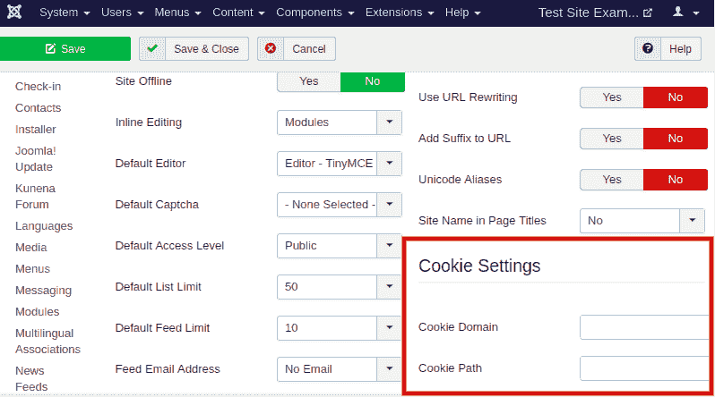

# Joomla -站点设置

> 原文:[https://www.javatpoint.com/joomla-site-settings](https://www.javatpoint.com/joomla-site-settings)

Joomla“**站点设置**”是 Joomla 全局配置的一部分。只能由超级用户修改。“站点设置”的所有设置都保存在 configuration.php 文件中，该文件位于 Joomla 站点的根目录中。

## 访问网站设置

要访问站点设置，从 Joomla 任务栏导航到“**系统-全局配置**”。

或者点击 Joomla 控制面板左侧栏中的“**全局**”选项。

它会自动将您重定向到“**站点**”选项卡，您将在其中获得分成不同组的几个设置:

### 网站设置组

该组包含几个有助于控制 Joomla 站点公共网页行为的设置。

“站点设置”组包含以下选项:

**网站名称** -指定网站名称。它通常由网站模板显示为每个网页的标题文本。

**网站离线** -使网站的公共页面离线。当设置为“是”时，网站的公共页面将被显示消息和登录表单的单个页面替换。可以在脱机页上插入自定义消息或图像。只有管理员可以登录并在网站上工作。

**内联编辑** -用于启用/禁用模块和菜单的前端编辑。您应该具有管理员权限来执行内联编辑。

**默认编辑器** -用于选择在网站上创建或更新文章时使用的默认文本编辑器。您可以选择代码镜像、TinyMCE 或无(仅编辑原始 HTML 代码)。

**默认验证码** -用于选择网站表单使用的默认验证码。如果您已经安装了验证码插件，您可以从下拉列表中选择插件。

**默认访问级别** -用于为网站内容、菜单项、项目等分配访问级别。您可以选择来宾、公共、注册、特殊和超级用户等选项。

**默认列表限制** -用于选择控制面板列表中显示内容的默认数量。

**默认订阅源限制** -用于选择在 RSS 新闻订阅源中显示的内容项目的默认数量。

**订阅源电子邮件地址** -用于指定 RSS 和 Atom 新闻订阅源包含的电子邮件地址。

### 元数据设置组

元数据是描述您的网站的信息。它对站点用户不可见。它可以被搜索引擎用来增加更好的搜索排名和网站的可见性。

“元数据设置”组涵盖以下选项:

**网站元描述** -用于指定网站的简短、概括的描述，搜索引擎将阅读该描述，为您的网页提供描述性文本。

**网站元关键词** -用于指定逗号分隔的单词和短语列表，搜索引擎将使用该列表来细化网站网页的索引。

**机器人** -用于阻止网址被索引。您可以在四种设置组合中进行选择，即索引跟随、无索引跟随、索引不跟随、无索引不跟随。

**内容权限** -用于以文本格式指定权限，是一般公众使用网站上的内容所必需的。

**显示作者元标签** -用于允许文章上的作者元标签。

**显示 Joomla 版本** -用于在生成器元标签中包含 Joomla 的已安装版本。

### 搜索引擎优化设置组

一个词 SEO 代表“**搜索引擎优化**”。这是通过搜索引擎结果增加网站流量的一个重要部分。

“搜索引擎优化设置”组包含以下选项:

**搜索引擎友好网址** -用于允许/不允许搜索引擎友好网址。如果该选项设置为“是”，生成的网址将会更短，更易读，并且更适合搜索引擎。

**使用网址重写** -如果该选项设置为“是”，网络服务器的重写引擎将删除网址的 index.php 部分。您需要将 Joomla 根目录中的 htaccess.txt 文件重命名为. htaccess。

**URL 添加后缀** -用于允许/不允许显示文档类型后缀(即 html 或 html 等)。)，到网址。

**Unicode 别名** -用于允许/不允许使用 Unicode(非拉丁字符)别名，而不是默认的音译。

**页面标题中的网站名称** -用于显示文章名称前或后的网站名称。默认情况下，不允许显示网站名称。

### Cookie 设置组

Cookies 是存储在现场访问者计算机上的小文本文件。Cookies 包括诸如网站何时被访问、网站首选项、权限和登录详细信息等信息。

“Cookie 设置”组涵盖以下选项:

**Cookie 域** -用于指定将覆盖站点默认 Cookie 域的域。您需要添加一个句点(。)之前的域(即 **.yourdomain.com** )使其对所有子域有效。

**Cookie 路径** -用于指定 Cookie 有效的路径。它将覆盖默认路径。

* * *