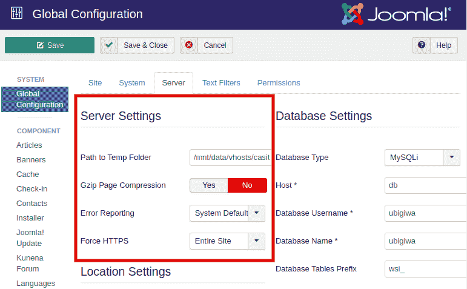
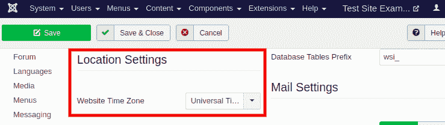
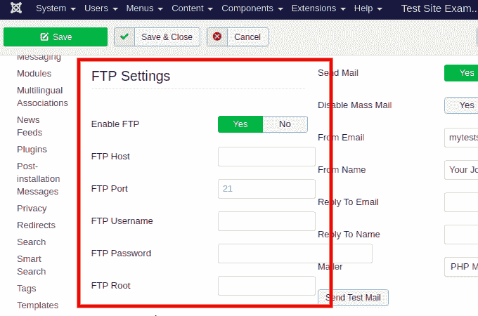
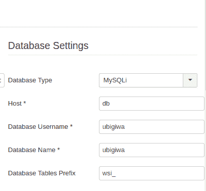
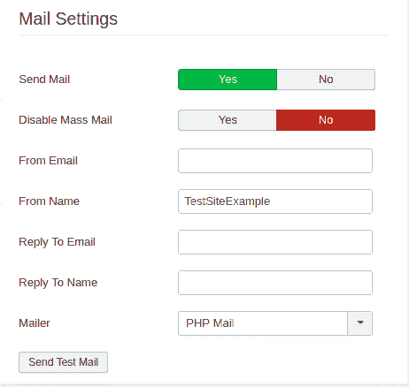

# 服务器设置

> 原文：<https://www.javatpoint.com/joomla-server-settings>

要访问 Joomla“服务器设置”，请导航至“**系统-全局配置**”，然后单击“**服务器**”选项卡。

“全局配置服务器”选项卡上有五个组:

## 服务器设置组

“服务器设置”组提供了控制临时文件夹、错误报告、gzip 页面压缩和一些其他设置的选项。

该组包括以下选项:

**临时文件夹的路径** -用于指定存放所有临时文件的文件夹的路径。如果指定自定义文件夹，请确保该文件夹是可写的。

**Gzip 页面压缩** -用于压缩页面大小，提高加载时间。

**报错** -用于定义 PHP 报错的级别。它有五个选项:

*   **系统默认** -是服务器 PHP 中指定的默认报告级别。INI 文件。
*   **简单** -用于获取基本 PHP 错误的报告。
*   **最大** -用于获取所有 PHP 错误的报告。
*   **开发** -用于获取所有 PHP 错误的报告。
*   **无** -禁用错误报告。

**强制 HTTPS** -用于强制站点访问使用安全的 HTTPS 协议。您可以选择“**仅限管理员**”强制 HTTPS 为管理员(仅限后端)，或选择“**整个网站**”强制 HTTPS 为网站所有页面。

### 位置设置组

该组提供选项来指定服务器时区和时间/日期设置。

**网站时区** -用于指定网站将用于显示日期和时间的时区。

### 文件传输协议设置组

用于使用 **FTP(文件传输协议)**将文件上传到站点，而不是默认的 PHP 上传功能。

**启用 FTP** -用于允许或不允许 Joomla 在添加、删除或更新网站文件时使用 FTP。默认设置设置为“否”。

*   **FTP 主机** -用于指定将用于 FTP 访问 Joomla 网站文件的 URL。
*   **FTP 端口** -用于指定 FTP 访问 Joomla 网站文件时使用的 FTP 端口号。
*   **FTP 用户名** -用于指定用户身份，Joomla 将使用该身份进行 FTP 访问。
*   **FTP 密码** -用于指定验证用户身份所需的密码。
*   **FTP 根** -用于指定从 FTP 登录位置到保存 Joomla 站点所有文件的文件夹的路径。

### 数据库设置组

它包含用于标识数据库位置、数据库以及数据库中保存 Joomla 网站配置和内容信息的表的设置。它还包含访问数据库内容所需的用户名。它不包括与该用户名关联的密码。这些设置是在 Joomla 安装期间定义的，除非您迁移到不同的服务器或托管帐户，否则不应更改。

该组包括以下选项:

**数据库类型** -用于指定 Joomla 网站使用的数据库类型。

**Host -** 用于指定安装数据库的服务器的主机名。

**数据库用户名-** 用于指定有权访问数据库的用户名。

**数据库名称-** 用于指定数据库的名称。

**数据库表前缀** -用于指定数据库中 Joomla 表的名称前缀。

### 邮件设置组

邮件设置提供了通过 Joomla 网站发送自动生成的电子邮件(即通知或注册详细信息)的选项。

该组包括以下选项:

**发送邮件** -用于允许或禁止从 Joomla 网站发送邮件。

**禁用群发邮件** -用于允许或不允许使用群发邮件功能向所有用户或所有用户组发送电子邮件。

**发件人电子邮件** -用于指定从网站发送的电子邮件的“发件人”字段中显示的电子邮件地址。

**发件人姓名** -用于指定从网站发送的电子邮件中“发件人”字段显示的姓名。

**回复邮件** -用于指定收件人回复邮件时，您希望接收邮件的电子邮件地址。

**回复姓名** -用于指定收件人回复邮件时将显示给收件人的姓名。

**邮件程序-** 用于指定发送自动生成的电子邮件时要使用的机制。默认情况下，它被设置为“PHP 邮件程序”。

* * *