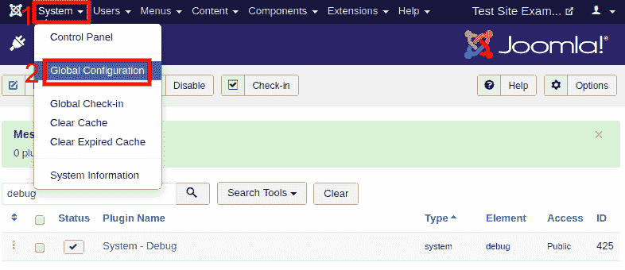
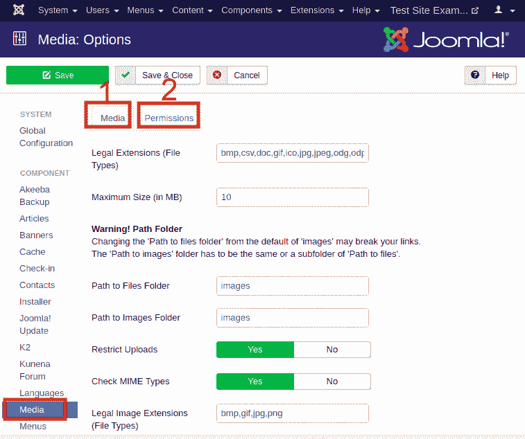
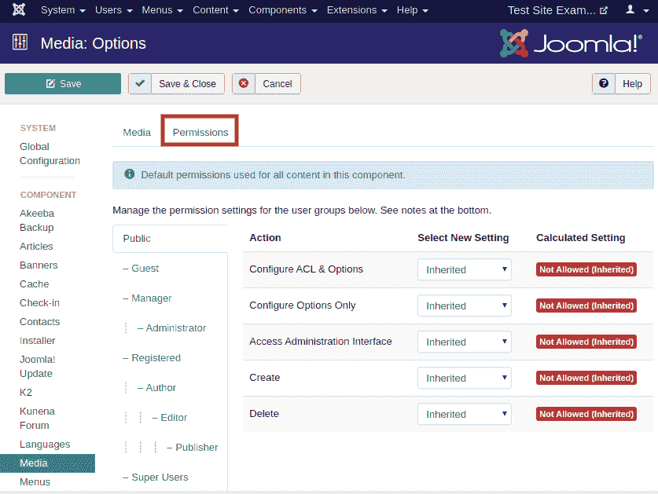

# 媒体设置

> 原文：<https://www.javatpoint.com/joomla-media-settings>

Joomla 媒体设置允许用户管理媒体管理器全局使用的参数设置。这些设置有助于配置全局媒体文件选项，如上传、MIME 类型检查、MIME 类型黑名单、文件大小等。

## 访问媒体设置

要访问 Joomla 媒体设置，请执行以下步骤:

*   从 Joomla 任务栏导航到“**系统-全局配置**”。

*   点击左侧边栏中的“**媒体**”选项，如下图:

这里可以看到两个标签:**媒体(1)** 和**权限(2)** 。

## 媒体

“**媒体**标签下的选项描述如下:

**合法扩展名(文件类型)** -显示可用的文件扩展名，可通过媒体管理器上传。扩展名用逗号分隔。例如- bmp，csv，doc，gif，ico，jpg，jpeg...

**最大大小(以 MB 为单位)** -用于指定可通过媒体管理器上传的文件的最大允许大小(以 MB 为单位)。

**文件夹路径** -显示相对于 Joomla 安装根目录的文件夹路径。

**图像文件夹路径** -显示相对于 Joomla 安装根目录的图像文件夹路径。

**限制上传** -如果开启此功能，权限小于管理员的用户将被限制只能上传图像文件。

**检查 MIME 类型** - MIME 代表**多用途互联网邮件扩展**，它根据文件在网络上的格式来识别文件。MIME 魔术或文件信息用于验证文件类型。

**合法图像扩展名(文件类型)** -指定允许上传的图像文件类型。文件类型用逗号分隔。它还检查有效的图像标题。

**忽略扩展名** -用于指定 MIME 检查时要忽略的文件类型。

**合法的 MIME 类型** -指定合法的 MIME 类型，用逗号分隔。

**非法 MIME 类型** -它指定由逗号分隔的非法 MIME 类型。

## 许可

要更改扩展的权限，请通过单击位于左侧的标题来选择用户组。从页面执行所需的操作。

以下是“**权限**选项卡下可用的操作:

**配置 ACL &选项** -用于允许或不允许特定用户组访问，以编辑扩展的选项和权限。

**仅配置选项** -用于允许或不允许特定用户组编辑选项，但扩展权限除外。

**访问管理界面** -用于允许或不允许特定用户组访问扩展的用户管理界面。

**创建** -用于允许或不允许特定用户组创建扩展内容的权限。

**删除** -用于允许或不允许特定用户组删除扩展内容的权限。

进行更改后，点击工具栏中的“**保存**”按钮。

* * *