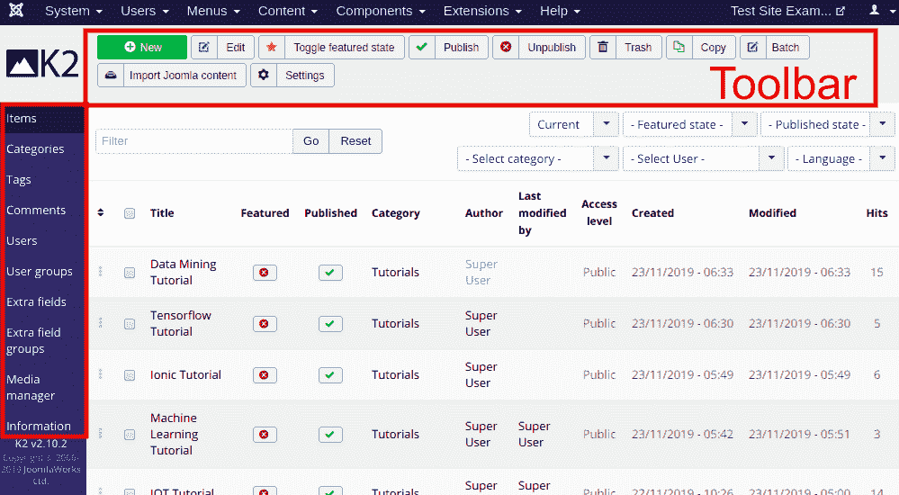

# 什么是 K2

> 原文：<https://www.javatpoint.com/joomla-k2>

K2 是 Joomla 扩展，用来替换 Joomla 中默认的文章系统。在 Joomla 1.5 中，只有添加标题和内容主体的选项。后来，文章图像作为单独的字段被引入，但不支持自动调整大小。在 Joomla 3.x 中，标签作为独立的组件被引入。所有这些使得默认文章系统的配置有点混乱。因此，K2 被开发来为文章图像、视频、播客、音频文件、图像库、附件、评论和标签等添加额外的字段。所有这些都打包在一个包裹里。

K2 是管理内容的理想解决方案，无论网站的大小如何。你可以用它来创建一个小型的博客到复杂的公司网站。K2 支持 Joomla 扩展目录中列出的 200 多个扩展和 K2 扩展目录中列出的 250 多个扩展。

## K2 的特点

K2 建立在四个共同的原则之上:功能丰富的内容、易用性、灵活的模板和性能。除此之外，它是免费使用的。

K2 的一些重要特征如下:

*   嵌套级别的类别
*   评论(与谷歌的 ReCaptcha 和 Akismet 集成)
*   图像、视频、图库的附件
*   原生高级 **SEF(搜索引擎友好)**选项
*   内置谷歌结构化数据
*   内置媒体管理器
*   具有多个覆盖的模板系统
*   **基于 AJAX(异步 JavaScript 和 XML)** 的前端编辑和评论审核
*   自定义用户页面(例如，作者博客/用户档案等。)

## 如何安装 K2

要安装 K2，您需要遵循给定的步骤:

*   导航至以下链接:[https://getk2.org/](https://getk2.org/)
*   点击下载按钮开始下载 K2 包文件。

*   下载 K2 包文件后，登录 Joomla 账号，从任务栏导航到“**扩展-管理-安装**”。

*   点击**上传包文件标签**，浏览已经下载的 K2 包文件。

*   一旦您选择了文件，它将开始安装扩展名。安装完成后，它会向您发送安装成功的消息。

## K2 仪表板

K2 是为支持 Joomla API 而开发的，这意味着所有 Joomla 插件都将在 K2 组件和模块中正常运行，无论是在前端还是后端。

要访问 K2 和可用选项，您需要从 Joomla 任务栏导航到“**组件- K2** ”。它看起来像下图:

点击工具栏中的**导入 Joomla 内容**，开始 K2 的工作。

就像 Joomla 默认界面一样，K2 工具栏也在页面顶部。您将主要通过边栏工作，边栏有以下选项:

| **项** | 它显示包含所有文章的列表。您可以在此添加新内容。 |
| **类别** | 它用于创建或修改类别。Joomla 将文章放入不同的部分和类别。但是 K2 只包括类别，你想有多少级别就有多少级别。 |
| **标签** | 标签被称为小关键词，可以添加在每个项目的底部。 |
| **评论** | K2 使用自己的评论系统。在这里，你会发现你网站上写的所有评论。 |
| **用户** | 它显示有权在您的站点上编写或修改内容的所有用户的列表。 |
| **用户组** | 它用于允许或禁止对用户组的访问。 |
| **额外字段** | 用于指定价格、重量、颜色等额外字段。 |
| **额外场组** | 它被用来组织许多领域。 |
| **媒体管理器** | 它用于管理 Joomla 文件。 |
| **信息** | 它用于指定 Joomla 信息。 |

如果您要使用 K2，最好按照以下顺序工作:

*   种类
*   额外字段/额外朋友组
*   项目
*   其他功能。

* * *