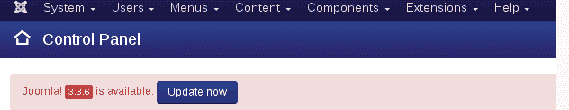
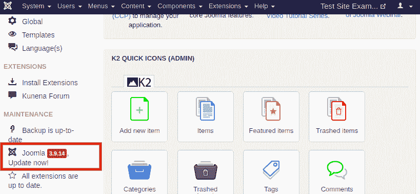
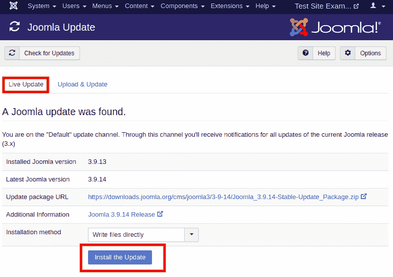
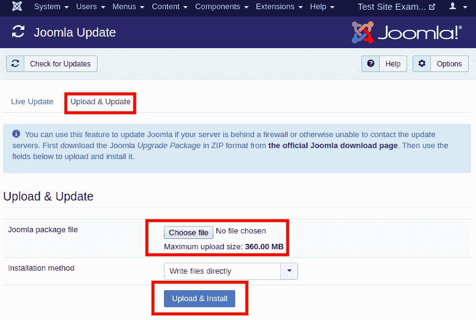
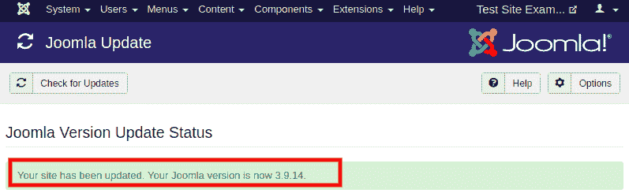

# Joomla 更新

> 原文：<https://www.javatpoint.com/joomla-update>

发布 Joomla 更新是为了增强网站的特性和功能。它们的建立是为了确保你的 Joomla 网站是安全的，有最新的功能、安全补丁、改进和错误修复。

Joomla 积极发布新的更新，以增强用户体验并修复安全漏洞。有一个庞大的开发者社区，他们总是致力于增强 Joomla 体验。

## 为什么更新 Joomla

总是建议保持你的 Joomla 是最新的。这有几个原因:

*   **安全**
    Joomla 更新包括修补安全漏洞的主要修复。更新 Joomla，你可以确保你的 Joomla 网站的安全。
*   **稳定性**
    Joomla 还包括 bug 和其他稳定性问题的修复。因此，更新使 Joomla 网站更加稳定。
*   **特色**
    Joomla 一直致力于让初学者更轻松。他们不断改进，并通过更新添加新功能。因此，您可以通过运行最新版本来访问最新的特性和功能。

## 正在更新 Joomla

一旦你登录到你的 Joomla 帐户，你应该会看到一个新的 Joomla 版本可供更新的通知。点击**“立即更新”**按钮，可以直接从那里进行更新。

您还会在左侧栏的“维护”下看到一条通知，如下所示:

单击以上任一选项后，您将被重定向到更新管理器页面。如果在控制面板页面没有看到通知，那么需要从 Joomla 任务栏导航到**“组件- Joomla 更新”**。您将被重定向到包含两种方法的页面，如下所示:

### 方法 1:实时更新

这个方法会自动检查并从 Joomla 服务器下载最新版本。您需要点击**“安装更新”**按钮来开始更新过程。

### 方法 2:上传和更新

这种方法允许你上传 Joomla 包，然后点击**“上传并安装”**按钮手动安装。

安装更新后，您将被重定向到确认更新成功的屏幕。它看起来像下图:

* * *