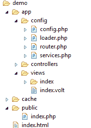

# 什么是费尔康

> 原文:[https://www.javatpoint.com/what-is-phalcon](https://www.javatpoint.com/what-is-phalcon)

Phalcon 是由一群开发人员开发的，安德烈斯·古铁雷斯是他们的团队负责人。Phalcon 是 PHP 编程语言的开源框架。它基于模块视图控制器模式。Phalcon 是第一个用 C 语言实现 ORM 的框架。

## Phalcon 应用结构

Phalcon 的关键特征是它是一个松散耦合的框架。Phalcon 允许用户使用便于特定应用的目录结构来构建项目。它遵循 MVC，具有“标准结构”。对于项目，Phalcon 具有以下目录结构:

**//结构布局**

**应用程序:**包含配置、控制器和视图资源文件夹。该目录定义了应用程序的所有功能。它由运行在服务器上的重要脚本和文件组成。

**配置:**定义应用的配置属性。它由四个文件组成:

1.  **Config.php:** 它提供了基于嵌套对象属性的用户界面。它有助于访问应用程序代码中的配置数据。
2.  **Loader.php:** 它允许我们自动加载所有的项目类。因为这个组件是用 C 语言编写的，所以它为外部 PHP 文件提供了最低的开销。
3.  **Router.php:** 它允许我们定义映射到控制器或处理器的路由。由于映射，控制器接收请求。路由器只需解析一个 URI 就可以确定这些信息。
4.  **Services.php:** 它实现了服务的依赖注入和定位。

**控制器:**控制器下定义的所有方法都处理请求。默认情况下，控制器上的所有方法都映射到动作。

**视图:**代表你的应用的用户界面。视图由嵌入了相应执行任务的 PHP 代码的 html 文件组成。

**Cache:** 是 Phalcon 目录下的一个类，可以更快的访问常用数据。这个类是用 C 语言编写的。它提供了高性能并减少了开销。

**Public:** 包括所有支持执行中主要内容的文件和文件夹，如 CSS、JavaScript、图像等。

* * *

## 模型视图控制器体系结构

Phalcon 由实现 MVC 架构的面向对象类组成。MVC 是一个用来开发 web 框架和桌面应用程序的框架。一些优点是:

*   业务逻辑与数据库和用户界面层隔离开来。
*   非常容易维护代码，因为不同的部分是为困难的代码创建的。

### 模型

模型表示应用程序的数据或信息。我们应用程序的大部分业务逻辑都在模型中。它描述了操作数据的规则。它有助于与数据库表的交互。在大多数情况下，每个表对应于我们应用程序中的一个模型。

### 视图

它代表我们应用程序的用户界面。视图由嵌入其中以执行不同任务的 HTML 页面和 PHP 代码组成。它通过向网络浏览器提供数据来处理应用程序生成的请求。

### 控制器

它提供了模型和视图之间的流动。它处理来自网络浏览器的请求，然后重新检查模型，并将结果传递给视图。