# Phalcon 安装

> 原文:[https://www.javatpoint.com/phalcon-installation](https://www.javatpoint.com/phalcon-installation)

我们需要根据您的操作系统安装 WAMP/MAMP/LAMP/XAMP。下面的安装是基于 WAMP 的。

我们安装以下先决条件:

1.  费尔康
2.  开发人员工具

* * *

## 安装 Phalcon

**步骤 1:** 从[https://phalconphp.com/en/download](https://phalconphp.com/en/download)下载窗口的 Phalcon。

为 Windows 下载 Phalcon dll 文件。

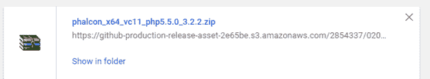

**第二步:**解压**C:\ wamp \ bin \ php \ PHP 5 . 5 . 12 \ ext**中的文件夹，即 PHP 的扩展文件夹。

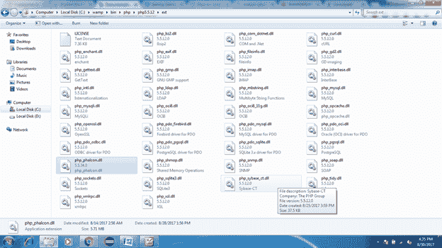

**步骤 3:** 用记事本或其他类似编辑器编辑位于**C:\ wamp \ bin \ PHP \ PHP 5 . 5 . 12 \ php.ini**的 PHP . ini 文件。

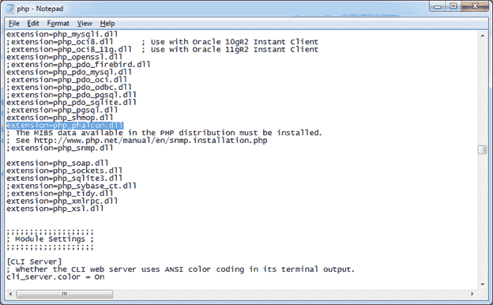

**第 4 步:**重启 WAMP 服务器，我们可以看到添加了 Phalcon 扩展。

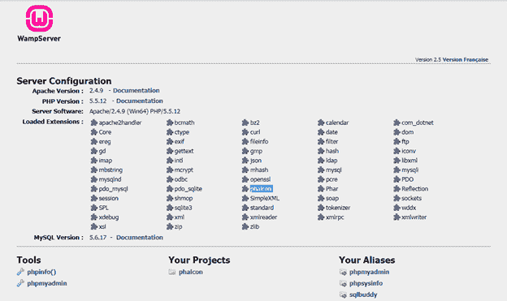

* * *

## 安装开发人员工具

**第一步:**从[https://github.com/phalcon/phalcon-devtools](https://github.com/phalcon/phalcon-devtools)下载正确版本的开发者工具。在看起来像 C:\phalcon-devtools-master 的 C:\驱动器中提取。

**WAMP 版本信息**

通过运行 WAMP 服务器进行检查，然后单击 phpinfo()。

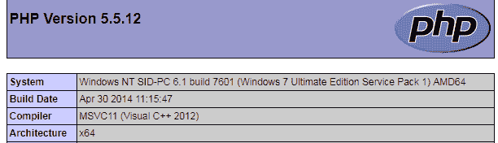
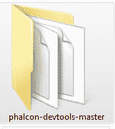

**步骤 2:** 为 PHP 和 Phalcon 开发人员工具设置环境变量。

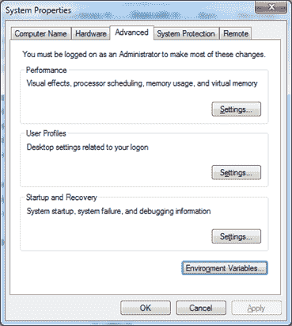
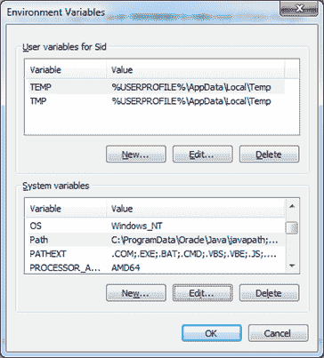
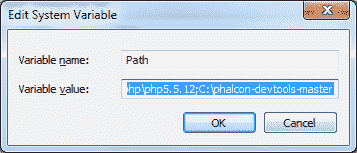

**第三步:**打开 cmd 并输入命令**“phalcon”**。

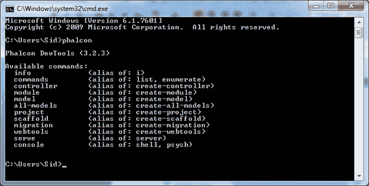

**第 4 步:**使用命令创建项目**演示**。

```php
phalcon create-project <project-name>.

```

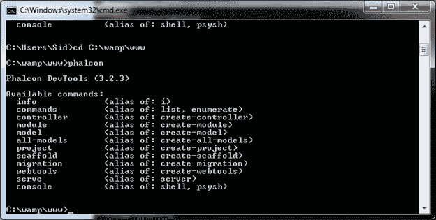
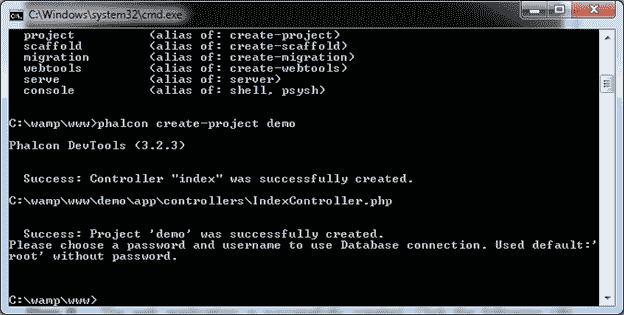

**编辑:**我们编辑服务器配置文件

1.  在文本编辑器中打开 apache 的配置文件。配置文件位置在**{ wamp _ dir }/Apache/conf/httpd . conf**。
2.  搜索以下字符串:**# LoadModule Rewrite _ modules/mod _ Rewrite . so**并取消注释(去掉“#”符号)。
3.  现在搜索另一个字符串 **AllowOverride None** 并替换为 **AllowOverride All** 。
4.  最后保存更改并重新启动 wamp 服务器。

**运行** -为了检查项目安装是否成功，我们运行位于目录文件:///C://wamp/www/demo/index . html 下的项目文件，并在 localhost 上运行。

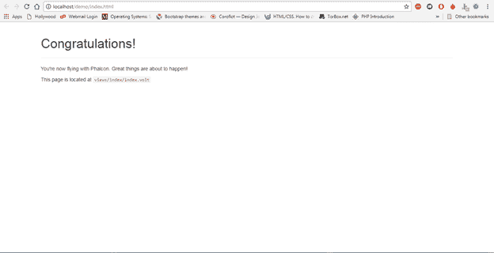