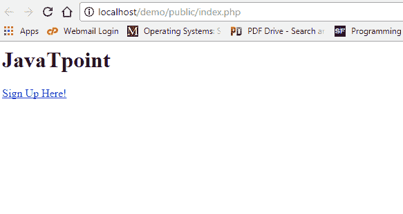
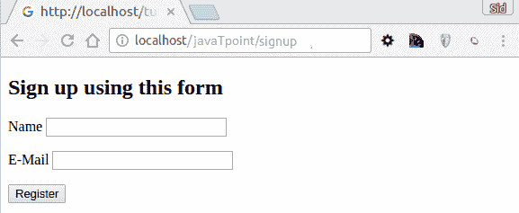

# 费尔康形式

> 原文:[https://www.javatpoint.com/phalcon-forms](https://www.javatpoint.com/phalcon-forms)

它处理 web 应用程序中表单的创建和维护。现在，因为我们在添加注册表单之前已经设计了一个基本的网络应用程序。

**设计注册表单**

更改 **index.phtml** 视图文件，添加注册页面链接作为控制器。

**app/view/index/index . phtml**

```php
<?php
echo "<h1>Hello!</h1>";
echo PHP_EOL;
echo PHP_EOL;
echo $this->tag->linkTo(
    "signup",
    "Sign Up Here!"
);

```

输出:



现在，我们编写注册控制器

**应用程序/控制器/签名控制器. php**

```php
<?php
use Phalcon\Mvc\Controller;
class SignupController extends Controller
{
    public function indexAction() 
	{
	 }
}
?>

```

**初始化表单**

在这种形式中，我们提供了形式定义，即提供了形式的结构。

**app/浏览量/注册/index.phtml**

```php
<h2>Sign up using this form</h2>
<?php echo $this->tag->form("signup/register"); ?>
<p>
<label for="name">Name</label>
<?php echo $this->tag->textField("name"); ?>
</p>
<p>
<label for="email">E-Mail</label>
<?php echo $this->tag->textField("email"); ?>
</p>
<p>
<?php echo $this->tag->submitButton("Register"); ?>
</p>
</form>

```

输出



### 验证表单

Phalcon 表单与验证组件集成在一起，提供即时验证。

```php
<?php
use Phalcon\Forms\Element\Text;
use Phalcon\Validation\Validator\PresenceOf;
use Phalcon\Validation\Validator\StringLength;
$name = new Text(
    'name'
);
$name->addValidator(
    new PresenceOf(
        [
            'message' => 'The name is required',
        ]
    )
);
$email = new Text(
'email'
);
$name->addValidator(
    new PresenceOf(
        [
            'message' =>'The email is required',
        ]
    )
);
$form->add($name);
$form->add($email);
?>

```

* * *

## 表单元素

Phalcon 提供了一组用于表单的内置元素。所有这些元素都位于**Phalcon \ Forms \元素内。**

| 名字 | 描述 |
| Phalcon \表单\元素\文本 | 生成输入[类型=文本]元素 |
| Phalcon \表单\元素\密码 | 生成输入[类型=密码]元素 |
| Phalcon \表单\元素\选择 | 基于选择生成选择标签(组合列表)元素 |
| Phalcon \表单\元素\检查 | 生成输入[类型=检查]元素 |
| Phalcon \表单\元素\文本区域 | 生成 TEXTAREA 元素 |
| Phalcon \表单\元素\隐藏 | 生成输入[类型=隐藏]元素 |
| Phalcon \表单\元素\文件 | 生成输入[类型=文件]元素 |
| Phalcon \表单\元素\日期 | 生成输入[类型=日期]元素 |
| Phalcon \表单\元素\数字 | 生成输入[类型=数量]元素 |
| Phalcon \表单\元素\提交 | 生成输入[类型=提交]元素 |