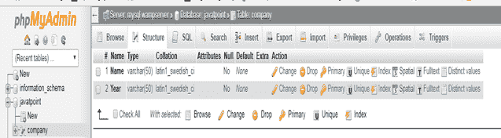

# 连接到数据库的 Phalcon

> 原文：<https://www.javatpoint.com/phalcon-connect-to-database>

我们连接前端和后端，即数据库。要访问数据库，我们需要用户名和密码。下面我们连接到数据库名称:javatpoint 和定义配置文件。

**例**

```php
<?php

// Required
$config = [
    'host'     => '127.0.0.1',

// Optional
$config['persistent'] = false;

// Create a connection
$connection = new \Phalcon\Db\Adapter\Pdo\Mysql($config);
    'username' =>'siddharth',
    'password' =>'flash',
    'dbname'   => 'javatpoint',
];

```

输出:

