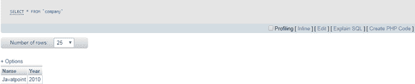
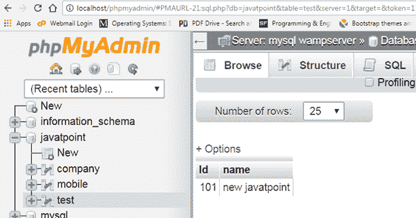

# 插入/更新/删除行

> 原文：<https://www.javatpoint.com/phalcon-insert-update-delete-rows>

### 插入行

```php
// Inserting data with a raw SQL statement
$sql     = 'INSERT INTO 'company'('name', 'year') VALUES ('javatpoint', 2010)';
$success = $connection->execute($sql);

// With placeholders
$sql     = 'INSERT INTO 'company'('name', 'year') VALUES (?, ?)';
$success = $connection->execute(
    $sql,
    [
'javatoint',
2010,
    ]
);

// Generating dynamically the necessary SQL
$success = $connection->insert(
'company',
    [
'javatpoint',
2010,
    ],
    [
        'name',
        'year',
    ],
);

```

输出:



* * *

## 更新行

```php
// Updating data with a raw SQL statement
$sql     = 'UPDATE 'company' SET 'name' = 'javatpoint' WHERE 'id' = 101';
$success = $connection->execute($sql);

// With placeholders
$sql     = 'UPDATE 'company' SET 'name' = ? WHERE 'id' = ?';
$success = $connection->execute(
    $sql,
    [
'javatpoint',
        101,
    ]
);

// Generating dynamically the necessary SQL (another syntax)
$success = $connection->updateAsDict(
'company',
    [
        'name' =>'New javatpoint',
    ],

    'id = 101' // Warning! In this case values are not escaped
);

```

输出:



* * *

## 删除行

```php
// Deleting data with a raw SQL statement
$sql     = 'DELETE 'company' WHERE 'id' = 101';
$success = $connection->execute($sql);

// With placeholders
$sql     = 'DELETE 'company' WHERE 'id' = ?';
$success = $connection->execute($sql, [101]);

// Generating dynamically the necessary SQL
$success = $connection->delete(
'company',
    'id = ?',
    [
        101,
    ]
);

```