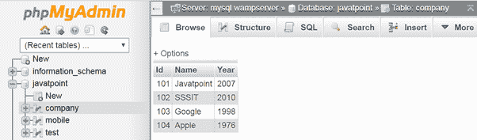

# Phalcon 事务和嵌套事务

> 原文:[https://www . javatpoint . com/phalcon-transaction-and-nested-transaction](https://www.javatpoint.com/phalcon-transaction-and-nested-transaction)

法尔孔支持交易，因为它附属于 PDO。为了提高数据库的性能，我们可以执行数据操作。下面是应用事务的数据库结构:



### 交易示例:

```php
<?php

try {
    // Start a transaction
    $connection->begin();

    // Execute some SQL statements
    $connection->execute('DELETE 'company' WHERE 'id' = 101');
    $connection->execute('DELETE 'company' WHERE 'id' = 102');
    $connection->execute('DELETE 'company' WHERE 'id' = 103');

    // Commit if everything goes well
    $connection->commit();
} catch (Exception $e) {
    // An exception has occurred rollback the transaction
    $connection->rollback();
}

```

//数据库**‘公司’**数据删除。

### 嵌套事务示例:

```php
<?php

try {
    // Start a transaction
    $connection->begin();

    // Execute some SQL statements
    $connection->execute('DELETE 'company' WHERE 'id' = 101');

    try {
        // Start a nested transaction
        $connection->begin();

        // Execute these SQL statements into the nested transaction
        $connection->execute('DELETE 'company' WHERE 'id' = 102');
        $connection->execute('DELETE 'company' WHERE 'id' = 103');

        // Create a save point
        $connection->commit();
    } catch (Exception $e) {
        // An error has occurred, release the nested transaction
        $connection->rollback();
    }

    // Continue, executing more SQL statements
    $connection->execute('DELETE 'company' WHERE 'id' = 104');

    // Commit if everything goes well
    $connection->commit();
} catch (Exception $e) {
    // An exception has occurred rollback the transaction
    $connection->rollback();
}

```

//数据库**‘公司’**数据删除。

| 事件名称 | 触发的 | 中断操作 |
| 后连接 | 成功连接到数据库系统后 | 不 |
| 查询前 | 在向数据库系统发送 SQL 语句之前 | 是 |
| 查询后 | 向数据库系统发送一条 SQL 语句后 | 不 |
| 断开连接前 | 在关闭临时数据库连接之前 | 不 |
| 开始交易 | 在交易将要开始之前 | 不 |
| 回滚事务 | 在事务回滚之前 | 不 |
| 提交事务 | 在提交事务之前 | 不 |