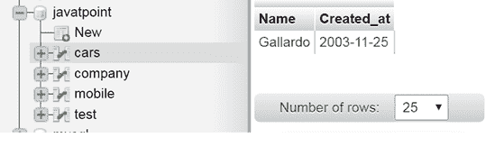

# Phalcon 模型交易

> 原文：<https://www.javatpoint.com/phalcon-model-transactions>

在诸如插入/删除/更新/回滚等操作之后，模型事务有助于维护数据库的完整性。事务在提交数据库之前检查操作是否成功完成。

交易有三种类型:

1.  人工交易
2.  隐式事务
3.  孤立交易

### 人工交易

当只有一个连接和简单事务时，使用此方法。只需将当前连接移动到事务模式，然后提交或回滚操作，无论操作是否成功，就可以创建该事务。

### 履行

```php
<?php

use Phalcon\Mvc\Controller;

class Cars extends Controller
{
    public function saveAction()
    {
        // Start a transaction
        $this->db->begin();

        $cars = new Cars();

        $car->name       = 'Gallardo';
        $car->created_at = date('Y-m-d');

        // The model failed to save, so rollback the transaction
        if ($car->save() === false) {
            $this->db->rollback();
            return;
        }

        $carprice= new CarPrice();

        $carprice ->car_id = $car->id;
        $ carprice ->type      = 'head';

        // The model failed to save, so rollback the transaction
        if ($carprice ->save() === false) {
            $this->db->rollback();

            return;
        }

        // Commit the transaction
        $this->db->commit();
    }
}

```

输出:



* * *

## 隐式事务

隐式事务确保数据被正确存储。

### 履行

```php
<?php

$carprice = new CarPrice();

$carprice->type = 'head';

$car = new Cars();

$car->name       = 'Gallardo';
$car->created_at = date('Y-m-d');
$car->carprice  = $carprice;

// Creates an implicit transaction to store both records
$car->save();

```

* * *

## 孤立交易

隔离事务在新连接中执行，确保所有生成的 SQL、虚拟外键检查和业务规则都与主连接隔离。

### 履行

```php
<?php

use Phalcon\Mvc\Model\Transaction\Failed as TxFailed;
use Phalcon\Mvc\Model\Transaction\Manager as TxManager;

try {
    // Create a transaction manager
    $manager = new TxManager();

    // Request a transaction
    $transaction = $manager->get();

    $car = new Car();

    $car->setTransaction($transaction);

    $car->name       = 'Gallardo';
    $car->created_at = date('Y-m-d');

    if ($car->save() === false) {
        $transaction->rollback(
            'Cannot save car?
        );
    }

    $carprice = new CarPrice();

    $carprice->setTransaction($transaction);

    $carprice->car_id = $car->id;
    $carprice->type      = 'head';

    if ($carprice->save() === false) {
        $transaction->rollback(
            'Cannot save car price'
        );
    }

    $transaction->commit();
} catch (TxFailed $e) {
    echo 'Failed, reason: ', $e->getMessage();
}

```