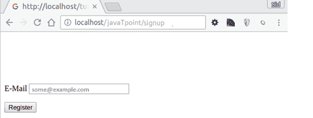

# 法尔孔请求环境

> 原文：<https://www.javatpoint.com/phalcon-request>

HTTP 请求是由浏览器发起的，它包含关于请求的附加信息，如头数据、文件、变量等。基于 web 的应用程序需要解析这些信息，以便向请求者提供正确的响应。请求的所有信息都存储在目录 **Phalcon\Http\Request 下。**

## 检索值

为了检索值，PHP 根据请求的类型自动决定数组类型为 **$_GET 和$_POST** 。

**Phalcon\Http\Request** 允许我们访问存储在$_REQUEST、$_GET 和$_POST 数组中的值，并使用过滤器服务(即 **Phalcon\Filter)对其进行过滤。**

以下是相同行为的示例:

```php
<?php

use Phalcon\Filter;

$filter = new Filter();

// Automatically applying the filter
$email = $request->getPost('user_email', 'email');

// Setting a default value if the param is null
$email = $request->getPost('user_email', 'email', 'some@example.com');

// Setting a default value if the param is null without filtering
$email = $request->getPost('user_email', null, 'some@example.com');

```

输出



* * *

## 请求方法

| 方法 | 描述 |
| 公共 setDI(Phalcon \ Diinterface $ dependency injector) | 设置依赖注入器。 |
| 公共 getDI() | 返回内部依赖注入器。 |
| 公共 getServer(混合$name) | 从$_SERVER superglobal 获取变量。 |
| public has(混合$name) | 检查$_REQUEST superglobal 是否有特定的索引。 |
| 公共 hasPost(混合$名称) | 检查$_POST 超全局是否有一定的索引。 |
| 公共 hasPut(混合$名称) | 检查 PUT 数据是否有一定的索引。 |
| 公共散列查询(混合$名称) | 检查$_GET 超全局是否有一定的索引。 |
| 最终公共 hasServer(混合$名称) | 检查$_SERVER superglobal 是否有特定的索引。 |
| 最终公共 getHeader(混合$header) | 从请求数据中获取 HTTP 头。 |
| 公共 getScheme() | 获取 HTTP 架构(http/https)。 |
| isAjax 公众() | 检查是否使用 ajax 发出了请求。 |
| public isSoap() | 检查请求是否是使用 SOAP 发出的。 |
| public isSecure() | 检查请求是否使用了任何安全层。 |
| public getRawBody() | 获取 HTTP 原始请求正文。 |
| public getServerAddress （） | 获取活动服务器地址。 |